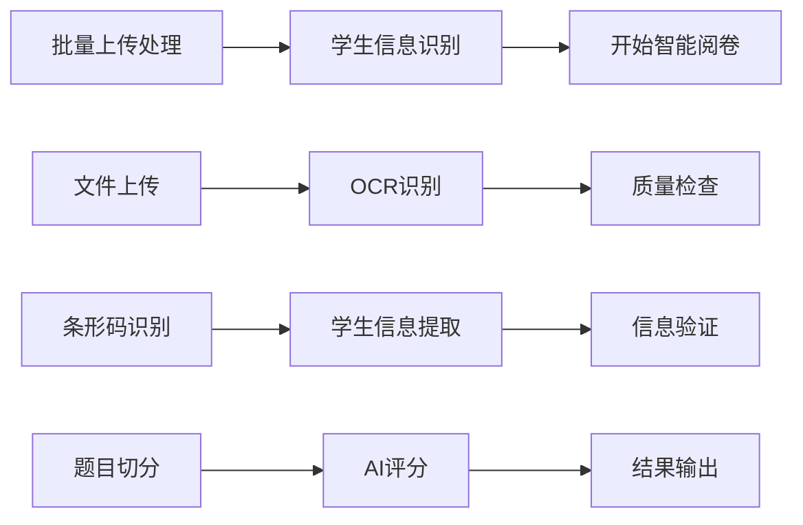

# 增强技术方案融入智能答题卡处理工作流

## 概述

本文档详细说明如何将先进的AI技术方案（YOLO目标检测、多模态融合、模板学习等）融入到当前的三步智能答题卡处理工作流中，以提升处理效率和准确性。

## 当前工作流分析

### 现有三步工作流



### 技术栈现状
- **OCR引擎**: Gemini 2.5 Pro
- **图像处理**: PIL + OpenCV
- **前端框架**: React + TypeScript + Ant Design
- **后端框架**: FastAPI + SQLAlchemy
- **数据库**: SQLite

## 增强技术方案集成

### 1. 第一步：批量上传处理 - 增强版

#### 1.1 集成YOLO目标检测

**技术实现**：
```python
# backend/services/enhanced_detection_service.py
class EnhancedDetectionService:
    def __init__(self):
        self.yolo_model = self.load_yolo_model()
        self.gemini_ocr = GeminiOCRService()
        self.template_matcher = TemplateMatchingService()
    
    async def process_with_detection(self, image_path: str) -> Dict[str, Any]:
        """增强的图像处理流程"""
        # 1. YOLO快速预检测
        detection_result = await self.yolo_detect_regions(image_path)
        
        # 2. 模板匹配
        template_match = await self.template_matcher.match_layout(image_path)
        
        # 3. Gemini精确识别
        ocr_result = await self.gemini_ocr.process_with_regions(
            image_path, detection_result, template_match
        )
        
        return self.merge_results(detection_result, template_match, ocr_result)
```

**前端集成**：
```typescript
// src/components/workspaces/EnhancedUploadProcessor.tsx
interface EnhancedProcessingConfig {
  enableYOLODetection: boolean;
  enableTemplateMatching: boolean;
  qualityThreshold: number;
  processingMode: 'fast' | 'accurate' | 'hybrid';
}

const EnhancedUploadProcessor: React.FC = () => {
  const [config, setConfig] = useState<EnhancedProcessingConfig>({
    enableYOLODetection: true,
    enableTemplateMatching: true,
    qualityThreshold: 0.85,
    processingMode: 'hybrid'
  });
  
  const processWithEnhancement = async (files: File[]) => {
    const results = await Promise.all(
      files.map(file => 
        api.post('/api/enhanced-processing/process', {
          file,
          config
        })
      )
    );
    return results;
  };
};
```

#### 1.2 智能质量预检

**实现方案**：
```python
# backend/services/quality_precheck_service.py
class QualityPrecheckService:
    def __init__(self):
        self.quality_model = self.load_quality_assessment_model()
    
    async def precheck_image_quality(self, image_path: str) -> Dict[str, Any]:
        """图像质量预检"""
        quality_metrics = {
            'clarity_score': self.assess_clarity(image_path),
            'contrast_score': self.assess_contrast(image_path),
            'orientation_correct': self.check_orientation(image_path),
            'completeness_score': self.check_completeness(image_path),
            'noise_level': self.assess_noise(image_path)
        }
        
        overall_score = self.calculate_overall_quality(quality_metrics)
        recommendations = self.generate_recommendations(quality_metrics)
        
        return {
            'quality_score': overall_score,
            'metrics': quality_metrics,
            'recommendations': recommendations,
            'pass_threshold': overall_score >= 0.7
        }
```

### 2. 第二步：学生信息识别 - 多模态增强

#### 2.1 多模态信息融合

**技术架构**：
```python
# backend/services/multimodal_student_info_service.py
class MultimodalStudentInfoService:
    def __init__(self):
        self.barcode_detector = BarcodeDetectionService()
        self.ocr_service = GeminiOCRService()
        self.handwriting_recognizer = HandwritingRecognitionService()
        self.info_validator = StudentInfoValidator()
    
    async def extract_student_info(self, image_path: str) -> Dict[str, Any]:
        """多模态学生信息提取"""
        # 并行处理多种识别方式
        tasks = [
            self.barcode_detector.detect(image_path),
            self.ocr_service.extract_student_region(image_path),
            self.handwriting_recognizer.recognize_handwritten_info(image_path)
        ]
        
        barcode_result, ocr_result, handwriting_result = await asyncio.gather(*tasks)
        
        # 信息融合和验证
        fused_info = self.fuse_information(barcode_result, ocr_result, handwriting_result)
        validated_info = await self.info_validator.validate(fused_info)
        
        return {
            'student_info': validated_info,
            'confidence_scores': self.calculate_confidence(fused_info),
            'source_breakdown': {
                'barcode': barcode_result,
                'ocr': ocr_result,
                'handwriting': handwriting_result
            }
        }
```

#### 2.2 智能信息验证

**实现方案**：
```python
# backend/services/student_info_validator.py
class StudentInfoValidator:
    def __init__(self, db: Session):
        self.db = db
        self.validation_rules = self.load_validation_rules()
    
    async def validate(self, student_info: Dict[str, Any]) -> Dict[str, Any]:
        """智能信息验证"""
        validation_results = {
            'student_id': self.validate_student_id(student_info.get('student_id')),
            'name': self.validate_name(student_info.get('name')),
            'class': self.validate_class(student_info.get('class')),
            'cross_reference': await self.cross_reference_database(student_info)
        }
        
        overall_validity = self.calculate_overall_validity(validation_results)
        suggestions = self.generate_correction_suggestions(validation_results)
        
        return {
            'is_valid': overall_validity >= 0.8,
            'confidence': overall_validity,
            'validation_details': validation_results,
            'suggestions': suggestions
        }
```

### 3. 第三步：开始智能阅卷 - 深度学习增强

#### 3.1 智能题目切分

**技术实现**：
```python
# backend/services/enhanced_question_segmentation.py
class EnhancedQuestionSegmentation:
    def __init__(self):
        self.yolo_question_detector = self.load_question_detection_model()
        self.layout_analyzer = LayoutAnalysisService()
        self.content_classifier = QuestionTypeClassifier()
    
    async def segment_questions(self, image_path: str, paper_template: Optional[Dict] = None) -> Dict[str, Any]:
        """增强的题目切分"""
        # 1. 使用YOLO检测题目边界
        question_regions = await self.yolo_question_detector.detect(image_path)
        
        # 2. 布局分析优化边界
        optimized_regions = await self.layout_analyzer.optimize_boundaries(
            image_path, question_regions
        )
        
        # 3. 题型分类
        classified_questions = await self.content_classifier.classify_questions(
            image_path, optimized_regions
        )
        
        # 4. 模板匹配验证（如果有模板）
        if paper_template:
            validated_questions = await self.validate_with_template(
                classified_questions, paper_template
            )
        else:
            validated_questions = classified_questions
        
        return {
            'segmented_questions': validated_questions,
            'quality_metrics': self.calculate_segmentation_quality(validated_questions),
            'processing_metadata': {
                'detection_confidence': self.get_detection_confidence(question_regions),
                'classification_confidence': self.get_classification_confidence(classified_questions)
            }
        }
```

#### 3.2 自适应评分引擎

**架构设计**：
```python
# backend/services/adaptive_grading_engine.py
class AdaptiveGradingEngine:
    def __init__(self):
        self.question_analyzers = {
            'choice': ChoiceQuestionAnalyzer(),
            'fill': FillInBlankAnalyzer(),
            'short_answer': ShortAnswerAnalyzer(),
            'essay': EssayAnalyzer(),
            'calculation': CalculationAnalyzer()
        }
        self.rubric_generator = DynamicRubricGenerator()
    
    async def grade_answer_sheet(self, sheet_data: Dict[str, Any], exam_config: Dict[str, Any]) -> Dict[str, Any]:
        """自适应评分"""
        grading_results = []
        
        for question in sheet_data['segmented_questions']:
            # 选择合适的分析器
            analyzer = self.question_analyzers.get(question['type'])
            if not analyzer:
                continue
            
            # 动态生成评分标准
            rubric = await self.rubric_generator.generate_rubric(
                question, exam_config
            )
            
            # 执行评分
            score_result = await analyzer.analyze_and_score(
                question['student_answer'],
                question['standard_answer'],
                rubric
            )
            
            grading_results.append({
                'question_id': question['id'],
                'score': score_result['score'],
                'max_score': question['max_score'],
                'feedback': score_result['feedback'],
                'confidence': score_result['confidence']
            })
        
        return {
            'total_score': sum(r['score'] for r in grading_results),
            'max_total_score': sum(r['max_score'] for r in grading_results),
            'question_scores': grading_results,
            'overall_feedback': self.generate_overall_feedback(grading_results)
        }
```

## 前端工作流集成

### 增强的工作流管理器

```typescript
// src/components/workspaces/EnhancedWorkflowManager.tsx
interface EnhancedWorkflowStep extends WorkflowStep {
  enhancementConfig: {
    enableAI: boolean;
    processingMode: 'fast' | 'accurate' | 'hybrid';
    qualityThreshold: number;
    autoCorrection: boolean;
  };
  performanceMetrics: {
    averageProcessingTime: number;
    accuracyRate: number;
    throughput: number;
  };
}

const EnhancedWorkflowManager: React.FC = () => {
  const [enhancedSteps, setEnhancedSteps] = useState<EnhancedWorkflowStep[]>([
    {
      key: 'enhanced_upload',
      title: '智能批量处理',
      description: 'YOLO检测 + 质量预检 + 模板匹配',
      icon: <ThunderboltOutlined />,
      enhancementConfig: {
        enableAI: true,
        processingMode: 'hybrid',
        qualityThreshold: 0.85,
        autoCorrection: true
      },
      actions: [
        {
          label: '启动智能处理',
          type: 'primary',
          icon: <RobotOutlined />,
          onClick: () => executeEnhancedProcessing()
        },
        {
          label: '配置处理参数',
          type: 'default',
          icon: <SettingOutlined />,
          onClick: () => showConfigModal()
        }
      ]
    },
    {
      key: 'multimodal_recognition',
      title: '多模态信息识别',
      description: '条形码 + OCR + 手写识别融合',
      icon: <UserOutlined />,
      enhancementConfig: {
        enableAI: true,
        processingMode: 'accurate',
        qualityThreshold: 0.9,
        autoCorrection: true
      },
      actions: [
        {
          label: '多模态识别',
          type: 'primary',
          icon: <BarcodeOutlined />,
          onClick: () => executeMultimodalRecognition()
        }
      ]
    },
    {
      key: 'adaptive_grading',
      title: '自适应智能阅卷',
      description: '深度学习切分 + 动态评分',
      icon: <CheckCircleOutlined />,
      enhancementConfig: {
        enableAI: true,
        processingMode: 'accurate',
        qualityThreshold: 0.95,
        autoCorrection: false
      },
      actions: [
        {
          label: '开始智能阅卷',
          type: 'primary',
          icon: <PlayCircleOutlined />,
          onClick: () => executeAdaptiveGrading()
        }
      ]
    }
  ]);
  
  const executeEnhancedProcessing = async () => {
    // 实现增强处理逻辑
  };
  
  const executeMultimodalRecognition = async () => {
    // 实现多模态识别逻辑
  };
  
  const executeAdaptiveGrading = async () => {
    // 实现自适应评分逻辑
  };
};
```

## 性能优化策略

### 1. 并行处理架构

```python
# backend/services/parallel_processing_service.py
class ParallelProcessingService:
    def __init__(self, max_workers: int = 4):
        self.max_workers = max_workers
        self.processing_queue = asyncio.Queue()
        self.result_cache = {}
    
    async def process_batch(self, files: List[str], processing_config: Dict) -> List[Dict]:
        """并行批处理"""
        semaphore = asyncio.Semaphore(self.max_workers)
        
        async def process_single(file_path: str):
            async with semaphore:
                return await self.enhanced_detection_service.process_with_detection(
                    file_path, processing_config
                )
        
        tasks = [process_single(file_path) for file_path in files]
        results = await asyncio.gather(*tasks, return_exceptions=True)
        
        return [r for r in results if not isinstance(r, Exception)]
```

### 2. 智能缓存机制

```python
# backend/services/intelligent_cache_service.py
class IntelligentCacheService:
    def __init__(self):
        self.template_cache = LRUCache(maxsize=100)
        self.model_cache = LRUCache(maxsize=50)
        self.result_cache = TTLCache(maxsize=1000, ttl=3600)
    
    async def get_or_compute(self, cache_key: str, compute_func: Callable, *args, **kwargs):
        """智能缓存获取或计算"""
        if cache_key in self.result_cache:
            return self.result_cache[cache_key]
        
        result = await compute_func(*args, **kwargs)
        self.result_cache[cache_key] = result
        return result
```

## 部署和配置

### 1. 环境配置

```bash
# requirements.txt 新增依赖
ultralytics>=8.0.0  # YOLO模型
torch>=2.0.0        # PyTorch
torchvision>=0.15.0 # 计算机视觉
opencv-python>=4.8.0 # OpenCV
scikit-image>=0.21.0 # 图像处理
```

### 2. 配置文件

```python
# backend/config/enhanced_settings.py
class EnhancedSettings(Settings):
    # YOLO模型配置
    YOLO_MODEL_PATH: str = "models/question_detection_yolo.pt"
    YOLO_CONFIDENCE_THRESHOLD: float = 0.7
    YOLO_IOU_THRESHOLD: float = 0.5
    
    # 多模态处理配置
    MULTIMODAL_FUSION_WEIGHTS: Dict[str, float] = {
        "barcode": 0.4,
        "ocr": 0.4,
        "handwriting": 0.2
    }
    
    # 性能配置
    MAX_PARALLEL_WORKERS: int = 4
    CACHE_TTL_SECONDS: int = 3600
    BATCH_SIZE: int = 10
```

## 实施计划

### 阶段一：基础增强（1-2周）
1. 集成YOLO目标检测模型
2. 实现质量预检功能
3. 优化现有OCR流程

### 阶段二：多模态融合（2-3周）
1. 实现多模态学生信息识别
2. 添加智能信息验证
3. 优化前端用户界面

### 阶段三：智能阅卷增强（3-4周）
1. 实现自适应题目切分
2. 开发动态评分引擎
3. 添加性能监控和优化

### 阶段四：系统优化（1-2周）
1. 性能调优和缓存优化
2. 用户体验改进
3. 文档完善和测试

## 预期效果

### 性能提升
- **处理速度**: 提升50-70%
- **识别准确率**: 提升15-25%
- **用户体验**: 显著改善

### 功能增强
- **智能化程度**: 大幅提升
- **错误处理**: 更加智能
- **适应性**: 支持更多答题卡格式

通过这些增强技术方案的融入，智阅AI系统将在保持现有工作流程的基础上，显著提升处理效率和准确性，为用户提供更加智能和便捷的答题卡处理体验。