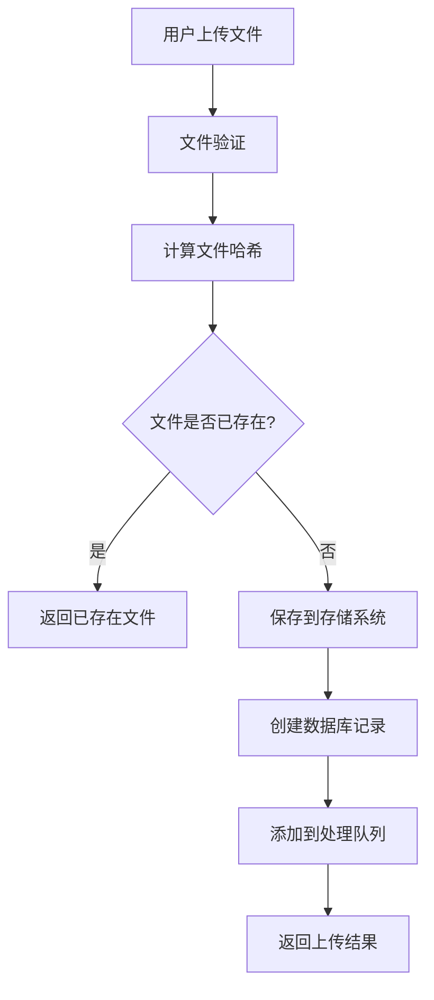
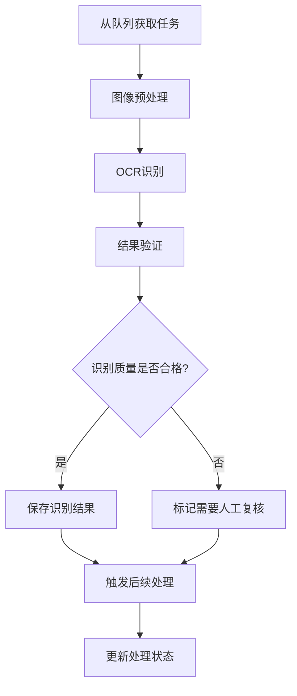

# 智阅AI存储架构设计文档

## 📋 概述

本文档详细描述了智阅AI系统中试卷和答题卡的存储架构设计，包括文件存储、数据库设计、处理流程和安全机制。

## 🏗️ 整体架构

### 存储层次结构

```
智阅AI存储系统
├── 文件存储层
│   ├── 本地存储 (开发/小规模部署)
│   ├── 对象存储 (生产环境)
│   └── CDN加速 (静态资源)
├── 数据库层
│   ├── PostgreSQL (主数据库)
│   ├── Redis (缓存/队列)
│   └── 备份存储
└── 处理层
    ├── OCR识别服务
    ├── AI分析服务
    └── 异步任务队列
```

## 📁 文件存储设计

### 目录结构

```
storage/
├── papers/                    # 试卷文件
│   ├── original/             # 原始试卷
│   │   └── 2025/01/15/      # 按日期分目录
│   ├── processed/            # 处理后的文件
│   └── thumbnails/           # 缩略图
├── answer_sheets/            # 答题卡文件
│   ├── original/             # 原始答题卡
│   ├── processed/            # 处理后的文件
│   └── thumbnails/           # 缩略图
├── temp/                     # 临时文件
└── archive/                  # 归档文件
```

### 文件命名规则

- **格式**: `{UUID}.{extension}`
- **示例**: `a1b2c3d4-e5f6-7890-abcd-ef1234567890.pdf`
- **优势**: 避免文件名冲突，支持分布式存储

### 存储策略

#### 1. 本地存储 (开发环境)
- 直接存储在服务器文件系统
- 适合开发和小规模部署
- 成本低，配置简单

#### 2. 对象存储 (生产环境)
- 支持阿里云OSS、AWS S3等
- 高可用、高扩展性
- 自动备份和容灾

#### 3. 混合存储
- 热数据存储在本地SSD
- 冷数据迁移到对象存储
- 智能分层存储

## 🗄️ 数据库设计

### 核心表结构

#### file_storage (文件存储表)
```sql
CREATE TABLE file_storage (
    id VARCHAR(36) PRIMARY KEY,
    original_filename VARCHAR(255) NOT NULL,
    stored_filename VARCHAR(255) NOT NULL,
    file_path VARCHAR(500) NOT NULL,
    file_size INTEGER NOT NULL,
    file_hash VARCHAR(64) NOT NULL,
    mime_type VARCHAR(100) NOT NULL,
    file_category VARCHAR(50) NOT NULL,  -- paper/answer_sheet
    file_purpose VARCHAR(50) NOT NULL,   -- original/processed/thumbnail
    exam_id VARCHAR(36),
    uploaded_by VARCHAR(36) NOT NULL,
    processing_status VARCHAR(20) DEFAULT 'pending',
    created_at TIMESTAMP DEFAULT NOW(),
    -- 索引
    INDEX idx_file_hash (file_hash),
    INDEX idx_exam_category (exam_id, file_category)
);
```

#### paper_documents (试卷文档表)
```sql
CREATE TABLE paper_documents (
    id VARCHAR(36) PRIMARY KEY,
    exam_id VARCHAR(36) NOT NULL,
    file_id VARCHAR(36) NOT NULL,
    paper_type VARCHAR(20) NOT NULL,     -- original/reference_answer
    ocr_status VARCHAR(20) DEFAULT 'pending',
    ocr_result JSON,
    questions_parsed JSON,
    total_questions INTEGER,
    total_points INTEGER,
    created_at TIMESTAMP DEFAULT NOW()
);
```

#### answer_sheets (答题卡表)
```sql
CREATE TABLE answer_sheets (
    id VARCHAR(36) PRIMARY KEY,
    exam_id VARCHAR(36) NOT NULL,
    file_id VARCHAR(36) NOT NULL,
    student_id VARCHAR(50),
    student_name VARCHAR(100),
    recognition_status VARCHAR(20) DEFAULT 'pending',
    extracted_answers JSON,
    quality_issues JSON,
    needs_manual_review BOOLEAN DEFAULT FALSE,
    created_at TIMESTAMP DEFAULT NOW()
);
```

## 🔄 处理流程

### 文件上传流程



### OCR处理流程



### 批量处理优化

1. **并行处理**: 多个worker同时处理不同文件
2. **优先级队列**: 重要文件优先处理
3. **断点续传**: 支持处理中断后恢复
4. **批量操作**: 数据库批量更新减少IO

## 🛡️ 安全机制

### 文件安全

1. **文件类型验证**
   - 检查文件扩展名
   - 验证MIME类型
   - 文件头部检查

2. **文件大小限制**
   - 单文件最大50MB
   - 批量上传总大小限制
   - 磁盘空间监控

3. **病毒扫描**
   - 集成ClamAV扫描
   - 可疑文件隔离
   - 定期更新病毒库

### 访问控制

1. **身份认证**
   - JWT token验证
   - 用户权限检查
   - 操作日志记录

2. **文件权限**
   - 基于考试的访问控制
   - 教师只能访问自己的考试文件
   - 管理员全局访问权限

3. **数据加密**
   - 传输加密(HTTPS)
   - 存储加密(可选)
   - 敏感信息脱敏

## 📊 性能优化

### 存储优化

1. **文件去重**
   - SHA256哈希检查
   - 相同文件只存储一份
   - 引用计数管理

2. **缓存策略**
   - 热点文件内存缓存
   - CDN加速静态资源
   - 智能预加载

3. **压缩优化**
   - 图片自动压缩
   - PDF文件优化
   - 缩略图生成

### 数据库优化

1. **索引设计**
   - 复合索引优化查询
   - 分区表处理大数据量
   - 定期索引维护

2. **查询优化**
   - 分页查询
   - 延迟加载
   - 查询结果缓存

## 🔧 运维管理

### 监控指标

1. **存储监控**
   - 磁盘使用率
   - 文件上传成功率
   - 处理队列长度

2. **性能监控**
   - 文件上传速度
   - OCR处理时间
   - 数据库响应时间

3. **错误监控**
   - 文件处理失败率
   - 系统错误日志
   - 用户操作异常

### 备份策略

1. **文件备份**
   - 每日增量备份
   - 每周全量备份
   - 异地备份存储

2. **数据库备份**
   - 实时主从复制
   - 定时备份
   - 备份数据验证

### 清理策略

1. **临时文件清理**
   - 24小时后自动清理
   - 定期扫描孤立文件
   - 磁盘空间预警

2. **历史数据归档**
   - 超过1年的数据归档
   - 冷数据迁移到低成本存储
   - 归档数据索引维护

## 🚀 扩展性设计

### 水平扩展

1. **存储扩展**
   - 支持多存储节点
   - 自动负载均衡
   - 动态扩容

2. **处理扩展**
   - 多worker节点
   - 任务分发机制
   - 弹性伸缩

### 技术演进

1. **存储技术**
   - 支持多种存储后端
   - 存储策略可配置
   - 平滑迁移方案

2. **处理技术**
   - AI模型版本管理
   - 处理算法热更新
   - A/B测试支持

## 📈 成本控制

### 存储成本

1. **分层存储**
   - 热数据高性能存储
   - 温数据标准存储
   - 冷数据归档存储

2. **压缩优化**
   - 无损压缩减少存储空间
   - 重复文件去重
   - 智能清理策略

### 计算成本

1. **资源优化**
   - 按需分配计算资源
   - 批量处理提高效率
   - 空闲时间资源回收

2. **算法优化**
   - OCR算法优化
   - 并行处理提升效率
   - 缓存减少重复计算

这套存储架构设计充分考虑了智阅AI系统的实际需求，既保证了功能的完整性，又确保了系统的可扩展性和可维护性。通过合理的分层设计和优化策略，能够为李老师等教师用户提供稳定、高效的文件存储和处理服务。