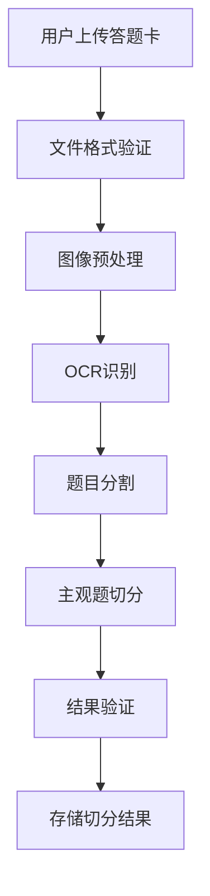

# 主观题按题号切分实现方案

## 概述

在智阅AI系统中，答题卡上传后需要对主观题进行智能切分，以便后续的AI评分。本文档详细说明了主观题按题号切分的技术实现方案。

## 整体流程

### 1. 答题卡上传阶段



### 2. 核心技术组件

#### 2.1 OCR识别服务 (`GeminiOCRService`)

**位置**: `backend/services/gemini_ocr_service.py`

**功能**:
- 使用Gemini 2.5 Pro进行多模态图像识别
- 提取学生信息和答题内容
- 识别涂卡区域和手写文本

**关键特性**:
```python
# 专门针对答题卡的提示词
prompt = """
你是一个专业的答题卡识别专家，请仔细分析这张答题卡图像：

1. 学生基本信息识别
2. 选择题涂卡识别
3. 主观题手写内容识别
4. 题目区域定位
"""
```

#### 2.2 题目分割服务 (`QuestionSegmentationService`)

**位置**: `backend/services/question_segmentation_service.py`

**核心功能**:

##### 2.2.1 题目边界识别
```python
def _identify_question_boundaries(self, text_blocks: List[Dict[str, Any]]) -> List[int]:
    """
    识别题目边界
    - 检测题目编号模式：1. 2. 3. 或 (1) (2) (3)
    - 识别题目开始关键词
    - 分析文本布局结构
    """
    boundaries = [0]
    
    for i, block in enumerate(text_blocks):
        text = block['text']
        if self._is_question_start(text):
            boundaries.append(i)
    
    return boundaries
```

##### 2.2.2 题目类型分类
```python
def _classify_single_question(self, question_text: str) -> QuestionType:
    """
    智能分类题目类型：
    - 选择题：检测选项标识 A、B、C、D
    - 填空题：检测下划线或空括号
    - 简答题：检测关键词"简述"、"说明"
    - 论述题：检测关键词"论述"、"分析"
    - 计算题：检测数学表达式
    """
```

##### 2.2.3 主观题答案提取
```python
def _extract_answer_for_question(self, segment: QuestionSegment) -> str:
    """
    针对不同题型提取学生答案：
    - 选择题：提取涂卡结果
    - 主观题：提取手写文本内容
    - 使用正则表达式匹配答案模式
    """
```

## 主观题切分详细实现

### 3.1 图像预处理

```python
async def _preprocess_image(self, image_path: str) -> str:
    """
    图像预处理步骤：
    1. 格式转换（统一为RGB）
    2. 尺寸调整（适配Gemini限制）
    3. 质量增强（锐化、对比度、去噪）
    4. Base64编码
    """
    with Image.open(image_path) as img:
        # 转换格式
        if img.mode != 'RGB':
            img = img.convert('RGB')
        
        # 调整尺寸
        max_size = 2048
        if max(img.size) > max_size:
            ratio = max_size / max(img.size)
            new_size = tuple(int(dim * ratio) for dim in img.size)
            img = img.resize(new_size, Image.Resampling.LANCZOS)
        
        # 质量增强
        img = self._enhance_image_quality(img)
        
        return base64.b64encode(buffer.getvalue()).decode('utf-8')
```

### 3.2 智能题目分割算法

#### 3.2.1 文本块提取
```python
def _extract_text_blocks(self, ocr_result: Dict[str, Any]) -> List[Dict[str, Any]]:
    """
    从OCR结果提取结构化文本块：
    - 解析Gemini返回的文本区域
    - 计算每个文本块的位置坐标
    - 评估识别置信度
    """
```

#### 3.2.2 题目边界检测
```python
# 题目编号识别模式
question_patterns = {
    'question_number': [
        r'(\d+)[.．、]',      # 1. 2. 3.
        r'[(（](\d+)[)）]',    # (1) (2) (3)
        r'第(\d+)题',         # 第1题
        r'(\d+)\s*[、.]',     # 1、 2、
    ]
}
```

#### 3.2.3 区域坐标计算
```python
def _calculate_region(self, blocks: List[Dict[str, Any]]) -> QuestionRegion:
    """
    计算题目在图像中的精确位置：
    - 计算包围盒坐标
    - 合并相邻文本块
    - 评估区域置信度
    """
    min_x = min(block['bbox'][0] for block in blocks)
    min_y = min(block['bbox'][1] for block in blocks)
    max_x = max(block['bbox'][2] for block in blocks)
    max_y = max(block['bbox'][3] for block in blocks)
    
    return QuestionRegion(
        x=int(min_x),
        y=int(min_y),
        width=int(max_x - min_x),
        height=int(max_y - min_y),
        confidence=avg_confidence
    )
```

### 3.3 主观题特殊处理

#### 3.3.1 手写文本识别
```python
# Gemini专用提示词（针对主观题）
subjective_prompt = """
对于主观题区域，请特别注意：
1. 识别手写文字内容
2. 保持原有的段落结构
3. 识别图表、公式等特殊内容
4. 评估书写清晰度
5. 标注难以识别的字符
"""
```

#### 3.3.2 答案区域定位
```python
def _extract_subjective_answer_region(self, question_segment: QuestionSegment) -> Dict[str, Any]:
    """
    定位主观题答案区域：
    1. 识别题目结束位置
    2. 查找答题区域标识（如答题框、横线等）
    3. 计算答案区域边界
    4. 提取该区域的手写内容
    """
```

## API接口设计

### 4.1 OCR处理接口

**端点**: `POST /api/ocr/process`

```python
@router.post("/process", response_model=OCRResult)
async def process_single_answer_sheet(
    answer_sheet_id: str,
    current_user: User = Depends(get_current_user),
    db: Session = Depends(get_db)
):
    """
    处理单个答题卡的OCR识别和题目切分
    
    返回结果包含：
    - 学生信息
    - 客观题答案
    - 主观题切分结果
    - 质量评估
    """
```

### 4.2 批量处理接口

**端点**: `POST /api/ocr/batch-process`

```python
@router.post("/batch-process")
async def start_batch_ocr_processing(
    request: OCRRequest,
    background_tasks: BackgroundTasks
):
    """
    启动批量OCR处理任务
    支持并发处理多份答题卡
    实时更新处理进度
    """
```

## 前端集成

### 5.1 答题卡上传组件

**位置**: `src/components/workspaces/AnswerSheetUploadWorkspace.tsx`

```typescript
// 批量上传处理
const handleBatchUpload = async () => {
  setUploading(true);
  
  try {
    // 1. 上传文件
    const uploadResults = await uploadAnswerSheets(fileList);
    
    // 2. 启动OCR处理
    const ocrTask = await startBatchOCR(uploadResults.map(r => r.id));
    
    // 3. 监控处理进度
    const progressInterval = setInterval(async () => {
      const status = await getTaskStatus(ocrTask.task_id);
      updateProgress(status);
      
      if (status.status === 'completed') {
        clearInterval(progressInterval);
        loadProcessedResults(ocrTask.task_id);
      }
    }, 1000);
    
  } catch (error) {
    message.error('处理失败');
  }
};
```

### 5.2 切分结果展示

```typescript
// 显示切分后的题目
const renderSegmentedQuestions = (sheet: ProcessedAnswerSheet) => {
  return (
    <div className="segmented-questions">
      {sheet.segmentedQuestions?.map(question => (
        <Card key={question.number} size="small">
          <div className="question-header">
            <Tag color="blue">第{question.number}题</Tag>
            <Tag color={getTypeColor(question.type)}>
              {getTypeName(question.type)}
            </Tag>
            <span className="points">{question.points}分</span>
          </div>
          
          <div className="question-content">
            {question.type === 'subjective' ? (
              <div className="subjective-answer">
                <p className="answer-text">{question.studentAnswer}</p>
                <div className="answer-region">
                  
                </div>
              </div>
            ) : (
              <Tag color="green">{question.studentAnswer}</Tag>
            )}
          </div>
        </Card>
      ))}
    </div>
  );
};
```

## 质量保证

### 6.1 切分质量验证

```python
def validate_segmentation(self, segments: List[QuestionSegment]) -> Dict[str, Any]:
    """
    验证切分结果质量：
    1. 检查题目完整性
    2. 验证题号连续性
    3. 评估识别置信度
    4. 统计题型分布
    5. 检测异常情况
    """
    validation_result = {
        'total_questions': len(segments),
        'valid_questions': 0,
        'issues': [],
        'confidence_scores': [],
        'type_distribution': {},
        'quality_level': 'excellent'  # excellent/good/fair/poor
    }
```

### 6.2 错误处理机制

```python
# 常见问题及处理策略
error_handling_strategies = {
    'low_confidence': '降低识别阈值，人工复核',
    'missing_questions': '重新分析图像，调整分割参数',
    'unclear_handwriting': '标记为需要人工评分',
    'image_quality_poor': '建议重新扫描上传',
    'format_not_standard': '使用通用OCR模式处理'
}
```

## 性能优化

### 7.1 并发处理

```python
# 批量处理优化
batch_size = settings.OCR_BATCH_SIZE  # 默认5
executor = ThreadPoolExecutor(max_workers=batch_size)

# 分批并发处理
for i in range(0, len(answer_sheet_ids), batch_size):
    batch_ids = answer_sheet_ids[i:i + batch_size]
    tasks = [process_single_sheet_internal(sheet_id, db) for sheet_id in batch_ids]
    batch_results = await asyncio.gather(*tasks, return_exceptions=True)
```

### 7.2 缓存策略

```python
# 结果缓存
task_cache = {}  # 生产环境使用Redis

# 图像预处理缓存
image_cache = LRUCache(maxsize=100)

# OCR结果缓存
ocr_result_cache = TTLCache(maxsize=1000, ttl=3600)
```

## 配置参数

### 8.1 系统配置

```python
# settings.py
class Settings:
    # Gemini配置
    GEMINI_API_KEY: str
    GEMINI_MODEL: str = "gemini-2.5-pro"
    GEMINI_MAX_TOKENS: int = 8192
    
    # OCR配置
    OCR_BATCH_SIZE: int = 5
    OCR_CONFIDENCE_THRESHOLD: float = 0.7
    OCR_MAX_RETRIES: int = 3
    
    # 图像处理配置
    IMAGE_MAX_SIZE: int = 2048
    IMAGE_QUALITY: int = 95
    
    # 切分配置
    SEGMENTATION_MIN_CONFIDENCE: float = 0.6
    QUESTION_NUMBER_PATTERNS: List[str] = [
        r'(\d+)[.．、]',
        r'[(（](\d+)[)）]',
        r'第(\d+)题'
    ]
```

## 使用示例

### 9.1 完整处理流程

```python
# 1. 初始化服务
ocr_service = GeminiOCRService()
segmentation_service = QuestionSegmentationService()

# 2. 处理答题卡
image_path = "answer_sheet.jpg"
ocr_result = await ocr_service.process_answer_sheet(image_path)

# 3. 题目切分
segments = segmentation_service.segment_questions(ocr_result)

# 4. 质量验证
validation = segmentation_service.validate_segmentation(segments)

# 5. 导出结果
final_result = segmentation_service.export_segmentation_result(segments)
```

### 9.2 前端调用示例

```typescript
// 上传并处理答题卡
const processAnswerSheet = async (file: File) => {
  try {
    // 1. 上传文件
    const uploadResult = await uploadFile(file);
    
    // 2. 启动OCR处理
    const ocrResult = await api.post('/api/ocr/process', {
      answer_sheet_id: uploadResult.id
    });
    
    // 3. 获取切分结果
    if (ocrResult.status === 'completed') {
      const segments = ocrResult.segmented_questions;
      displaySegmentedQuestions(segments);
    }
    
  } catch (error) {
    message.error('处理失败：' + error.message);
  }
};
```

## 总结

智阅AI的主观题按题号切分功能通过以下技术实现：

1. **多模态AI识别**：使用Gemini 2.5 Pro进行图像理解和文本提取
2. **智能分割算法**：基于题目编号模式和文本结构进行自动分割
3. **类型智能分类**：根据题目内容和格式自动识别题目类型
4. **区域精确定位**：计算每道题在图像中的精确坐标位置
5. **质量保证机制**：多层验证确保切分结果的准确性
6. **并发处理优化**：支持批量处理提高效率

该方案能够有效处理各种格式的答题卡，准确识别和切分主观题，为后续的AI智能评分提供可靠的数据基础。