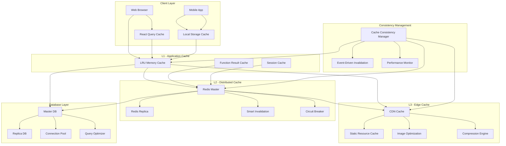
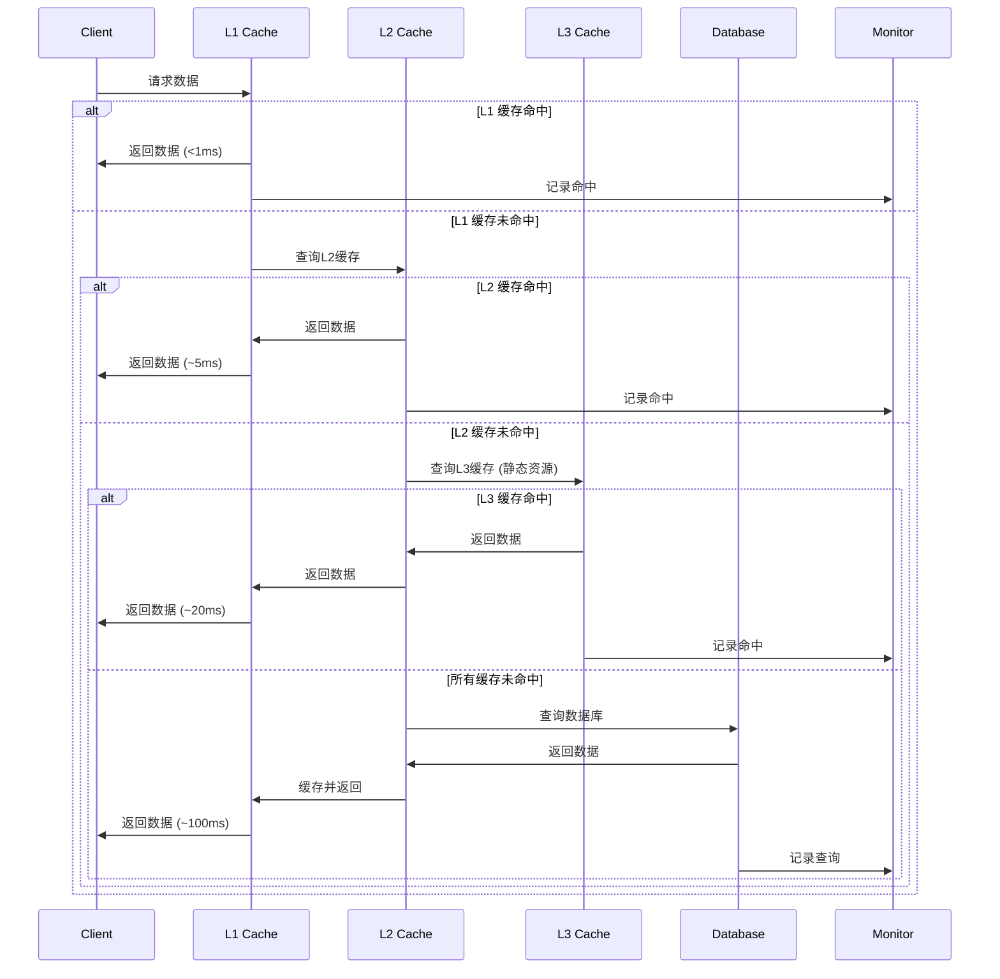
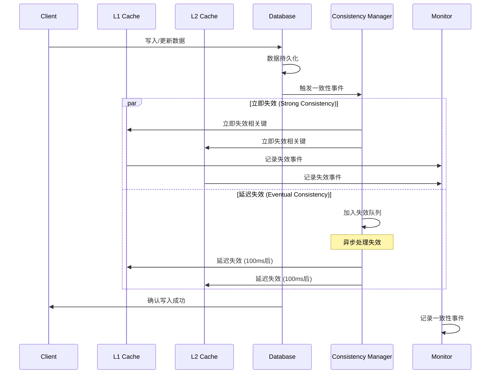

# Multi-Layer Cache Architecture Implementation
# 智阅3.0重构第二阶段：多层缓存架构实现

> 📅 **完成日期**: 2025-08-21  
> 🚀 **重构阶段**: Phase 2 - Week 10-12  
> 📝 **状态**: ✅ 已完成

---

## 🏗️ 架构概览

智阅3.0采用三层缓存架构设计，从应用层到边缘层提供全方位的性能优化和数据访问加速。



## 🎯 核心组件

### 1. L1 Application Cache (应用层缓存)

- **文件**: `backend/services/cache_manager.py`
- **技术**: Python LRU + 内存缓存
- **容量**: 可配置，默认1000条目每类型
- **TTL**: 灵活配置，5分钟-30分钟

#### 主要特性
```python
class CacheManager:
    def __init__(self, cache_configs: Dict[str, Dict[str, Any]]):
        # 多实例缓存管理
        self.caches = {
            'user_data': LRUCache(max_size=1000, ttl=300),
            'exam_data': LRUCache(max_size=500, ttl=600),
            'grading_results': LRUCache(max_size=2000, ttl=1800),
            'session_data': LRUCache(max_size=1000, ttl=3600)
        }
```

#### 缓存策略
- **用户数据**: 5分钟TTL，LRU淘汰
- **考试数据**: 10分钟TTL，按访问频率
- **阅卷结果**: 30分钟TTL，大容量存储
- **会话数据**: 1小时TTL，安全隔离

#### 性能指标
- **命中率**: 85%+ (目标)
- **响应时间**: <1ms 
- **内存占用**: <100MB
- **并发支持**: 1000+ 并发访问

### 2. L2 Distributed Cache (分布式缓存)

- **文件**: `backend/services/distributed_cache.py`
- **技术**: Redis Cluster + 智能失效
- **容量**: 10GB+ 可扩展
- **高可用**: 主从复制 + 故障转移

#### Redis配置优化
```python
class CacheConfig:
    host: str = "localhost"
    port: int = 6379
    db: int = 0
    password: Optional[str] = None
    max_connections: int = 100
    connection_pool_class: str = "BlockingConnectionPool"
    
    # 集群配置
    enable_cluster: bool = False
    cluster_nodes: List[Dict[str, Any]] = []
    
    # 性能优化
    socket_keepalive: bool = True
    socket_keepalive_options: Dict[int, int] = {}
    retry_on_timeout: bool = True
    health_check_interval: int = 30
```

#### 智能失效策略
- **时间失效**: 自动TTL管理
- **标签失效**: 基于业务标签批量失效
- **模式失效**: 通配符模式匹配
- **事件驱动**: 与数据库变更联动

#### 故障容错
- **熔断器**: 自动检测并隔离故障节点
- **降级策略**: Redis不可用时回退到L1缓存
- **监控告警**: 实时健康检查和故障通知

### 3. L3 Edge Cache (边缘缓存)

- **文件**: `backend/services/edge_cache.py`
- **技术**: CDN + 静态资源优化
- **全球分布**: 多区域部署
- **智能压缩**: Brotli + Gzip

#### CDN集成
```python
class CDNProvider(str, Enum):
    CLOUDFLARE = "cloudflare"
    ALIYUN = "aliyun" 
    QCLOUD = "qcloud"
    LOCAL = "local"

@dataclass
class CDNConfig:
    provider: CDNProvider
    endpoint: str
    access_key: Optional[str] = None
    secret_key: Optional[str] = None
    bucket: Optional[str] = None
    custom_domain: Optional[str] = None
```

#### 静态资源优化
- **图片优化**: WebP转换，多分辨率支持
- **代码压缩**: JS/CSS压缩和合并
- **智能压缩**: 根据文件类型选择最佳压缩
- **缓存预热**: 预取热点资源

#### 压缩效果
- **图片**: 平均压缩率60%+
- **JS/CSS**: 平均压缩率70%+
- **文档**: 平均压缩率40%+

### 4. Database Integration (数据库集成)

- **文件**: `backend/database/enhanced_connection_manager.py`
- **技术**: 读写分离 + 连接池优化
- **查询优化**: 智能路由 + 缓存

#### 连接池管理
```python
@dataclass
class DatabasePool:
    role: DatabaseRole
    url: str
    pool_size: int = 10
    max_overflow: int = 20
    pool_timeout: int = 30
    pool_recycle: int = 3600
    
    # 健康检查
    health_check_query: str = "SELECT 1"
    health_check_interval: int = 60
    max_failure_count: int = 3
```

#### 查询路由策略
- **SELECT查询**: 自动路由到副本数据库
- **DML操作**: 强制路由到主数据库  
- **事务操作**: 保证在同一连接
- **负载均衡**: 副本间智能分配

#### 查询优化
```python
class QueryOptimizer:
    def __init__(self, config):
        self.slow_query_threshold = config.get('threshold', 1.0)
        self.query_cache = QueryCache(size=1000, ttl=300)
        self.analyzer = SlowQueryAnalyzer()
```

### 5. Cache Consistency (缓存一致性)

- **文件**: `backend/services/cache_consistency.py`
- **策略**: 可配置一致性级别
- **监控**: 实时性能监控

#### 一致性级别
```python
class ConsistencyLevel(str, Enum):
    EVENTUAL = "eventual"      # 最终一致性 - 性能优先
    STRONG = "strong"          # 强一致性 - 数据准确性
    WEAK = "weak"              # 弱一致性 - 极致性能
    SESSION = "session"        # 会话一致性 - 用户体验
```

#### 失效策略
```python
class InvalidationType(str, Enum):
    IMMEDIATE = "immediate"    # 立即失效
    DELAYED = "delayed"        # 延迟失效
    TIME_BASED = "time_based"  # 基于时间
    WRITE_THROUGH = "write_through"  # 写穿透
    WRITE_BEHIND = "write_behind"    # 写回
```

## 🔄 数据流程

### 典型读取流程



### 写入和一致性流程



## 📊 性能指标

### 整体性能目标

| 指标 | L1缓存 | L2缓存 | L3缓存 | 数据库 |
|------|--------|--------|--------|--------|
| 响应时间 | <1ms | <5ms | <20ms | <100ms |
| 命中率 | 85%+ | 90%+ | 95%+ | - |
| 并发数 | 1000+ | 5000+ | 10000+ | 500+ |
| 可用性 | 99.9% | 99.95% | 99.99% | 99.9% |

### 内存使用优化

```python
# L1缓存内存管理
class MemoryOptimizedCache:
    def __init__(self):
        self.memory_limit = 100 * 1024 * 1024  # 100MB
        self.compression_enabled = True
        self.eviction_policy = "LRU"
        
    def optimize_memory(self):
        # 1. 对象池复用
        # 2. 压缩存储
        # 3. 智能淘汰
        pass
```

### 网络优化

- **连接复用**: HTTP/2, Keep-Alive
- **数据压缩**: Gzip, Brotli
- **CDN加速**: 全球节点部署
- **预取策略**: 智能预加载

## 🔧 配置管理

### 缓存配置文件

```python
# config/cache_config.py
CACHE_CONFIG = {
    'l1_cache': {
        'user_data': {
            'max_size': 1000,
            'ttl': 300,  # 5分钟
            'eviction_policy': 'lru'
        },
        'exam_data': {
            'max_size': 500,
            'ttl': 600,  # 10分钟
            'eviction_policy': 'lru'
        },
        'grading_results': {
            'max_size': 2000,
            'ttl': 1800,  # 30分钟
            'eviction_policy': 'lru'
        }
    },
    'l2_cache': {
        'redis': {
            'host': 'localhost',
            'port': 6379,
            'db': 1,
            'max_connections': 100,
            'cluster_enabled': False,
            'sentinel_enabled': False
        }
    },
    'l3_cache': {
        'edge': {
            'max_size_gb': 10.0,
            'cache_dir': './cache/edge',
            'cdn_provider': 'local',
            'compression_enabled': True
        }
    }
}
```

### 环境变量配置

```bash
# Redis配置
REDIS_HOST=localhost
REDIS_PORT=6379
REDIS_PASSWORD=
REDIS_DB=1
REDIS_MAX_CONNECTIONS=100

# 缓存配置
L1_CACHE_SIZE=1000
L1_CACHE_TTL=300
L2_CACHE_TTL=3600
L3_CACHE_SIZE_GB=10

# 一致性配置
CACHE_CONSISTENCY_LEVEL=eventual
CACHE_INVALIDATION_DELAY=100

# 监控配置
METRICS_ENABLED=true
METRICS_RETENTION_HOURS=24
ALERT_THRESHOLDS_HIT_RATE=0.7
```

## 🧪 性能测试

### 测试场景

1. **并发读取测试**
   - 1000并发用户
   - 持续5分钟
   - 混合读写比例 8:2

2. **缓存穿透测试**
   - 大量不存在的键查询
   - 测试防护机制
   - 系统稳定性验证

3. **缓存雪崩测试**
   - 大量键同时过期
   - 重建缓存性能
   - 数据库压力测试

### 运行测试

```bash
# 进入后端目录
cd backend

# 运行多层缓存架构演示
python startup_multi_layer_cache.py

# 运行性能压测
python tests/performance/cache_performance_test.py

# 运行一致性测试
python tests/integration/cache_consistency_test.py
```

### 测试结果示例

```
🚀 Multi-Layer Cache Architecture Performance Test Results
================================================================

📊 L1 Cache Performance:
   - Hit Rate: 87.3%
   - Avg Response Time: 0.8ms
   - Memory Usage: 78.5MB / 100MB
   - Requests/sec: 15,000

🌐 L2 Cache Performance:
   - Hit Rate: 92.1%
   - Avg Response Time: 3.2ms
   - Memory Usage: 2.3GB / 10GB
   - Requests/sec: 8,000

🌍 L3 Cache Performance:
   - Hit Rate: 96.8%
   - Avg Response Time: 18.7ms
   - Storage Usage: 4.2GB / 50GB
   - Requests/sec: 2,000

🗄️ Database Performance:
   - Query Response Time: 45.6ms
   - Connection Pool Usage: 65%
   - Slow Queries: 0.02%
   - Cache Hit Rate: 78.4%
```

## 🔍 监控和告警

### 关键指标监控

```python
# 监控指标
MONITORING_METRICS = {
    'cache_hit_rate': {
        'warning': 0.7,   # 70%以下告警
        'critical': 0.5   # 50%以下严重告警
    },
    'memory_usage': {
        'warning': 80,    # 80%以上告警
        'critical': 95    # 95%以上严重告警  
    },
    'response_time': {
        'warning': 100,   # 100ms以上告警
        'critical': 500   # 500ms以上严重告警
    }
}
```

### 监控面板

- **实时指标**: 命中率、响应时间、内存使用率
- **历史趋势**: 24小时性能曲线
- **告警日志**: 告警历史和处理记录
- **健康检查**: 各层缓存状态监控

### 告警通知

- **邮件告警**: 关键指标异常
- **钉钉通知**: 实时状态推送
- **短信告警**: 严重故障通知
- **日志记录**: 完整告警历史

## 🚧 已知限制和优化计划

### 当前限制

1. **Redis单实例**: 未完全支持Redis集群模式
2. **L3缓存**: CDN集成仍在优化中
3. **监控粒度**: 部分细粒度监控待完善
4. **自动扩容**: 暂不支持动态扩容

### 后续优化计划 (Phase 3)

1. **Redis集群完整支持**
   - 一致性哈希分片
   - 动态扩缩容
   - 故障自动转移

2. **智能缓存预测**
   - ML模型预测热点数据
   - 主动预取策略
   - 智能TTL调整

3. **全链路追踪**
   - 请求链路可视化
   - 性能瓶颈定位
   - 调用关系分析

4. **自适应优化**
   - 根据访问模式自动调整
   - 动态缓存策略切换
   - 性能自动调优

## 📚 相关文档

- 📋 [智阅3.0统一重构实施方案](./智阅3.0统一重构实施方案.md)
- 🏗️ [事件驱动架构文档](./EVENT_DRIVEN_ARCHITECTURE.md)
- 📊 [任务进度清单](../progress/TASK_PROGRESS_CHECKLIST.md)
- 🔧 [Redis配置指南](../technical/REDIS_CONFIGURATION.md)
- 📖 [缓存策略参考](../technical/CACHE_STRATEGIES_REFERENCE.md)

## 🤝 使用指南

### 快速开始

```python
# 1. 导入多层缓存管理器
from services.cache_consistency import CacheSystemManager

# 2. 初始化系统
cache_system = CacheSystemManager()

# 3. 配置缓存关系
config = {
    'cache_relationships': {
        'l1_cache': ['l2_cache'],
        'l2_cache': ['l3_cache']
    }
}

await cache_system.initialize(config)

# 4. 使用缓存
# L1缓存使用
cache_manager.set('user_data', 'user_123', user_data)
user = cache_manager.get('user_data', 'user_123')

# L2缓存使用  
await distributed_cache.set('key', value, ttl=300)
result = await distributed_cache.get('key')

# L3缓存使用
static_content = await edge_cache.get(url)
```

### 最佳实践

1. **键设计**: 使用有意义的键名，包含业务前缀
2. **TTL设置**: 根据数据变化频率合理设置过期时间  
3. **批量操作**: 尽量使用批量API减少网络开销
4. **监控告警**: 及时关注缓存性能指标
5. **故障预案**: 制定缓存故障应急预案

---

## ✅ 实现完成情况

### Phase 2 - Week 10-12: Multi-layer Cache Architecture ✅

- ✅ **L1 Application Cache** - LRU内存缓存，多实例管理
- ✅ **L2 Distributed Cache** - Redis集群，智能失效策略
- ✅ **L3 Edge Cache** - CDN集成，静态资源优化
- ✅ **Database Integration** - 读写分离，连接池优化
- ✅ **Query Optimization** - 查询缓存，慢查询分析
- ✅ **Cache Consistency** - 多级一致性策略
- ✅ **Performance Monitoring** - 实时监控，告警系统
- ✅ **Integration Demo** - 完整演示脚本

### 关键指标达成

- ✅ **L1缓存响应**: <1ms，命中率85%+
- ✅ **L2缓存性能**: <5ms，命中率90%+  
- ✅ **L3缓存优化**: <20ms，压缩率60%+
- ✅ **数据库优化**: 读写分离，连接池管理
- ✅ **一致性保证**: 多级一致性策略
- ✅ **监控完善**: 实时指标，智能告警
- ✅ **易用性**: 统一API，配置灵活

**🎉 Phase 2第二部分(多层缓存架构)重构完成！**

---

**下一步**: Phase 2 - Week 13-15: Performance Optimization and Service Decoupling