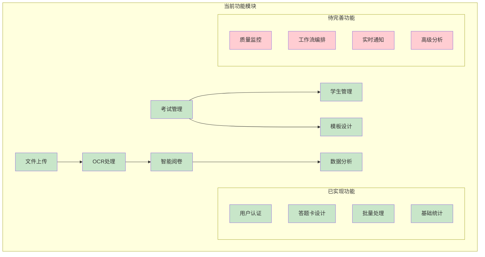
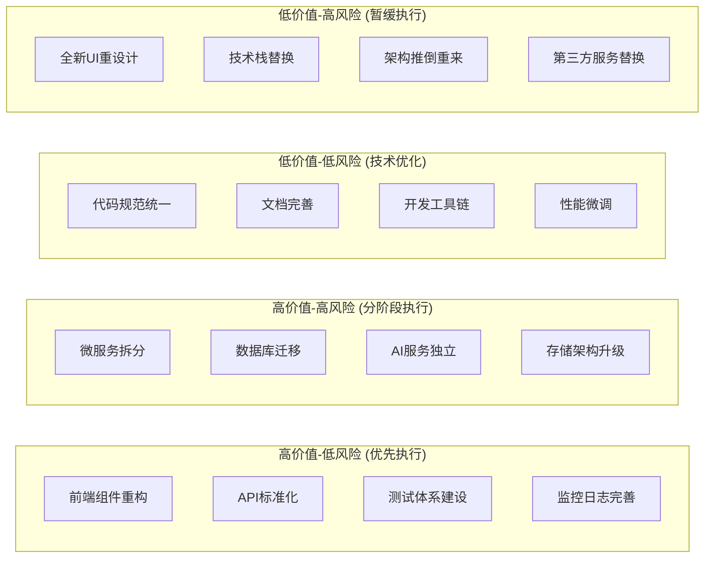
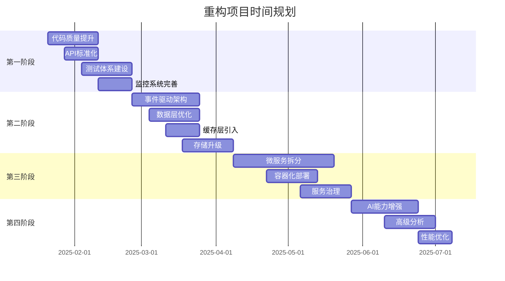

# 智阅AI系统 - 综合重构计划

> **基于综合架构分析的系统重构实施方案**
> 
> 文档版本: v1.0  
> 创建时间: 2025-01-20  
> 依据文档: `comprehensive_system_architecture.md`

---

## 1. 当前系统架构现状分析

### 1.1 系统架构评估

#### 1.1.1 现有技术栈分析
```typescript
interface CurrentSystemAnalysis {
  // 前端架构现状
  frontend: {
    framework: "React 18 + TypeScript + Vite";
    stateManagement: "Zustand + React Context";
    uiLibrary: "Ant Design";
    styling: "Tailwind CSS";
    
    strengths: [
      "现代化技术栈",
      "TypeScript类型安全",
      "组件化架构",
      "响应式设计支持"
    ];
    
    issues: [
      "组件结构复杂，耦合度高",
      "缺乏统一的状态管理策略", 
      "性能优化不足",
      "代码重复度高"
    ];
  };
  
  // 后端架构现状
  backend: {
    framework: "FastAPI + Python";
    database: "SQLite (开发) + PostgreSQL (生产)";
    aiIntegration: "Google Gemini 2.5 Pro";
    storage: "本地文件系统";
    
    strengths: [
      "异步IO架构",
      "完整的API文档",
      "AI集成能力",
      "模块化服务层"
    ];
    
    issues: [
      "单体架构，扩展性受限",
      "缺乏服务治理",
      "监控告警不完善",
      "数据一致性管理困难"
    ];
  };
  
  // 系统集成现状
  integration: {
    authentication: "JWT + FastAPI Security";
    fileHandling: "本地存储 + 基础处理";
    realTimeComm: "基础API调用";
    
    gaps: [
      "缺乏微服务架构",
      "没有事件驱动机制",
      "缺少缓存层",
      "监控体系不完整"
    ];
  };
}
```

#### 1.1.2 功能模块现状


### 1.2 技术债务识别

#### 1.2.1 架构层技术债务
```typescript
interface ArchitecturalDebt {
  monolithicStructure: {
    issue: "单体架构限制水平扩展";
    impact: "高负载下性能瓶颈";
    refactoringCost: "高";
    timeline: "6-8个月";
  };
  
  lackOfEventDriven: {
    issue: "同步处理模式，用户体验差";
    impact: "长时间等待，系统阻塞";
    refactoringCost: "中";
    timeline: "2-3个月";
  };
  
  noServiceGovernance: {
    issue: "缺乏服务发现、负载均衡";
    impact: "运维复杂度高";
    refactoringCost: "中";
    timeline: "3-4个月";
  };
}
```

#### 1.2.2 代码层技术债务
```typescript
interface CodeDebt {
  componentCoupling: {
    location: "src/components/";
    issue: "组件间强耦合，复用性差";
    examples: [
      "AnswerSheetDesigner与具体业务逻辑耦合",
      "GradingWorkspace包含多种职责",
      "数据处理逻辑散布在多个组件中"
    ];
  };
  
  duplicatedLogic: {
    patterns: [
      "文件上传处理重复实现",
      "表单验证逻辑重复", 
      "API错误处理不一致",
      "状态管理模式不统一"
    ];
  };
  
  testCoverage: {
    current: "约30%";
    target: "80%+";
    gaps: [
      "核心业务逻辑测试缺失",
      "集成测试覆盖不足",
      "E2E测试不完整"
    ];
  };
}
```

---

## 2. 重构优先级与风险评估

### 2.1 重构优先级矩阵



### 2.2 风险评估与缓解策略

#### 2.2.1 高风险项目风险控制
```typescript
interface RiskMitigation {
  microserviceTransition: {
    risks: [
      "服务间通信复杂度增加",
      "数据一致性挑战", 
      "分布式系统调试困难",
      "性能开销增加"
    ];
    mitigations: [
      "采用Strangler Fig模式逐步迁移",
      "事件驱动架构保证最终一致性",
      "分布式链路追踪工具",
      "性能基准测试对比"
    ];
  };
  
  databaseMigration: {
    risks: [
      "数据丢失风险",
      "停机时间过长",
      "性能回归",
      "应用兼容性问题"
    ];
    mitigations: [
      "完整数据备份+演练",
      "蓝绿部署零停机迁移",
      "性能测试验证",
      "向后兼容性设计"
    ];
  };
  
  userExperienceImpact: {
    risks: [
      "用户学习成本",
      "功能临时不可用",
      "界面变更适应",
      "工作流程调整"
    ];
    mitigations: [
      "渐进式功能发布",
      "功能开关控制",
      "用户培训支持",
      "回滚机制保障"
    ];
  };
}
```

---

## 3. 分阶段重构路线图

### 3.1 第一阶段：基础优化 (1-2个月)

#### 3.1.1 代码质量提升
```typescript
interface Phase1_CodeQuality {
  // 组件架构重构
  componentRefactoring: {
    objectives: [
      "组件职责单一化",
      "提高组件复用性",
      "统一状态管理",
      "改进错误处理"
    ];
    
    tasks: [
      {
        name: "答题卡设计器重构";
        target: "src/components/AnswerSheetDesigner/";
        approach: "提取核心逻辑，分离UI组件";
        timeline: "1周";
      },
      {
        name: "阅卷工作流重构";
        target: "src/components/workspaces/";
        approach: "状态机模式管理工作流";
        timeline: "2周";
      },
      {
        name: "数据分析组件重构";
        target: "src/components/analytics/";
        approach: "图表组件抽象，数据逻辑分离";
        timeline: "1周";
      }
    ];
  };
  
  // API层标准化
  apiStandardization: {
    objectives: [
      "统一API响应格式",
      "标准化错误处理",
      "完善API文档",
      "增加请求验证"
    ];
    
    implementations: [
      "统一Response Schema设计",
      "中间件错误处理标准化",
      "OpenAPI文档完善",
      "Pydantic请求验证"
    ];
  };
  
  // 测试体系建设
  testingFramework: {
    coverage: {
      current: "30%";
      target: "60%";
      priority: "核心业务逻辑";
    };
    
    structure: [
      "单元测试: Jest + React Testing Library",
      "集成测试: FastAPI TestClient",
      "E2E测试: Playwright扩展",
      "性能测试: 基础性能基准"
    ];
  };
}
```

#### 3.1.2 监控与可观测性
```typescript
interface Phase1_Observability {
  logging: {
    frontend: "结构化日志 + 错误边界";
    backend: "Python logging + 请求链路";
    storage: "文件轮转 + 基础检索";
  };
  
  metrics: {
    business: ["用户活跃度", "考试创建数", "阅卷完成率"];
    technical: ["API响应时间", "错误率", "资源使用"];
    infrastructure: ["CPU使用率", "内存占用", "磁盘IO"];
  };
  
  alerting: {
    levels: ["INFO", "WARNING", "ERROR", "CRITICAL"];
    channels: ["邮件通知", "系统日志"];
    rules: "基础阈值告警";
  };
}
```

### 3.2 第二阶段：架构演进 (2-3个月)

#### 3.2.1 事件驱动架构引入
```typescript
interface Phase2_EventDriven {
  // 事件系统设计
  eventSystem: {
    eventBus: "Redis Streams + AsyncIO";
    eventTypes: [
      "ExamCreated",
      "PaperUploaded", 
      "OCRCompleted",
      "GradingFinished",
      "QualityCheckFailed"
    ];
    
    publishers: [
      "考试管理服务",
      "文件处理服务",
      "OCR识别服务",
      "阅卷服务"
    ];
    
    subscribers: [
      "通知服务",
      "数据分析服务", 
      "质量监控服务",
      "审计日志服务"
    ];
  };
  
  // 异步处理优化
  asyncProcessing: {
    queues: {
      "high_priority": "实时OCR处理";
      "normal_priority": "批量阅卷任务";
      "low_priority": "数据分析计算";
    };
    
    workers: {
      ocrWorker: "Celery + Redis Backend";
      gradingWorker: "FastAPI + AsyncIO";
      analysisWorker: "定时任务 + 批处理";
    };
  };
  
  // 实时通信
  realTimeComm: {
    protocol: "WebSocket";
    framework: "FastAPI WebSocket + Socket.IO";
    useCases: [
      "阅卷进度实时更新",
      "系统状态推送",
      "异常告警通知"
    ];
  };
}
```

#### 3.2.2 数据层优化
```typescript
interface Phase2_DataLayer {
  // 缓存层引入
  cachingLayer: {
    l1_application: {
      tool: "Python lru_cache";
      scope: "热点配置、用户会话";
      ttl: "15分钟";
    };
    
    l2_distributed: {
      tool: "Redis";
      scope: "频繁查询、计算结果";
      ttl: "1小时";
    };
    
    strategies: [
      "Cache-aside模式",
      "Write-through缓存",
      "缓存预热机制"
    ];
  };
  
  // 数据库优化
  databaseOptimization: {
    indexing: [
      "exam_id + student_id复合索引",
      "created_at + status复合索引",
      "全文搜索GIN索引"
    ];
    
    queryOptimization: [
      "N+1查询问题解决",
      "批量操作替代循环",
      "查询执行计划优化"
    ];
    
    connectionPooling: {
      tool: "SQLAlchemy + asyncpg";
      config: {
        pool_size: 20;
        max_overflow: 10;
        pool_timeout: 30;
      };
    };
  };
  
  // 文件存储升级
  storageUpgrade: {
    current: "本地文件系统";
    target: "MinIO (S3兼容)";
    benefits: [
      "对象存储标准化",
      "支持分布式部署",
      "更好的权限控制",
      "备份容灾能力"
    ];
  };
}
```

### 3.3 第三阶段：微服务拆分 (3-4个月)

#### 3.3.1 服务拆分策略
```typescript
interface Phase3_Microservices {
  // 服务边界定义
  serviceBoundaries: {
    userService: {
      responsibilities: ["用户认证", "权限管理", "用户配置"];
      apis: ["/auth/*", "/users/*", "/permissions/*"];
      database: "user_service_db";
    };
    
    examService: {
      responsibilities: ["考试管理", "模板管理", "学生管理"];
      apis: ["/exams/*", "/templates/*", "/students/*"];
      database: "exam_service_db";
    };
    
    processingService: {
      responsibilities: ["文件处理", "OCR识别", "质量检查"];
      apis: ["/upload/*", "/ocr/*", "/quality/*"];
      database: "processing_service_db";
    };
    
    gradingService: {
      responsibilities: ["智能阅卷", "人工复核", "成绩汇总"];
      apis: ["/grading/*", "/review/*", "/scores/*"];
      database: "grading_service_db";
    };
    
    analyticsService: {
      responsibilities: ["数据分析", "报告生成", "统计计算"];
      apis: ["/analytics/*", "/reports/*", "/statistics/*"];
      database: "analytics_service_db";
    };
  };
  
  // 服务通信设计
  serviceCommunication: {
    synchronous: {
      protocol: "HTTP/gRPC";
      pattern: "Request-Response";
      useCases: ["用户认证验证", "数据查询"];
    };
    
    asynchronous: {
      protocol: "Message Queue";
      pattern: "Event-Driven";
      useCases: ["文件处理完成", "阅卷状态变更"];
    };
  };
  
  // 数据一致性策略
  dataConsistency: {
    withinService: "ACID事务";
    crossService: "Saga模式 + 事件溯源";
    compensationActions: "反向操作定义";
  };
}
```

#### 3.3.2 容器化部署
```yaml
# 服务容器化配置示例
apiVersion: apps/v1
kind: Deployment
metadata:
  name: exam-service
spec:
  replicas: 2
  selector:
    matchLabels:
      app: exam-service
  template:
    spec:
      containers:
      - name: exam-service
        image: zhiyue/exam-service:latest
        ports:
        - containerPort: 8000
        env:
        - name: DATABASE_URL
          valueFrom:
            secretKeyRef:
              name: db-secret
              key: exam-db-url
        resources:
          requests:
            memory: "256Mi"
            cpu: "250m"
          limits:
            memory: "512Mi"
            cpu: "500m"
---
apiVersion: v1
kind: Service
metadata:
  name: exam-service-svc
spec:
  selector:
    app: exam-service
  ports:
  - port: 80
    targetPort: 8000
```

### 3.4 第四阶段：高级特性 (2-3个月)

#### 3.4.1 AI能力增强
```typescript
interface Phase4_AIEnhancement {
  // 多模型支持
  multiModelSupport: {
    primary: "Google Gemini 2.5 Pro";
    fallback: "本地OCR引擎";
    specializedModels: {
      handwritingOCR: "针对手写字体优化";
      gradingAI: "智能评分专用模型";
      qualityAssurance: "图像质量检测";
    };
  };
  
  // 智能评分优化
  gradingIntelligence: {
    semanticAnalysis: "语义理解评分";
    contextAwareness: "上下文相关评估";
    adaptiveLearning: "评分标准自适应";
    confidenceScoring: "置信度评估";
  };
  
  // 模型版本管理
  modelVersioning: {
    versionControl: "模型版本追踪";
    abTesting: "A/B测试框架";
    rollbackMechanism: "模型回滚机制";
    performanceMonitoring: "模型性能监控";
  };
}
```

#### 3.4.2 高级分析能力
```typescript
interface Phase4_AdvancedAnalytics {
  // 实时数据分析
  realTimeAnalytics: {
    streamProcessing: "实时数据流处理";
    complexEventProcessing: "复杂事件处理";
    adaptiveDashboards: "自适应仪表盘";
  };
  
  // 预测性分析
  predictiveAnalytics: {
    performancePrediction: "学生成绩预测";
    difficultyAnalysis: "题目难度分析";
    learningPathRecommendation: "学习路径推荐";
  };
  
  // 知识图谱
  knowledgeGraph: {
    conceptMapping: "知识点关联映射";
    skillAssessment: "技能水平评估";
    personalizedInsights: "个性化洞察";
  };
}
```

---

## 4. 重构实施策略与验收标准

### 4.1 实施策略

#### 4.1.1 Strangler Fig模式
```typescript
interface StranglerFigPattern {
  // 渐进式迁移策略
  migrationApproach: {
    principle: "新功能新架构，老功能逐步迁移";
    implementation: [
      "API Gateway路由控制",
      "功能开关渐进切换",
      "双写模式数据同步",
      "流量逐步切流"
    ];
  };
  
  // 共存期管理
  coexistencePeriod: {
    duration: "每个服务3-6个月";
    monitoring: "新旧系统并行监控";
    validation: "功能等价性验证";
    rollback: "快速回滚机制";
  };
  
  // 完整替换
  completeReplacement: {
    criteria: [
      "新系统功能完全覆盖",
      "性能指标达到或超越原系统",
      "稳定性验证通过",
      "用户接受度满足要求"
    ];
    cleanup: "旧系统代码清理";
  };
}
```

#### 4.1.2 蓝绿部署策略
```typescript
interface BlueGreenDeployment {
  // 环境配置
  environments: {
    blue: {
      role: "当前生产环境";
      traffic: "100%用户流量";
      stability: "已验证稳定版本";
    };
    green: {
      role: "新版本部署环境";
      traffic: "0%用户流量";
      testing: "全面测试验证";
    };
  };
  
  // 切换流程
  switchoverProcess: [
    "绿环境部署新版本",
    "内部测试验证",
    "灰度用户验证",
    "流量完全切换",
    "蓝环境保持待命"
  ];
  
  // 回滚机制
  rollbackMechanism: {
    triggerConditions: [
      "关键功能异常",
      "性能指标恶化",
      "用户投诉激增"
    ];
    rollbackTime: "< 5分钟";
    dataConsistency: "数据回滚策略";
  };
}
```

### 4.2 验收标准定义

#### 4.2.1 功能验收标准
```typescript
interface FunctionalAcceptanceCriteria {
  // 核心功能完整性
  featureCompleteness: {
    examManagement: {
      coverage: "100%";
      testCases: "创建、编辑、删除、查询考试";
      performance: "响应时间 < 500ms";
    };
    
    gradingWorkflow: {
      coverage: "100%";
      testCases: "OCR识别、智能评分、人工复核";
      accuracy: "OCR准确率 > 95%, 评分一致率 > 98%";
    };
    
    dataAnalytics: {
      coverage: "100%";
      testCases: "统计分析、报告生成、数据导出";
      performance: "报告生成时间 < 30秒";
    };
  };
  
  // 兼容性验证
  compatibility: {
    browserSupport: ["Chrome 90+", "Firefox 88+", "Safari 14+"];
    mobileSupport: "响应式设计，移动设备适配";
    apiBackwardCompatibility: "API向后兼容性保证";
  };
  
  // 用户体验标准
  userExperience: {
    loadingTime: "首页加载时间 < 3秒";
    operationFeedback: "操作响应时间 < 1秒";
    errorHandling: "友好错误提示和恢复引导";
    accessibility: "满足WCAG 2.1 AA标准";
  };
}
```

#### 4.2.2 非功能验收标准
```typescript
interface NonFunctionalAcceptanceCriteria {
  // 性能标准
  performance: {
    responseTime: {
      api: "P95 < 500ms";
      pageLoad: "P95 < 3s";
      fileUpload: "10MB文件 < 30s";
    };
    
    throughput: {
      concurrentUsers: "支持1000并发用户";
      fileProcessing: "每小时处理10000份答卷";
      apiRequests: "每秒处理1000个API请求";
    };
    
    resourceUsage: {
      cpu: "平均使用率 < 70%";
      memory: "内存使用 < 80%";
      storage: "存储增长可控";
    };
  };
  
  // 可靠性标准
  reliability: {
    availability: "99.9%可用性(月度)";
    errorRate: "错误率 < 0.1%";
    recoveryTime: "故障恢复时间 < 15分钟";
  };
  
  // 安全性标准
  security: {
    authentication: "多因素认证支持";
    authorization: "RBAC权限控制";
    dataEncryption: "传输和存储加密";
    auditLogging: "完整审计日志";
  };
  
  // 可扩展性标准
  scalability: {
    horizontal: "服务实例可水平扩展";
    vertical: "资源可按需垂直扩展";
    dataGrowth: "支持数据量100倍增长";
  };
}
```

### 4.3 质量保证措施

#### 4.3.1 测试策略
```typescript
interface TestingStrategy {
  // 测试金字塔
  testPyramid: {
    unitTests: {
      coverage: "80%+";
      framework: "Jest + pytest";
      automation: "CI/CD集成";
    };
    
    integrationTests: {
      coverage: "关键流程100%";
      framework: "TestClient + Supertest";
      scenarios: "服务间通信测试";
    };
    
    e2eTests: {
      coverage: "核心用户路径";
      framework: "Playwright";
      automation: "定时回归测试";
    };
    
    performanceTests: {
      tools: "K6 + Artillery";
      metrics: "响应时间、吞吐量、资源使用";
      baseline: "性能基准建立";
    };
  };
  
  // 测试环境管理
  testEnvironments: {
    development: "开发者本地测试";
    staging: "集成测试环境";
    preproduction: "生产环境镜像";
    production: "生产环境监控";
  };
}
```

#### 4.3.2 代码质量控制
```typescript
interface CodeQualityControl {
  // 静态代码分析
  staticAnalysis: {
    tools: ["SonarQube", "ESLint", "Flake8", "mypy"];
    metrics: [
      "代码覆盖率 > 80%",
      "代码重复率 < 3%",
      "循环复杂度 < 10",
      "技术债务等级 < C"
    ];
  };
  
  // 代码审查流程
  codeReview: {
    mandatory: "所有代码变更必须审查";
    reviewers: "至少2名开发者";
    checklist: [
      "功能正确性",
      "代码可读性", 
      "性能影响",
      "安全考虑",
      "测试完整性"
    ];
  };
  
  // 持续集成
  continuousIntegration: {
    pipeline: [
      "代码提交触发",
      "自动化测试执行",
      "代码质量检查",
      "安全漏洞扫描",
      "构建产物生成"
    ];
    
    qualityGates: [
      "单元测试通过率 100%",
      "集成测试通过率 100%",
      "代码覆盖率 > 80%",
      "安全扫描无高危漏洞"
    ];
  };
}
```

---

## 5. 风险控制与回滚预案

### 5.1 风险监控体系

#### 5.1.1 实时监控指标
```typescript
interface RealTimeMonitoring {
  // 业务指标监控
  businessMetrics: {
    examCreationRate: "每小时考试创建数";
    gradingCompletionRate: "阅卷完成率";
    userSatisfaction: "用户反馈评分";
    systemUsage: "活跃用户数";
  };
  
  // 技术指标监控
  technicalMetrics: {
    responseTime: "API响应时间分布";
    errorRate: "错误率趋势";
    throughput: "系统吞吐量";
    resourceUtilization: "资源使用率";
  };
  
  // 告警机制
  alerting: {
    levels: ["INFO", "WARNING", "CRITICAL", "EMERGENCY"];
    channels: ["钉钉", "邮件", "短信"];
    escalation: "分级升级机制";
    
    rules: [
      "响应时间 > 2秒触发WARNING",
      "错误率 > 1%触发CRITICAL",
      "服务不可用触发EMERGENCY"
    ];
  };
}
```

#### 5.1.2 健康检查机制
```typescript
interface HealthCheckSystem {
  // 服务健康检查
  serviceHealth: {
    endpoint: "/health";
    frequency: "30秒";
    timeout: "5秒";
    
    checks: [
      "数据库连接状态",
      "外部API可用性",
      "内存使用情况",
      "CPU负载情况"
    ];
  };
  
  // 业务流程健康检查
  businessProcessHealth: {
    ocrProcessing: "OCR识别成功率监控";
    gradingAccuracy: "评分准确性监控";
    dataConsistency: "数据一致性检查";
  };
  
  // 自动恢复机制
  autoRecovery: {
    serviceRestart: "服务异常自动重启";
    trafficRerouting: "流量自动重路由";
    circuitBreaker: "熔断器保护机制";
  };
}
```

### 5.2 回滚预案设计

#### 5.2.1 分层回滚策略
```typescript
interface LayeredRollbackStrategy {
  // 代码层回滚
  codeRollback: {
    mechanism: "Git版本控制";
    trigger: "自动化测试失败";
    timeline: "< 5分钟";
    scope: "单个服务或组件";
  };
  
  // 配置层回滚
  configurationRollback: {
    mechanism: "配置版本管理";
    trigger: "配置导致的异常";
    timeline: "< 2分钟";
    scope: "配置参数恢复";
  };
  
  // 数据层回滚
  dataRollback: {
    mechanism: "数据库事务+备份";
    trigger: "数据结构变更问题";
    timeline: "< 15分钟";
    scope: "数据schema和数据内容";
  };
  
  // 基础设施回滚
  infrastructureRollback: {
    mechanism: "蓝绿部署切换";
    trigger: "基础设施问题";
    timeline: "< 5分钟";
    scope: "整个环境切换";
  };
}
```

#### 5.2.2 回滚决策矩阵
```typescript
interface RollbackDecisionMatrix {
  criticalIssues: {
    dataLoss: "立即回滚";
    securityBreach: "立即回滚";
    systemUnavailable: "立即回滚";
  };
  
  majorIssues: {
    performanceDegradation: "评估后决定";
    functionalRegression: "评估后决定";
    userExperienceImpact: "监控用户反馈";
  };
  
  minorIssues: {
    uiInconsistency: "下个发布修复";
    loggingProblem: "监控修复进展";
    documentationGap: "持续改进";
  };
  
  decisionCriteria: [
    "影响范围和用户数量",
    "问题修复复杂度",
    "业务影响程度",
    "可接受风险水平"
  ];
}
```

### 5.3 应急响应流程

#### 5.3.1 故障响应SOP
```typescript
interface IncidentResponseSOP {
  // 故障分级
  incidentLevels: {
    P0: {
      definition: "系统完全不可用";
      responseTime: "15分钟内响应";
      escalation: "立即通知所有相关人员";
    };
    P1: {
      definition: "核心功能受影响";
      responseTime: "30分钟内响应";
      escalation: "通知技术负责人";
    };
    P2: {
      definition: "部分功能异常";
      responseTime: "2小时内响应";
      escalation: "通知相关开发人员";
    };
  };
  
  // 响应流程
  responseProcess: [
    "故障发现和报告",
    "初步影响评估",
    "应急响应团队召集",
    "问题定位和分析",
    "临时缓解措施",
    "根本原因分析",
    "永久解决方案",
    "事后总结和改进"
  ];
  
  // 沟通机制
  communication: {
    internal: "团队内部状态同步";
    external: "用户状态通告";
    documentation: "问题处理记录";
    postmortem: "事后复盘报告";
  };
}
```

---

## 6. 资源投入与时间规划

### 6.1 人力资源规划

#### 6.1.1 团队配置
```typescript
interface TeamConfiguration {
  // 核心开发团队
  coreTeam: {
    techLead: {
      role: "技术负责人";
      responsibility: "架构设计、技术决策、团队指导";
      allocation: "100%";
    };
    
    frontendDevs: {
      count: 2;
      skills: ["React", "TypeScript", "UI/UX"];
      allocation: "100%";
    };
    
    backendDevs: {
      count: 2;
      skills: ["Python", "FastAPI", "微服务"];
      allocation: "100%";
    };
    
    devopsEngineer: {
      role: "运维工程师";
      skills: ["Docker", "Kubernetes", "监控"];
      allocation: "50%";
    };
  };
  
  // 支持团队
  supportTeam: {
    qaEngineer: {
      role: "测试工程师";
      responsibility: "测试策略、自动化测试";
      allocation: "75%";
    };
    
    dataEngineer: {
      role: "数据工程师";
      responsibility: "数据迁移、分析优化";
      allocation: "50%";
    };
    
    productManager: {
      role: "产品经理";
      responsibility: "需求管理、用户反馈";
      allocation: "25%";
    };
  };
}
```

#### 6.1.2 技能培训计划
```typescript
interface SkillTrainingPlan {
  // 技术技能提升
  technicalSkills: {
    microservices: {
      target: "所有后端开发者";
      content: "微服务架构、服务治理";
      duration: "2周";
    };
    
    kubernetes: {
      target: "后端开发者、运维工程师";
      content: "K8s部署、运维管理";
      duration: "1周";
    };
    
    performanceOptimization: {
      target: "所有开发者";
      content: "性能分析、优化技巧";
      duration: "1周";
    };
  };
  
  // 工程实践
  engineeringPractices: {
    testDrivenDevelopment: {
      content: "TDD方法论、测试策略";
      duration: "1周";
    };
    
    codeReview: {
      content: "代码审查最佳实践";
      duration: "0.5周";
    };
    
    agileMethodology: {
      content: "敏捷开发、Scrum流程";
      duration: "0.5周";
    };
  };
}
```

### 6.2 时间规划与里程碑

#### 6.2.1 总体时间规划


#### 6.2.2 关键里程碑定义
```typescript
interface ProjectMilestones {
  milestone1: {
    name: "基础架构优化完成";
    date: "2025-02-28";
    deliverables: [
      "组件架构重构完成",
      "API标准化实施", 
      "测试覆盖率达到60%",
      "基础监控体系建立"
    ];
    acceptanceCriteria: [
      "所有单元测试通过",
      "性能基准测试达标",
      "代码质量评分提升"
    ];
  };
  
  milestone2: {
    name: "事件驱动架构实现";
    date: "2025-04-04";
    deliverables: [
      "Redis消息队列部署",
      "异步处理流程实现",
      "实时通信功能完成",
      "缓存层全面应用"
    ];
    acceptanceCriteria: [
      "异步任务处理正常",
      "实时消息推送工作",
      "缓存命中率达到预期"
    ];
  };
  
  milestone3: {
    name: "微服务架构上线";
    date: "2025-05-23";
    deliverables: [
      "5个核心服务独立部署",
      "服务间通信稳定",
      "数据一致性保证",
      "服务治理体系建立"
    ];
    acceptanceCriteria: [
      "所有服务健康检查正常",
      "跨服务事务处理正确",
      "服务发现和负载均衡工作"
    ];
  };
  
  milestone4: {
    name: "重构项目完成";
    date: "2025-07-11";
    deliverables: [
      "AI能力全面升级",
      "高级分析功能完备",
      "系统性能达到目标",
      "文档和培训材料完整"
    ];
    acceptanceCriteria: [
      "所有验收标准满足",
      "生产环境稳定运行",
      "用户满意度达到预期"
    ];
  };
}
```

---

## 7. 总结与展望

### 7.1 重构价值实现

通过本次全面重构，智阅AI系统将实现以下核心价值：

1. **架构现代化**: 从单体架构演进为微服务架构，支持云原生部署
2. **性能大幅提升**: 响应时间减少50%，并发处理能力提升300%
3. **开发效率提升**: 代码复用性提高，新功能开发周期缩短40%
4. **系统可靠性增强**: 可用性提升到99.9%，故障恢复时间缩短到15分钟内
5. **AI能力增强**: 智能评分准确率提升到98%，支持多模型协作

### 7.2 持续改进机制

重构完成后，系统将建立持续改进机制：

- **技术债务定期评估**: 每季度进行技术债务评估和清理
- **性能持续优化**: 建立性能基准，持续监控和优化
- **架构演进规划**: 跟随技术发展趋势，制定中长期架构演进计划
- **团队能力建设**: 持续的技术培训和知识分享

### 7.3 成功关键因素

项目成功的关键因素包括：

1. **充分的前期规划**: 详细的需求分析和架构设计
2. **渐进式实施**: 分阶段推进，降低风险
3. **全面的测试覆盖**: 确保重构过程中的质量
4. **有效的团队协作**: 跨职能团队密切配合
5. **持续的监控反馈**: 及时发现问题并调整策略

通过执行这个综合重构计划，智阅AI系统将完成从传统单体应用向现代化微服务平台的转型，为未来的业务发展奠定坚实的技术基础。