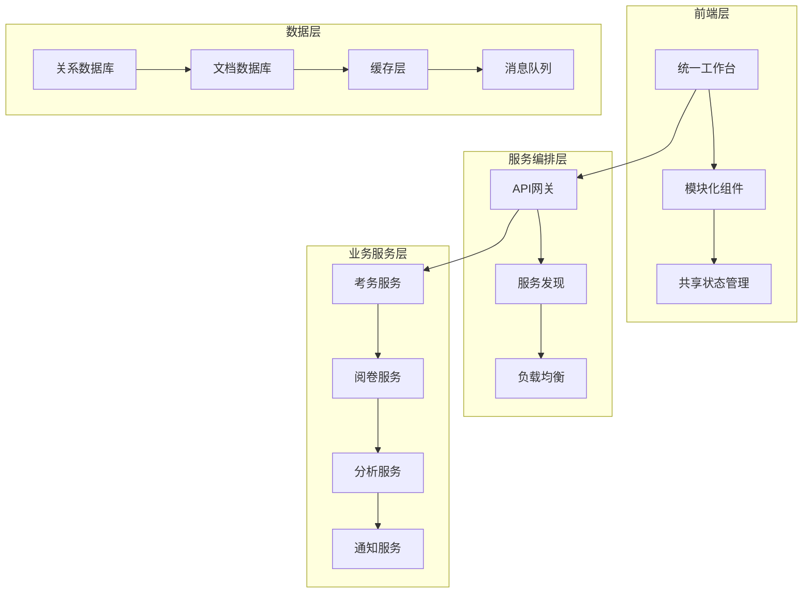

# 智阅阅卷系统项目重构方案

## 1. 现状分析

### 1.1 当前系统架构概述
基于《智阅阅卷系统模块功能说明.md》分析，当前系统采用6大核心模块架构：

```
工作台 ←→ 考务管理 → 采集与识别 → 阅卷中心 → 数据分析 → 系统管理
```

### 1.2 现有系统优势
1. **模块职责清晰**：6大核心模块分工明确，边界定义相对清晰
2. **流程链条完整**：从考试创建到成绩分析的完整业务闭环
3. **技术栈先进**：使用现代化技术栈（React + FastAPI + AI集成）
4. **标准化设计**：答题卡模板、条码编码等有标准化规范

### 1.3 主要问题识别

#### 1.3.1 架构层面问题
- **模块间耦合过紧**：模块间直接数据传递，缺乏统一的事件总线
- **状态管理分散**：每个模块独立管理状态，缺乏全局状态协调
- **扩展性受限**：添加新功能需要修改多个模块
- **错误处理不一致**：各模块错误处理机制不统一

#### 1.3.2 阅卷中心问题
- **子模块过多**：7个子模块导致复杂度过高
- **数据流转复杂**：多个子模块间的数据传递链路复杂
- **实时性不足**：缺乏统一的实时状态同步机制
- **监控分散**：各子模块独立监控，缺乏全局视图

#### 1.3.3 用户体验问题
- **操作流程分散**：用户需要在多个模块间切换
- **状态不同步**：模块间状态更新存在延迟
- **异常处理用户体验差**：错误发生时用户难以快速定位问题

#### 1.3.4 技术债务
- **代码重复**：各模块存在相似功能的重复实现
- **API接口不统一**：缺乏统一的API设计规范
- **测试覆盖不足**：端到端测试覆盖率低
- **性能优化空间大**：缺乏系统性的性能优化策略

## 2. 重构目标

### 2.1 核心目标
1. **提升用户体验**：简化操作流程，提供统一的工作界面
2. **增强系统稳定性**：提高错误处理能力和系统容错性
3. **优化性能表现**：提升响应速度和处理能力
4. **强化扩展能力**：支持功能快速迭代和扩展

### 2.2 具体指标
- **操作效率提升40%**：通过流程优化和界面整合
- **错误率降低60%**：通过统一错误处理和状态管理
- **响应速度提升50%**：通过缓存优化和异步处理
- **开发效率提升30%**：通过代码复用和模块解耦

## 3. 重构策略

### 3.1 整体策略
**渐进式重构 + 微服务化改造**



### 3.2 分阶段实施

#### 第一阶段：基础架构重构 (6周)
1. **统一状态管理** (2周)
   - 实现全局状态管理store
   - 建立模块间事件通信机制
   - 优化数据流转路径

2. **API网关建设** (2周)
   - 统一API入口和规范
   - 实现请求路由和负载均衡
   - 建立API监控和限流机制

3. **错误处理系统** (2周)
   - 建立统一错误处理机制
   - 实现错误日志收集和分析
   - 优化用户错误提示体验

#### 第二阶段：阅卷中心重构 (8周)
1. **核心架构简化** (3周)
   - 将7个子模块整合为3个核心服务
   - 实现统一的工作流引擎
   - 建立实时状态同步机制

2. **智能化增强** (3周)
   - 集成AI评分引擎
   - 实现智能路由分发
   - 建立质量监控体系

3. **用户界面重构** (2周)
   - 设计统一的阅卷工作台
   - 实现拖拽式工作流配置
   - 优化移动端适配

#### 第三阶段：性能优化和集成 (4周)
1. **性能优化** (2周)
   - 实现智能缓存策略
   - 优化数据库查询性能
   - 实现异步任务处理

2. **模块集成** (2周)
   - 完成所有模块的接口对接
   - 实现端到端测试
   - 进行性能压力测试

## 4. 详细重构方案

### 4.1 前端架构重构

#### 4.1.1 统一工作台设计
```typescript
// 新的工作台架构
interface WorkbenchLayout {
  header: GlobalHeader;           // 全局导航和用户信息
  sidebar: ModuleNavigation;      // 模块导航菜单
  content: DynamicWorkspace;      // 动态工作区
  footer: StatusBar;              // 全局状态栏
}

// 动态工作区支持
interface DynamicWorkspace {
  activeModule: ModuleType;
  workspaceHistory: WorkspaceState[];
  contextData: any;
  onModuleSwitch: (module: ModuleType) => void;
}
```

#### 4.1.2 状态管理重构
```typescript
// 全局状态管理架构
interface GlobalState {
  user: UserState;                // 用户状态
  exams: ExamState;              // 考试状态  
  grading: GradingState;         // 阅卷状态
  analytics: AnalyticsState;     // 分析状态
  system: SystemState;           // 系统状态
}

// 使用 Redux Toolkit + RTK Query
const store = configureStore({
  reducer: {
    user: userSlice.reducer,
    exams: examsSlice.reducer,
    grading: gradingSlice.reducer,
    analytics: analyticsSlice.reducer,
    system: systemSlice.reducer
  },
  middleware: (getDefaultMiddleware) =>
    getDefaultMiddleware().concat(apiSlice.middleware)
});
```

#### 4.1.3 组件库标准化
```typescript
// 统一的组件设计系统
export const ZhiyueDesignSystem = {
  // 基础组件
  components: {
    Button: ZhiyueButton,
    Input: ZhiyueInput,
    Table: ZhiyueTable,
    Chart: ZhiyueChart
  },
  
  // 业务组件
  business: {
    ExamCard: ExamCard,
    GradingPanel: GradingPanel,
    AnalyticsChart: AnalyticsChart,
    WorkflowSteps: WorkflowSteps
  },
  
  // 主题配置
  theme: {
    colors: zhiyueColors,
    spacing: zhiyueSpacing,
    typography: zhiyueTypography
  }
};
```

### 4.2 后端架构重构

#### 4.2.1 服务拆分策略
```python
# 微服务架构设计
services = {
    "exam_service": {
        "responsibilities": [
            "考试创建和管理",
            "学生信息管理", 
            "模板设计管理",
            "考场编排"
        ],
        "apis": ["/api/v1/exams", "/api/v1/students", "/api/v1/templates"]
    },
    
    "grading_service": {
        "responsibilities": [
            "阅卷流程管理",
            "AI评分调度",
            "人工阅卷管理",
            "质量控制"
        ],
        "apis": ["/api/v1/grading", "/api/v1/workflows", "/api/v1/quality"]
    },
    
    "analytics_service": {
        "responsibilities": [
            "成绩统计分析",
            "报告生成",
            "数据可视化",
            "知识图谱"
        ],
        "apis": ["/api/v1/analytics", "/api/v1/reports", "/api/v1/insights"]
    },
    
    "notification_service": {
        "responsibilities": [
            "消息推送",
            "邮件通知",
            "系统公告",
            "事件总线"
        ],
        "apis": ["/api/v1/notifications", "/api/v1/events"]
    }
}
```

#### 4.2.2 API网关设计
```python
# API网关配置
class APIGateway:
    def __init__(self):
        self.routes = {
            "/api/v1/exams/*": "exam_service:8001",
            "/api/v1/grading/*": "grading_service:8002", 
            "/api/v1/analytics/*": "analytics_service:8003",
            "/api/v1/notifications/*": "notification_service:8004"
        }
        
        self.middleware = [
            AuthenticationMiddleware(),
            RateLimitMiddleware(),
            LoggingMiddleware(),
            CORSMiddleware()
        ]
    
    async def route_request(self, request):
        # 服务发现和负载均衡
        service_url = self.discover_service(request.path)
        
        # 请求转发
        response = await self.forward_request(request, service_url)
        
        return response
```

#### 4.2.3 事件驱动架构
```python
# 事件总线设计
class EventBus:
    def __init__(self):
        self.subscribers = defaultdict(list)
        self.event_store = EventStore()
    
    async def publish(self, event: Event):
        # 持久化事件
        await self.event_store.save(event)
        
        # 分发给订阅者
        for handler in self.subscribers[event.type]:
            await handler.handle(event)
    
    def subscribe(self, event_type: str, handler: EventHandler):
        self.subscribers[event_type].append(handler)

# 事件定义
@dataclass
class ExamCreatedEvent(Event):
    exam_id: str
    creator_id: str
    timestamp: datetime

@dataclass 
class GradingCompletedEvent(Event):
    exam_id: str
    batch_id: str
    completion_rate: float
    timestamp: datetime
```

### 4.3 数据库架构重构

#### 4.3.1 数据分层设计
```sql
-- 核心业务数据 (PostgreSQL)
-- 考试主表
CREATE TABLE exams (
    id UUID PRIMARY KEY DEFAULT gen_random_uuid(),
    name VARCHAR(255) NOT NULL,
    subject VARCHAR(100) NOT NULL,
    grade VARCHAR(50) NOT NULL,
    status exam_status_enum NOT NULL DEFAULT 'draft',
    config JSONB,
    created_by UUID NOT NULL,
    created_at TIMESTAMP WITH TIME ZONE DEFAULT NOW(),
    updated_at TIMESTAMP WITH TIME ZONE DEFAULT NOW()
);

-- 阅卷会话表
CREATE TABLE grading_sessions (
    id UUID PRIMARY KEY DEFAULT gen_random_uuid(),
    exam_id UUID NOT NULL REFERENCES exams(id),
    status session_status_enum NOT NULL DEFAULT 'initializing',
    workflow_config JSONB NOT NULL,
    metrics JSONB,
    created_at TIMESTAMP WITH TIME ZONE DEFAULT NOW(),
    completed_at TIMESTAMP WITH TIME ZONE
);

-- 阅卷任务表  
CREATE TABLE grading_tasks (
    id UUID PRIMARY KEY DEFAULT gen_random_uuid(),
    session_id UUID NOT NULL REFERENCES grading_sessions(id),
    task_type task_type_enum NOT NULL,
    status task_status_enum NOT NULL DEFAULT 'pending',
    input_data JSONB,
    output_data JSONB,
    assigned_to UUID,
    created_at TIMESTAMP WITH TIME ZONE DEFAULT NOW(),
    completed_at TIMESTAMP WITH TIME ZONE
);
```

#### 4.3.2 缓存策略
```python
# Redis缓存设计
class CacheManager:
    def __init__(self):
        self.redis = redis.Redis(host='redis', port=6379, db=0)
        self.cache_configs = {
            'exam_info': {'ttl': 3600, 'prefix': 'exam:'},
            'grading_progress': {'ttl': 300, 'prefix': 'progress:'},
            'user_session': {'ttl': 86400, 'prefix': 'session:'},
            'analytics_cache': {'ttl': 1800, 'prefix': 'analytics:'}
        }
    
    async def get_cached_data(self, key: str, cache_type: str):
        config = self.cache_configs[cache_type]
        full_key = f"{config['prefix']}{key}"
        
        data = await self.redis.get(full_key)
        if data:
            return json.loads(data)
        return None
    
    async def cache_data(self, key: str, data: any, cache_type: str):
        config = self.cache_configs[cache_type]
        full_key = f"{config['prefix']}{key}"
        
        await self.redis.setex(
            full_key, 
            config['ttl'], 
            json.dumps(data, default=str)
        )
```

### 4.4 阅卷中心特别重构

#### 4.4.1 简化子模块架构
```python
# 原来7个子模块 → 简化为3个核心服务

class GradingOrchestrator:
    """阅卷编排器 - 替代原批次管理、上传中心、异常工单"""
    
    def __init__(self):
        self.workflow_engine = WorkflowEngine()
        self.task_scheduler = TaskScheduler()
        self.exception_handler = ExceptionHandler()
    
    async def create_grading_session(self, exam_id: str) -> GradingSession:
        # 创建阅卷会话
        session = await self.workflow_engine.create_session(exam_id)
        
        # 启动任务调度
        await self.task_scheduler.initialize(session.id)
        
        return session

class ProcessingEngine:
    """处理引擎 - 替代原预处理服务、判分中心"""
    
    def __init__(self):
        self.ocr_service = OCRService()
        self.ai_grading_service = AIGradingService()
        self.human_grading_service = HumanGradingService()
    
    async def process_answer_sheet(self, sheet: AnswerSheet) -> ProcessingResult:
        # OCR识别
        ocr_result = await self.ocr_service.process(sheet.image)
        
        # 智能路由
        routing_decision = self.decide_routing(ocr_result)
        
        if routing_decision == "AI":
            return await self.ai_grading_service.grade(ocr_result)
        else:
            return await self.human_grading_service.assign_task(ocr_result)

class QualityController:
    """质量控制器 - 替代原质量监控、成绩汇总"""
    
    def __init__(self):
        self.quality_checker = QualityChecker()
        self.metrics_collector = MetricsCollector()
        self.result_aggregator = ResultAggregator()
    
    async def validate_results(self, results: List[GradingResult]) -> QualityReport:
        # 质量检查
        quality_issues = await self.quality_checker.check(results)
        
        # 收集指标
        metrics = await self.metrics_collector.collect(results)
        
        # 生成报告
        return QualityReport(issues=quality_issues, metrics=metrics)
```

#### 4.4.2 统一工作流引擎
```python
class WorkflowEngine:
    """统一工作流引擎"""
    
    def __init__(self):
        self.state_machine = StateMachine()
        self.rule_engine = RuleEngine()
        self.event_bus = EventBus()
    
    async def execute_workflow(self, session_id: str):
        session = await self.get_session(session_id)
        
        while not session.is_completed():
            # 获取当前状态
            current_state = session.current_state
            
            # 执行状态逻辑
            result = await self.execute_state(current_state, session)
            
            # 状态转换
            next_state = await self.state_machine.transition(
                current_state, result
            )
            
            # 更新会话状态
            session.current_state = next_state
            await self.update_session(session)
            
            # 发布事件
            await self.event_bus.publish(
                StateTransitionEvent(
                    session_id=session_id,
                    from_state=current_state,
                    to_state=next_state,
                    timestamp=datetime.now()
                )
            )
```

## 5. 实施计划

### 5.1 时间安排 (18周总计)

#### Phase 1: 基础设施重构 (6周)
**Week 1-2: 开发环境和CI/CD优化**
- 统一开发环境配置
- 完善自动化测试流程  
- 建立代码质量检查

**Week 3-4: API网关和服务发现**
- 实现API网关
- 建立服务注册发现机制
- 实现负载均衡和熔断

**Week 5-6: 统一状态管理和事件总线**
- 前端全局状态管理重构
- 后端事件总线实现
- 建立实时通信机制

#### Phase 2: 核心业务重构 (8周)
**Week 7-9: 阅卷中心重构**
- 简化阅卷中心子模块架构
- 实现统一工作流引擎
- 建立智能路由机制

**Week 10-12: 用户界面整合**
- 设计统一工作台界面
- 实现模块间无缝切换
- 优化移动端体验

**Week 13-14: 数据层优化**
- 数据库性能调优
- 缓存策略优化
- 实现数据一致性保证

#### Phase 3: 集成测试和上线 (4周)
**Week 15-16: 系统集成测试**
- 端到端功能测试
- 性能压力测试
- 兼容性测试

**Week 17-18: 生产部署和优化**
- 灰度发布
- 性能监控和优化
- 用户培训和反馈收集

### 5.2 风险控制

#### 5.2.1 技术风险
- **风险**: 大规模重构可能影响系统稳定性
- **缓解**: 采用渐进式重构，保持向后兼容

#### 5.2.2 业务风险  
- **风险**: 重构期间业务功能可能受影响
- **缓解**: 维护双版本并行，逐步切换

#### 5.2.3 人员风险
- **风险**: 团队学习新架构需要时间
- **缓解**: 提前技术培训，建立知识库

### 5.3 成功指标

#### 5.3.1 技术指标
- API响应时间 < 200ms (P95)
- 系统可用性 > 99.9%
- 错误率 < 0.1%
- 代码覆盖率 > 80%

#### 5.3.2 业务指标  
- 用户任务完成时间减少 40%
- 系统学习成本降低 50%
- 功能开发效率提升 30%
- 用户满意度 > 4.5/5

## 6. 总结

### 6.1 重构核心价值
1. **架构升级**: 从单体架构向微服务架构演进
2. **体验优化**: 统一工作台提供一致的用户体验
3. **性能提升**: 通过缓存、异步等技术大幅提升性能
4. **维护简化**: 模块解耦降低维护复杂度

### 6.2 关键成功因素
1. **渐进式实施**: 避免大爆炸式改动带来的风险
2. **完善测试**: 保证重构过程中功能的正确性
3. **团队协作**: 前后端、产品、测试密切配合
4. **用户参与**: 及时收集用户反馈，调整重构策略

### 6.3 长期收益
- **技术债务清理**: 解决历史遗留问题
- **扩展能力增强**: 为未来功能扩展奠定基础
- **团队效率提升**: 标准化开发流程
- **用户价值最大化**: 更好的产品体验

通过这个重构方案的实施，智阅阅卷系统将从当前的功能导向架构升级为用户价值导向的现代化系统架构，为用户提供更加高效、稳定、易用的阅卷体验。