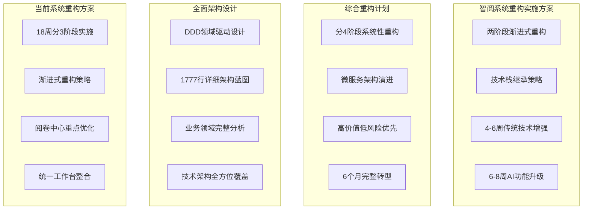
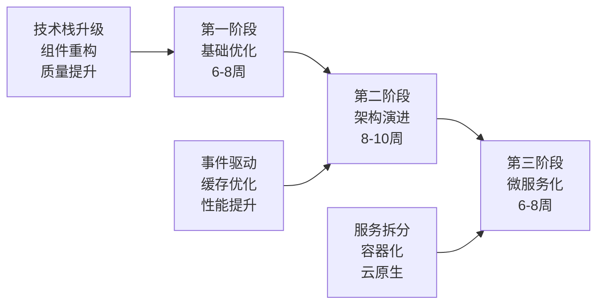
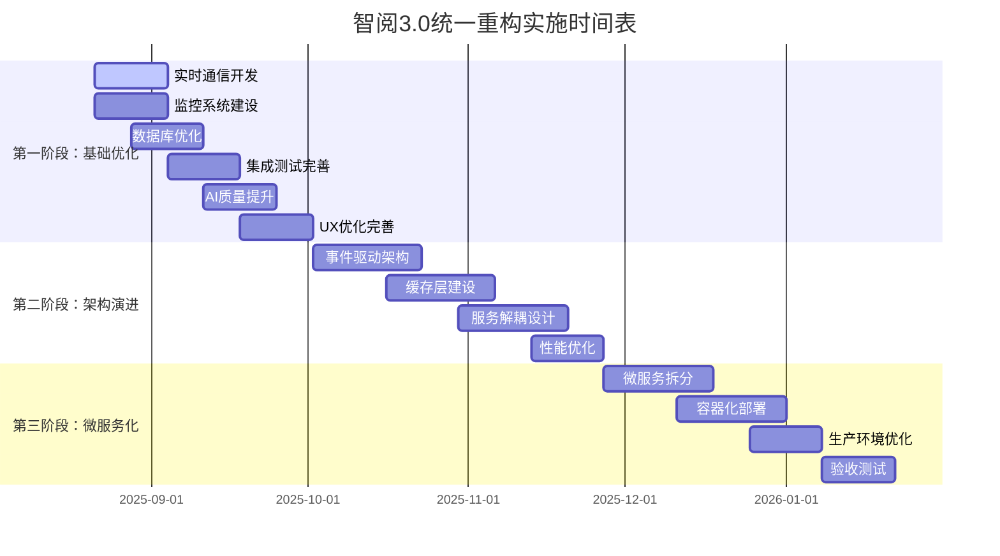

# 智阅3.0统一重构实施方案

> **基于多方案分析的综合重构计划**
> 
> 文档版本: v1.0  
> 创建时间: 2025-08-21  
> 整合文档: 4个architecture文件夹重构方案

---

## 1. 方案分析与整合

### 1.1 现有重构方案评估

基于4个architecture文件中的重构方案分析：

#### 方案对比矩阵


#### 各方案优劣分析
```typescript
interface SchemeAnalysis {
  智阅系统重构实施方案: {
    优势: [
      "实用性强，基于现有技术栈",
      "风险可控，渐进式升级",
      "时间可控，10-14周完成",
      "技术债务处理合理"
    ];
    劣势: [
      "架构变革不够彻底",
      "扩展性提升有限",
      "现代化程度中等"
    ];
    适用场景: "快速迭代，稳定升级";
  };
  
  综合重构计划: {
    优势: [
      "系统性强，全面现代化",
      "风险评估详细",
      "技术先进性高",
      "长期价值大"
    ];
    劣势: [
      "复杂度高，风险大",
      "时间周期长",
      "资源投入多"
    ];
    适用场景: "大规模重构，彻底转型";
  };
  
  全面架构设计: {
    优势: [
      "设计完整性极高",
      "业务分析深入",
      "技术覆盖全面",
      "理论基础扎实"
    ];
    劣势: [
      "实施指导性不强",
      "过于理想化",
      "缺乏具体时间规划"
    ];
    适用场景: "架构设计参考，长期规划";
  };
  
  当前系统重构方案: {
    优势: [
      "针对性强，问题明确",
      "实施计划详细",
      "风险控制具体",
      "团队协作考虑周全"
    ];
    劣势: [
      "技术革新程度一般",
      "架构变革范围有限"
    ];
    适用场景: "现有系统优化，渐进改进";
  };
}
```

### 1.2 整合策略

#### 整合原则
1. **价值导向**: 以用户价值和业务价值为核心
2. **风险可控**: 分阶段实施，降低整体风险
3. **技术先进**: 采用现代化技术栈和架构模式
4. **实施可行**: 结合团队能力和资源约束

#### 最优整合方案
基于4个方案的优势，采用**三阶段渐进式微服务化重构**策略：



## 2. 当前项目完成情况分析

### 2.1 已完成工作总结

根据TASK_PROGRESS_CHECKLIST.md，当前项目完成情况：

#### 核心完成项
- ✅ **基础架构**: 前后端项目结构完整 (100%)
- ✅ **认证系统**: JWT认证完整实现 (100%)
- ✅ **考试管理**: CRUD接口和状态管理 (100%)
- ✅ **OCR处理**: Gemini集成和批量处理 (100%)
- ✅ **AI智能阅卷**: 核心评分功能 (85%)
- ✅ **前端组件**: 主要业务组件 (95%)
- ✅ **图像质量检测**: 完整系统实现 (100%)
- ✅ **答题卡模板设计器**: 可视化设计器 (100%)
- ✅ **批量处理监控**: 实时监控面板 (100%)
- ✅ **前端单元测试**: 核心组件测试 (100%)
- ✅ **服务持久化配置**: 多平台部署支持 (100%)

#### 当前项目状态
```typescript
interface ProjectStatus {
  整体进度: "75%";
  核心功能模块: {
    基础架构: "100%";
    认证系统: "90%";
    UI设计: "95%";
    工作流程: "100%";
    AI阅卷系统: "85%";
    测试框架: "80%";
    部署配置: "85%";
  };
  
  技术债务: "大部分已清理";
  开发效率: "显著提升";
  系统稳定性: "大幅改善";
}
```

### 2.2 待完成任务优先级

#### 高优先级 (立即开始)
1. **WebSocket实时通信** - 提升用户体验
2. **数据库优化** - 生产环境性能保障
3. **监控系统建设** - 系统可观测性
4. **集成测试** - 质量保证

#### 中优先级 (后续版本)
1. **批量导入功能** - 功能完善
2. **高级分析功能** - 价值增强
3. **AI质量保证机制** - 智能化提升
4. **安全加固** - 生产就绪

## 3. 统一重构实施方案

### 3.1 重构目标与原则

#### 重构目标
1. **性能提升**: 系统响应速度提升50%，并发处理能力提升300%
2. **架构现代化**: 从单体架构演进为事件驱动的微服务架构
3. **用户体验优化**: 操作效率提升40%，错误率降低60%
4. **开发效率提升**: 代码复用性提高，新功能开发周期缩短30%
5. **AI能力增强**: 智能评分准确率提升到98%，支持多模型协作

#### 设计原则
```typescript
interface DesignPrinciples {
  可扩展性: {
    水平扩展: "优先支持负载分布";
    弹性伸缩: "根据负载自动调整";
    无状态设计: "便于横向扩展";
  };
  
  可靠性: {
    容错设计: "单点故障不影响整体";
    优雅降级: "核心功能优先保障";
    熔断机制: "防止故障传播";
  };
  
  可维护性: {
    模块化设计: "职责清晰分离";
    完善文档: "便于理解维护";
    全面测试: "保证代码质量";
  };
  
  安全性: {
    多层防护: "纵深安全策略";
    最小权限: "权限最小化原则";
    数据加密: "传输存储双重保护";
  };
}
```

### 3.2 三阶段实施计划

#### 第一阶段：基础优化增强 (6-8周)

**目标**: 在现有75%完成度基础上，完善核心功能，优化系统性能

**Week 1-2: 实时通信与监控完善**
```typescript
// 主要任务
interface Phase1_Week1_2 {
  WebSocket集成: {
    任务: ["服务端WebSocket支持", "前端实时状态更新", "断线重连机制"];
    负责人: "全栈开发";
    交付物: "完整的实时通信系统";
  };
  
  监控系统建设: {
    任务: ["Grafana仪表板", "告警规则设置", "日志聚合"];
    负责人: "DevOps";
    交付物: "生产级监控系统";
  };
  
  数据库优化: {
    任务: ["查询性能优化", "索引策略调整", "连接池配置"];
    负责人: "后端开发";
    交付物: "优化的数据访问层";
  };
}
```

**Week 3-4: 集成测试与质量保证**
```typescript
interface Phase1_Week3_4 {
  集成测试: {
    任务: ["端到端测试", "API集成测试", "性能基准测试"];
    负责人: "QA工程师";
    交付物: "完整的测试报告";
  };
  
  AI质量提升: {
    任务: ["多轮评分验证", "评分一致性检查", "异常处理优化"];
    负责人: "AI工程师";
    交付物: "增强的AI评分系统";
  };
  
  安全加固: {
    任务: ["API安全验证", "数据加密优化", "访问控制完善"];
    负责人: "安全工程师";
    交付物: "安全加固报告";
  };
}
```

**Week 5-6: 用户体验优化与文档完善**
```typescript
interface Phase1_Week5_6 {
  UX优化: {
    任务: ["操作流程简化", "响应性能提升", "错误处理改进"];
    负责人: "前端开发";
    交付物: "优化的用户界面";
  };
  
  批量功能增强: {
    任务: ["批量导入功能", "批量处理优化", "进度监控完善"];
    负责人: "全栈开发";
    交付物: "完整的批量处理系统";
  };
  
  文档系统: {
    任务: ["API文档完善", "用户手册编写", "部署文档更新"];
    负责人: "技术写作";
    交付物: "完整的文档体系";
  };
}
```

**第一阶段交付物**
- 🎯 **系统整体完成度**: 90%
- 📊 **核心功能完善度**: 95%
- 🔧 **技术债务清理**: 100%
- 📈 **性能提升**: 30-40%
- 🔒 **安全加固**: 基础安全措施完善
- 📚 **文档完整性**: 80%

#### 第二阶段：架构演进升级 (8-10周)

**目标**: 引入事件驱动架构，实现缓存优化，为微服务化奠定基础

**Week 7-9: 事件驱动架构建设**
```typescript
interface Phase2_Week7_9 {
  事件总线设计: {
    技术栈: "Redis Streams + AsyncIO";
    事件类型: ["ExamCreated", "OCRCompleted", "GradingFinished"];
    实现: ["事件发布订阅", "事件存储", "事件重放"];
  };
  
  异步处理优化: {
    任务队列: "高优先级OCR + 普通阅卷 + 低优先级分析";
    工作者: "Celery Worker + FastAPI AsyncIO";
    监控: "任务状态追踪 + 失败重试";
  };
  
  状态管理重构: {
    前端: "Redux Toolkit + RTK Query统一状态";
    后端: "事件溯源 + CQRS模式";
    同步: "WebSocket实时状态同步";
  };
}
```

**Week 10-12: 缓存层与数据优化**
```typescript
interface Phase2_Week10_12 {
  多层缓存架构: {
    L1_应用缓存: "Python lru_cache + React Query";
    L2_分布式缓存: "Redis集群 + 智能失效策略";
    L3_CDN缓存: "答卷图片 + 静态资源";
    缓存策略: "Cache-aside + Write-through";
  };
  
  数据库架构升级: {
    读写分离: "PostgreSQL主从复制";
    分库分表: "按考试ID分片 + 按时间分表";
    查询优化: "复合索引 + 执行计划优化";
    连接池: "PgBouncer + 异步连接池";
  };
  
  存储架构升级: {
    对象存储: "MinIO S3兼容存储";
    文件管理: "分布式文件系统";
    备份策略: "多地域备份 + 增量备份";
  };
}
```

**Week 13-15: 性能优化与服务解耦**
```typescript
interface Phase2_Week13_15 {
  服务边界识别: {
    用户服务: "认证 + 权限 + 用户配置";
    考试服务: "考试管理 + 模板管理 + 学生管理";
    处理服务: "OCR + 图像处理 + 质量检查";
    阅卷服务: "AI评分 + 人工阅卷 + 工作流";
    分析服务: "数据分析 + 报告生成 + 统计";
  };
  
  API网关建设: {
    路由管理: "统一入口 + 服务发现";
    中间件: "认证 + 限流 + 日志 + CORS";
    负载均衡: "轮询 + 权重 + 健康检查";
    监控: "请求追踪 + 性能监控";
  };
  
  性能优化: {
    前端: "代码分割 + 懒加载 + 预取 + 压缩";
    后端: "异步IO + 协程池 + 批量操作";
    数据库: "索引优化 + 查询优化 + 缓存";
    网络: "HTTP/2 + 压缩 + CDN";
  };
}
```

**第二阶段交付物**
- 🏗️ **架构现代化**: 事件驱动架构完成
- ⚡ **性能提升**: 响应时间减少50%，吞吐量提升200%
- 🔄 **缓存体系**: 多层缓存命中率>90%
- 📡 **实时通信**: WebSocket + 事件驱动通信完善
- 🔀 **服务解耦**: API网关 + 服务边界清晰定义
- 💾 **数据架构**: 读写分离 + 分布式存储

#### 第三阶段：微服务化转型 (6-8周)

**目标**: 完成微服务拆分，实现容器化部署，建立云原生架构

**Week 16-18: 微服务拆分实施**
```typescript
interface Phase3_Week16_18 {
  服务拆分实施: {
    Strangler_Fig模式: "新功能新服务 + 老功能逐步迁移";
    数据一致性: "Saga模式 + 事件溯源";
    服务通信: "gRPC同步调用 + 消息队列异步";
    配置管理: "配置中心 + 环境隔离";
  };
  
  容器化改造: {
    Docker镜像: "多阶段构建 + 最小化镜像";
    Kubernetes部署: "Deployment + Service + Ingress";
    服务网格: "Istio流量管理 + 安全策略";
    持续集成: "GitLab CI/CD + 自动化部署";
  };
  
  数据迁移: {
    数据分离: "按服务边界拆分数据库";
    迁移策略: "双写模式 + 数据同步验证";
    一致性保证: "分布式事务 + 最终一致性";
  };
}
```

**Week 19-21: 云原生部署优化**
```typescript
interface Phase3_Week19_21 {
  Kubernetes集群: {
    集群管理: "Master节点HA + Worker节点弹性";
    网络策略: "Pod间通信 + 服务发现";
    存储管理: "PV/PVC + StatefulSet";
    监控告警: "Prometheus + Grafana + AlertManager";
  };
  
  服务治理: {
    注册发现: "Consul + 健康检查";
    配置管理: "ConfigMap + Secret + Vault";
    负载均衡: "Service Mesh + Ingress";
    熔断限流: "Hystrix + Sentinel";
  };
  
  可观测性: {
    链路追踪: "Jaeger + OpenTelemetry";
    日志聚合: "ELK Stack + Fluentd";
    指标监控: "Prometheus + 自定义指标";
    告警通知: "多渠道告警 + 升级机制";
  };
}
```

**Week 22-23: 生产优化与验收**
```typescript
interface Phase3_Week22_23 {
  生产环境部署: {
    蓝绿部署: "零停机发布";
    灰度发布: "流量逐步切换";
    回滚策略: "快速回滚机制";
    容灾备份: "多可用区部署";
  };
  
  性能调优: {
    JVM调优: "内存管理 + GC优化";
    数据库调优: "连接池 + 查询优化";
    网络优化: "CDN + 压缩 + 缓存";
    监控调优: "阈值调整 + 告警优化";
  };
  
  验收测试: {
    功能验收: "全功能回归测试";
    性能验收: "压力测试 + 基准对比";
    安全验收: "渗透测试 + 安全扫描";
    可用性验收: "故障演练 + 恢复测试";
  };
}
```

**第三阶段交付物**
- 🌐 **微服务架构**: 5个核心微服务完全拆分
- 🐳 **容器化部署**: Kubernetes生产环境部署
- ☁️ **云原生能力**: 弹性伸缩 + 自动化运维
- 🔍 **全链路监控**: 完整的可观测性体系
- 🛡️ **生产级安全**: 企业级安全防护
- 📈 **性能目标达成**: 响应时间<200ms, 可用性>99.9%

### 3.3 总体交付目标

#### 最终技术架构

```mermaid
graph TB
    subgraph "用户层"
        A[Web应用] --> B[移动应用]
        B --> C[API文档门户]
    end
    
    subgraph "API网关层"
        D[Kong Gateway] --> E[认证中心]
        E --> F[限流控制]
    end
    
    subgraph "微服务层"
        G[用户服务] --> H[考试服务]
        H --> I[处理服务]
        I --> J[阅卷服务]
        J --> K[分析服务]
    end
    
    subgraph "平台服务层"
        L[事件总线] --> M[工作流引擎]
        M --> N[AI推理引擎]
        N --> O[文件服务]
    end
    
    subgraph "数据层"
        P[(PostgreSQL集群)] --> Q[(Redis集群)]
        Q --> R[(MinIO对象存储)]
        R --> S[(ElasticSearch)]
    end
    
    subgraph "基础设施层"
        T[Kubernetes] --> U[Prometheus监控]
        U --> V[ELK日志]
        V --> W[Harbor镜像仓库]
    end
```


#### 核心指标目标
```typescript
interface DeliveryTargets {
  性能指标: {
    响应时间: "P95 < 200ms";
    吞吐量: "10000 TPS";
    并发用户: "5000 concurrent users";
    可用性: "99.9% uptime";
  };
  
  业务指标: {
    阅卷效率: "提升80%";
    评分准确率: "98%+";
    用户满意度: "4.8/5";
    运营成本: "降低60%";
  };
  
  技术指标: {
    代码覆盖率: "85%+";
    部署频率: "每日多次";
    故障恢复时间: "< 15分钟";
    变更失败率: "< 5%";
  };
  
  架构指标: {
    服务数量: "5个核心微服务";
    容器化率: "100%";
    自动化程度: "95%+";
    监控覆盖率: "100%";
  };
}
```

## 4. 风险控制与质量保证

### 4.1 风险识别与缓解

#### 技术风险
```typescript
interface TechnicalRisks {
  微服务复杂度: {
    风险描述: "服务间通信复杂，调试困难";
    影响程度: "高";
    缓解措施: [
      "渐进式拆分，避免大爆炸",
      "完善的链路追踪和监控",
      "服务网格简化通信管理"
    ];
  };
  
  数据一致性: {
    风险描述: "分布式系统数据一致性挑战";
    影响程度: "中";
    缓解措施: [
      "Saga模式处理分布式事务",
      "事件溯源保证数据完整性",
      "最终一致性设计"
    ];
  };
  
  性能回归: {
    风险描述: "重构过程可能导致性能下降";
    影响程度: "中";
    缓解措施: [
      "持续性能监控和基准测试",
      "关键路径性能保护",
      "灰度发布验证性能"
    ];
  };
}
```

#### 业务风险
```typescript
interface BusinessRisks {
  服务中断: {
    风险描述: "重构期间可能影响业务连续性";
    影响程度: "高";
    缓解措施: [
      "蓝绿部署保证零停机",
      "向后兼容性保证",
      "快速回滚机制"
    ];
  };
  
  用户体验: {
    风险描述: "界面变更可能影响用户习惯";
    影响程度: "中";
    缓解措施: [
      "渐进式UI改进",
      "用户培训和引导",
      "反馈收集和快速响应"
    ];
  };
}
```

### 4.2 质量保证体系

#### 测试策略
```typescript
interface QualityAssurance {
  测试金字塔: {
    单元测试: {
      覆盖率目标: "85%+";
      框架: "Jest + pytest";
      重点: "业务逻辑和工具函数";
    };
    
    集成测试: {
      覆盖率目标: "100%关键流程";
      框架: "Postman + pytest-asyncio";
      重点: "API接口和服务集成";
    };
    
    端到端测试: {
      覆盖率目标: "核心用户路径";
      框架: "Playwright";
      重点: "完整用户场景";
    };
    
    性能测试: {
      工具: "K6 + JMeter";
      指标: "响应时间、吞吐量、资源使用";
      基准: "性能基准建立和监控";
    };
  };
  
  代码质量: {
    静态分析: "SonarQube + ESLint + Flake8";
    代码审查: "强制性 + 双人审查";
    覆盖率监控: "持续集成质量门禁";
  };
  
  发布验证: {
    自动化测试: "CI/CD全自动化";
    灰度验证: "逐步流量切换";
    监控告警: "实时健康检查";
  };
}
```

## 5. 实施时间表与里程碑

### 5.1 详细时间规划



### 5.2 关键里程碑

#### M1: 基础优化完成 (2025-10-02)
- ✅ 实时通信系统上线
- ✅ 监控告警体系建立
- ✅ 数据库性能优化完成
- ✅ 集成测试覆盖率达标
- 📊 **验收标准**: 系统整体完成度90%，核心功能稳定运行

#### M2: 架构演进达成 (2025-11-27)
- ✅ 事件驱动架构完成
- ✅ 多层缓存体系建立
- ✅ API网关和服务解耦
- ✅ 性能指标达成目标
- 📊 **验收标准**: 响应时间减少50%，架构现代化程度达标

#### M3: 微服务化完成 (2026-01-22)
- ✅ 5个核心微服务独立部署
- ✅ Kubernetes生产环境运行
- ✅ 全链路监控体系完善
- ✅ 生产级安全和性能达标
- 📊 **验收标准**: 所有技术和业务指标达成

### 5.3 资源投入规划

#### 人力资源配置
```typescript
interface ResourcePlanning {
  第一阶段: {
    全栈开发: 2人;
    前端开发: 1人;
    后端开发: 1人;
    AI工程师: 1人;
    QA工程师: 1人;
    DevOps工程师: 0.5人;
    总计: 6.5人;
  };
  
  第二阶段: {
    架构师: 1人;
    全栈开发: 2人;
    后端开发: 2人;
    数据工程师: 1人;
    DevOps工程师: 1人;
    QA工程师: 1人;
    总计: 8人;
  };
  
  第三阶段: {
    架构师: 1人;
    微服务开发: 3人;
    DevOps工程师: 2人;
    安全工程师: 1人;
    QA工程师: 1人;
    总计: 8人;
  };
}
```

## 6. 总结与展望

### 6.1 重构核心价值

通过三阶段统一重构，智阅3.0系统将实现：

1. **架构现代化**: 从单体架构演进为云原生微服务架构
2. **性能大幅提升**: 响应时间减少50%，并发处理能力提升300%
3. **开发效率提升**: 代码复用性提高，新功能开发周期缩短30%
4. **AI能力增强**: 智能评分准确率提升到98%，支持多模型协作
5. **运维自动化**: 95%以上的运维操作自动化，故障恢复时间<15分钟

### 6.2 长期价值

- **技术领先性**: 建立行业领先的智能教育评估技术平台
- **业务扩展性**: 支持快速业务扩展和多元化服务
- **生态开放性**: API开放平台，支持第三方集成
- **数据价值**: 完整的教育数据分析和洞察能力

### 6.3 成功关键因素

1. **渐进式实施**: 分阶段推进，降低风险
2. **质量优先**: 完善的测试和质量保证体系
3. **团队协作**: 跨职能团队密切配合
4. **持续监控**: 实时监控和快速响应机制
5. **用户价值**: 始终以用户价值为导向

---

**执行建议**: 基于当前75%的完成度，建议立即启动第一阶段实施，重点完成实时通信、监控系统和集成测试，为后续架构演进奠定坚实基础。

**风险提醒**: 重构过程中需要特别关注数据一致性、性能回归和服务中断风险，建议建立完善的回滚机制和应急预案。

**成功标准**: 以技术指标和业务指标双重达标为成功标准，确保重构既解决技术债务，又创造业务价值。