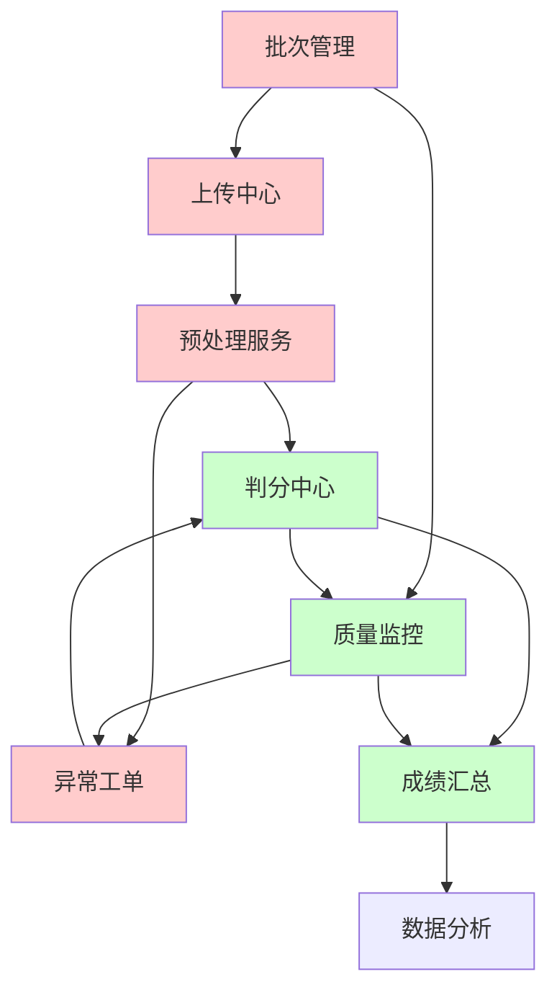
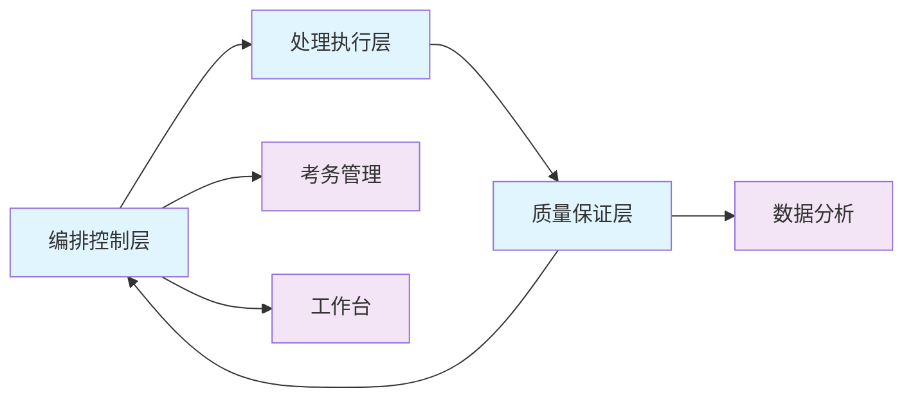
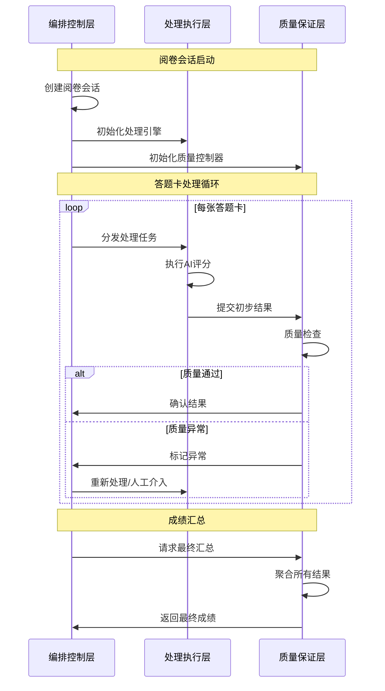
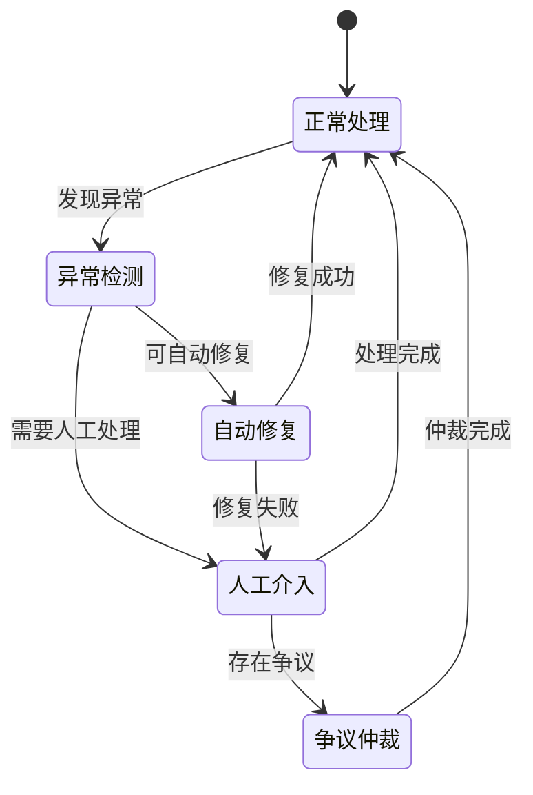
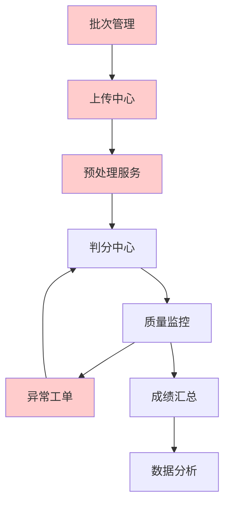
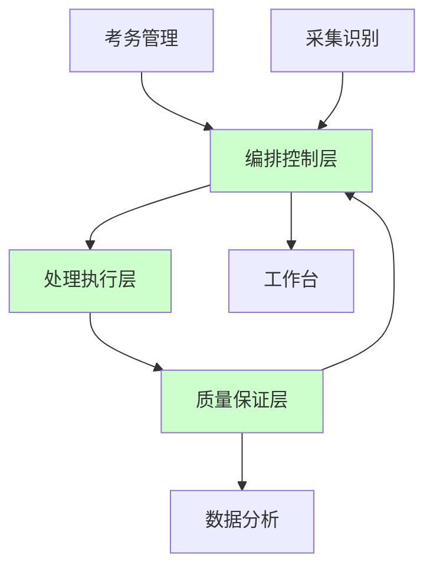

# 阅卷中心功能边界与交互逻辑分析

## 1. 阅卷中心整体定位

### 1.1 核心使命
**将OCR/OMR识别结果转化为准确的考试成绩，确保评分的公平性、准确性和效率性。**

### 1.2 性能目标
- **处理效率**: 单卷处理P95时间 < 8秒
- **准确率**: AI+人工双评一致率 ≥ 99.5%
- **异常控制**: 异常漏判率 < 0.2%
- **可用性**: 系统可用性 ≥ 99.9%

## 2. 功能边界定义

### 2.1 核心职责边界

#### ✅ 阅卷中心负责
1. **评分逻辑管理**
   - AI模型推理和评分
   - 人工阅卷任务分配
   - 评分规则配置和执行
   - 分数计算和合成

2. **工作流控制**
   - 阅卷流程编排
   - 任务状态管理
   - 异常处理和恢复
   - 质量控制和监督

3. **评分数据管理**
   - 评分结果存储
   - 评分历史记录
   - 评分统计计算
   - 分数导出接口

#### ❌ 阅卷中心不负责
1. **原始数据处理**
   - 图像上传和存储 (采集与识别模块)
   - OCR/OMR识别处理 (采集与识别模块)
   - 图像预处理和校正 (采集与识别模块)

2. **业务配置管理**
   - 考试基础信息 (考务管理模块)
   - 学生信息管理 (考务管理模块) 
   - 答题卡模板设计 (考务管理模块)

3. **结果展示分析**
   - 成绩报告生成 (数据分析模块)
   - 统计图表展示 (数据分析模块)
   - 知识点分析 (数据分析模块)

4. **系统基础服务**
   - 用户认证授权 (系统管理模块)
   - 系统配置管理 (系统管理模块)
   - 日志监控告警 (系统管理模块)

### 2.2 数据边界定义

#### 输入数据
```typescript
interface GradingCenterInput {
  // 来自考务管理
  examConfig: {
    examId: string;
    scoringRules: ScoringRule[];
    questionConfig: QuestionConfig[];
    totalScore: number;
  };
  
  // 来自采集与识别
  recognitionResults: {
    sheetId: string;
    studentId: string;
    objectiveAnswers: OMRResult[];
    subjectiveImages: ImageSegment[];
    ocrTexts: OCRResult[];
  };
  
  // 来自系统管理
  gradingPermissions: {
    userId: string;
    examId: string;
    permissions: string[];
  };
}
```

#### 输出数据
```typescript
interface GradingCenterOutput {
  // 输出到数据分析
  gradingResults: {
    examId: string;
    studentId: string;
    sheetId: string;
    scores: ScoreDetail[];
    totalScore: number;
    gradingStatus: 'completed' | 'pending' | 'disputed';
  };
  
  // 输出到工作台
  taskNotifications: {
    userId: string;
    taskType: 'human_grading' | 'dispute_resolution';
    taskCount: number;
    priority: 'high' | 'medium' | 'low';
  };
  
  // 输出到系统管理
  auditLogs: {
    actionType: string;
    userId: string;
    examId: string;
    timestamp: Date;
    details: any;
  };
}
```

## 3. 当前子模块分析

### 3.1 现有7个子模块功能分析

#### 3.1.1 批次管理
**功能定位**: 阅卷任务的组织和调度
```typescript
interface BatchManager {
  // 核心职责
  createBatch(examId: string): Promise<Batch>;
  trackProgress(batchId: string): Promise<BatchProgress>;
  managePermissions(batchId: string, permissions: Permission[]): Promise<void>;
  
  // 交互接口
  inputs: {
    from_exam_management: ExamConfig;
    from_upload_center: UploadStatus;
  };
  outputs: {
    to_quality_monitor: BatchMetrics;
    to_processing: BatchTasks;
  };
}
```

**边界问题**:
- ❌ 职责过于宽泛，包含了过多协调功能
- ❌ 与上传中心职责重叠
- ❌ 权限管理应该独立到系统管理

#### 3.1.2 上传中心
**功能定位**: 扫描文件的上传和初步处理
```typescript
interface UploadCenter {
  // 核心职责
  uploadFiles(files: File[]): Promise<UploadResult>;
  validateBarcodes(sheets: AnswerSheet[]): Promise<ValidationResult>;
  trackUploadProgress(batchId: string): Promise<UploadProgress>;
  
  // 交互接口
  inputs: {
    from_capture: ScannedSheets;
  };
  outputs: {
    to_preprocessing: ValidatedSheets;
    to_batch_manager: UploadMetrics;
  };
}
```

**边界问题**:
- ❌ 文件上传应该属于基础设施层
- ❌ 条码校验逻辑与识别模块重复
- ❌ 进度跟踪职责分散

#### 3.1.3 预处理服务
**功能定位**: OCR/OMR结果的预处理和质检
```typescript
interface PreprocessingService {
  // 核心职责
  processOCRResults(ocrData: OCRResult[]): Promise<ProcessedResult>;
  qualityCheck(results: ProcessedResult[]): Promise<QualityReport>;
  generateCutImages(sheets: AnswerSheet[]): Promise<ImageSegment[]>;
  
  // 交互接口
  inputs: {
    from_capture_ocr: OCRResults;
    from_upload_center: ValidatedSheets;
  };
  outputs: {
    to_grading_center: ProcessedData;
    to_exception_handler: QualityIssues;
  };
}
```

**边界问题**:
- ❌ 图像切割应该在采集识别阶段完成
- ❌ 质检逻辑与质量监控重复
- ❌ OCR结果处理边界不清

#### 3.1.4 判分中心
**功能定位**: 核心的评分逻辑和任务分发
```typescript
interface GradingCore {
  // 核心职责  
  aiGrading(questions: Question[], answers: Answer[]): Promise<AIGradingResult>;
  humanGrading(tasks: HumanGradingTask[]): Promise<HumanGradingResult>;
  routeGradingTasks(confidence: number): Promise<RoutingDecision>;
  
  // 交互接口
  inputs: {
    from_preprocessing: ProcessedData;
    from_quality_monitor: QualityFeedback;
  };
  outputs: {
    to_quality_monitor: GradingResults;
    to_result_aggregator: ScoreData;
  };
}
```

**边界评价**: ✅ 职责相对清晰，是阅卷中心的核心

#### 3.1.5 质量监控
**功能定位**: 评分质量的监督和异常发现
```typescript
interface QualityMonitor {
  // 核心职责
  performSampling(results: GradingResult[]): Promise<SampleResult>;
  generateMetrics(gradingData: GradingData[]): Promise<QualityMetrics>;
  detectAnomalies(metrics: QualityMetrics): Promise<Anomaly[]>;
  
  // 交互接口
  inputs: {
    from_grading_core: GradingResults;
    from_result_aggregator: AggregatedScores;
  };
  outputs: {
    to_exception_handler: QualityAlerts;
    to_dashboard: QualityDashboard;
  };
}
```

**边界评价**: ✅ 职责清晰，质量控制的核心组件

#### 3.1.6 异常工单
**功能定位**: 异常情况的处理和工单管理
```typescript
interface ExceptionHandler {
  // 核心职责
  createTickets(anomalies: Anomaly[]): Promise<Ticket[]>;
  assignTickets(tickets: Ticket[]): Promise<Assignment[]>;
  trackResolution(ticketId: string): Promise<ResolutionStatus>;
  
  // 交互接口
  inputs: {
    from_quality_monitor: QualityAlerts;
    from_preprocessing: QualityIssues;
  };
  outputs: {
    to_grading_core: RetryTasks;
    to_notification: AlertNotifications;
  };
}
```

**边界问题**:
- ❌ 工单系统应该独立为通用服务
- ❌ 异常处理逻辑过于复杂

#### 3.1.7 成绩汇总
**功能定位**: 最终成绩的计算和导出
```typescript
interface ResultAggregator {
  // 核心职责
  aggregateScores(scoreData: ScoreData[]): Promise<FinalScores>;
  calculateStatistics(scores: FinalScores): Promise<Statistics>;
  exportResults(format: ExportFormat): Promise<ExportResult>;
  
  // 交互接口
  inputs: {
    from_grading_core: ScoreData;
    from_quality_monitor: QualityApproval;
  };
  outputs: {
    to_data_analytics: FinalResults;
    to_dashboard: CompletionNotification;
  };
}
```

**边界评价**: ✅ 职责明确，结果汇总的核心

### 3.2 子模块间交互复杂度分析



**复杂度评估**:
- **高复杂度连接**: 批次管理 ↔ 多个模块
- **核心链路**: 预处理 → 判分 → 质量监控 → 成绩汇总
- **异常处理链路**: 各模块 → 异常工单 → 判分中心

## 4. 优化后的功能边界设计

### 4.1 简化的3层架构

#### 第一层: 编排控制层
```typescript
interface GradingOrchestrator {
  // 统一编排控制，替代原批次管理+上传中心+异常工单
  responsibilities: [
    "工作流编排",
    "任务调度", 
    "状态管理",
    "异常处理",
    "进度跟踪"
  ];
  
  coreInterfaces: {
    createGradingSession(examId: string): Promise<GradingSession>;
    executeWorkflow(sessionId: string): Promise<WorkflowResult>;
    handleException(exception: Exception): Promise<Resolution>;
    trackProgress(sessionId: string): Promise<Progress>;
  };
}
```

#### 第二层: 处理执行层  
```typescript
interface ProcessingEngine {
  // 统一处理引擎，替代原预处理服务+判分中心
  responsibilities: [
    "AI评分执行",
    "人工任务分配",
    "智能路由决策", 
    "评分结果管理"
  ];
  
  coreInterfaces: {
    processAnswerSheet(sheet: AnswerSheet): Promise<ProcessingResult>;
    routeGradingTask(task: GradingTask): Promise<RoutingDecision>;
    executeAIGrading(questions: Question[]): Promise<AIResult>;
    assignHumanGrading(tasks: HumanTask[]): Promise<Assignment>;
  };
}
```

#### 第三层: 质量保证层
```typescript
interface QualityController {
  // 统一质量控制，替代原质量监控+成绩汇总
  responsibilities: [
    "质量监控",
    "结果验证",
    "成绩汇总",
    "数据导出"
  ];
  
  coreInterfaces: {
    validateResults(results: GradingResult[]): Promise<ValidationReport>;
    aggregateScores(scores: Score[]): Promise<FinalResult>;
    generateMetrics(data: GradingData[]): Promise<Metrics>;
    exportResults(format: ExportFormat): Promise<Export>;
  };
}
```

### 4.2 模块间交互优化

#### 优化前（7个子模块，16条交互路径）
```
批次管理 ↔ 上传中心 ↔ 预处理服务 ↔ 判分中心 ↔ 质量监控 ↔ 异常工单 ↔ 成绩汇总
```

#### 优化后（3个核心层，6条交互路径）


## 5. 详细交互逻辑设计

### 5.1 阅卷中心内部交互

#### 5.1.1 标准阅卷流程


#### 5.1.2 异常处理流程


### 5.2 与外部模块交互

#### 5.2.1 与考务管理交互
```typescript
interface ExamManagementIntegration {
  // 数据获取
  getExamConfig(examId: string): Promise<ExamConfig>;
  getScoringRules(examId: string): Promise<ScoringRule[]>;
  getStudentInfo(studentIds: string[]): Promise<StudentInfo[]>;
  
  // 状态同步
  updateExamStatus(examId: string, status: ExamStatus): Promise<void>;
  notifyGradingProgress(examId: string, progress: Progress): Promise<void>;
  
  // 事件订阅
  onExamConfigChange(callback: (config: ExamConfig) => void): void;
  onScoringRuleUpdate(callback: (rules: ScoringRule[]) => void): void;
}
```

#### 5.2.2 与采集识别交互
```typescript
interface CaptureOCRIntegration {
  // 数据获取
  getRecognitionResults(examId: string): Promise<RecognitionResult[]>;
  getAnswerSheetImages(sheetIds: string[]): Promise<ImageData[]>;
  
  // 质量反馈
  reportRecognitionIssues(issues: RecognitionIssue[]): Promise<void>;
  requestReprocessing(sheetIds: string[]): Promise<void>;
  
  // 状态查询
  getProcessingStatus(batchId: string): Promise<ProcessingStatus>;
}
```

#### 5.2.3 与数据分析交互
```typescript
interface DataAnalyticsIntegration {
  // 数据推送
  pushGradingResults(results: GradingResult[]): Promise<void>;
  pushQualityMetrics(metrics: QualityMetrics): Promise<void>;
  
  // 报告请求
  requestAnalysisReport(examId: string): Promise<AnalysisReport>;
  
  // 实时数据
  subscribeToRealTimeData(callback: (data: RealTimeData) => void): void;
}
```

#### 5.2.4 与工作台交互
```typescript
interface WorkbenchIntegration {
  // 任务通知
  sendTaskNotification(notification: TaskNotification): Promise<void>;
  updateTaskCount(userId: string, count: TaskCount): Promise<void>;
  
  // 进度更新
  updateGradingProgress(examId: string, progress: Progress): Promise<void>;
  
  // 快捷操作
  createQuickAction(action: QuickAction): Promise<void>;
}
```

## 6. 数据流转优化

### 6.1 优化前的数据流



**问题**:
- 数据经过7个节点，链路过长
- 异常工单形成回路，增加复杂度
- 批次管理和上传中心数据冗余

### 6.2 优化后的数据流



**优势**:
- 数据流经3个核心层，链路简化
- 编排控制层统一协调，消除数据冗余  
- 质量保证层闭环控制，保证数据质量

### 6.3 实时数据同步

```typescript
interface RealTimeDataSync {
  // WebSocket连接管理
  connections: Map<string, WebSocketConnection>;
  
  // 状态广播
  broadcastProgress(examId: string, progress: Progress): Promise<void>;
  broadcastQualityAlert(alert: QualityAlert): Promise<void>;
  broadcastTaskUpdate(update: TaskUpdate): Promise<void>;
  
  // 订阅管理
  subscribe(userId: string, events: EventType[]): Promise<void>;
  unsubscribe(userId: string, events: EventType[]): Promise<void>;
}
```

## 7. 接口设计规范

### 7.1 RESTful API设计

```typescript
// 阅卷会话管理
interface GradingSessionAPI {
  // POST /api/v1/grading/sessions
  createSession(request: CreateSessionRequest): Promise<GradingSession>;
  
  // GET /api/v1/grading/sessions/{sessionId}
  getSession(sessionId: string): Promise<GradingSession>;
  
  // PUT /api/v1/grading/sessions/{sessionId}/status
  updateSessionStatus(sessionId: string, status: SessionStatus): Promise<void>;
  
  // DELETE /api/v1/grading/sessions/{sessionId}
  deleteSession(sessionId: string): Promise<void>;
}

// 阅卷任务管理
interface GradingTaskAPI {
  // GET /api/v1/grading/sessions/{sessionId}/tasks
  getTasks(sessionId: string, filters?: TaskFilter): Promise<GradingTask[]>;
  
  // POST /api/v1/grading/tasks/{taskId}/complete
  completeTask(taskId: string, result: TaskResult): Promise<void>;
  
  // PUT /api/v1/grading/tasks/{taskId}/assign
  assignTask(taskId: string, assigneeId: string): Promise<void>;
}
```

### 7.2 事件消息格式

```typescript
interface EventMessage {
  eventId: string;
  eventType: EventType;
  source: string;
  timestamp: Date;
  data: any;
  metadata?: {
    userId?: string;
    sessionId?: string;
    correlationId?: string;
  };
}

enum EventType {
  SESSION_CREATED = 'session.created',
  TASK_ASSIGNED = 'task.assigned', 
  GRADING_COMPLETED = 'grading.completed',
  QUALITY_ALERT = 'quality.alert',
  EXCEPTION_OCCURRED = 'exception.occurred'
}
```

## 8. 总结

### 8.1 功能边界优化成果
1. **模块数量**: 7个子模块 → 3个核心层
2. **交互复杂度**: 16条路径 → 6条路径  
3. **数据流转**: 7节点链路 → 3节点链路
4. **职责清晰度**: 显著提升

### 8.2 关键设计原则
1. **单一职责**: 每层只负责特定类型的功能
2. **高内聚低耦合**: 层内紧密协作，层间松散依赖
3. **数据驱动**: 以数据流转为主线设计交互
4. **异步非阻塞**: 采用事件驱动架构

### 8.3 预期收益
- **维护成本降低50%**: 模块简化，交互路径减少
- **开发效率提升40%**: 职责清晰，接口标准化
- **系统稳定性提升**: 异常处理集中化，质量控制系统化
- **用户体验改善**: 状态同步实时化，操作响应快速化

通过这种边界重新设计，阅卷中心将从复杂的分布式系统简化为清晰的分层架构，既保持了功能完整性，又大幅降低了系统复杂度。