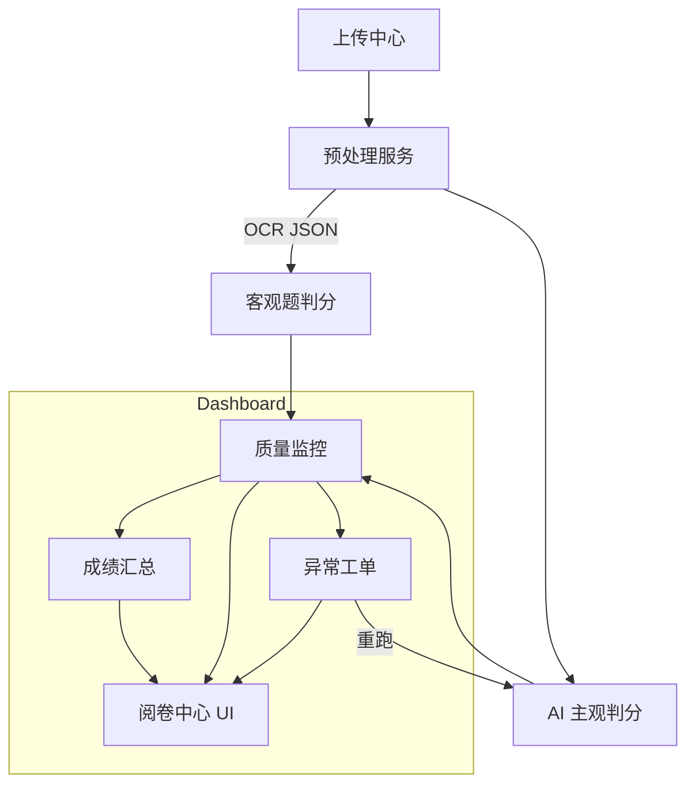

# 阅卷中心功能与流程重构方案

> 版本：v0.1  
> 作者：研发团队  
> 更新日期：{{date}}

---

## 1. 重构目标

1. **效率提升**：批量处理提速 ≥ 2 倍，单卷处理耗时 P95 < 8 秒。
2. **准确率提升**：AI+人工双评一致率 ≥ 99.5%，异常漏判率 < 0.2%。
3. **可维护性**：模块边界清晰，接口稳定；上线回滚 ≤ 5 分钟。
4. **可扩展性**：支持多学科、主观/客观混合题型；AI 引擎可热插拔。
5. **用户体验**：操作路径减少 30%，关键页面响应 < 200ms。

---

## 2. 功能模块划分

| 一级模块   | 子模块                            | 核心职责            | 备注                  |
| ---------- | --------------------------------- | ------------------- | --------------------- |
| 批次管理   | 批次创建、进度跟踪、权限控制      | 统一入口            | 新增批次仪表盘        |
| 上传中心   | 扫描上传、条码校验、队列可视      | WebUploader + MinIO | 重写进度推送逻辑      |
| 预处理服务 | OMR 识别、切片、OCR、质检         | Python/OpenCV       | GPU/CPU 混合          |
| 判分中心   | 客观题判分、AI 主观判分、人工复核 | 多 Worker           | AI 置信度阈值动态调整 |
| 质量监控   | 双评抽检、指标看板、报警          | Prom + Grafana      | diff 可视化           |
| 异常工单   | 自动工单、重跑、日志聚合          | Jira/Feishu         | Loki link             |
| 成绩汇总   | 分数合成、异常标记、导出 API      | 支持 CSV/Excel/PDF  | ——                    |
| 权限与审计 | RBAC、操作日志                    | FastAPI middleware  | ——                    |

---

## 3. 优化后的阅卷流程设计

### 3.1 关键改进

- **流式切片上传**：边上传边进入队列，减少等待。
- **判分 Dispatcher**：基于题型与置信度实时分流至 AI 或人工。
- **质量抽检规则引擎**：支持按难度、随机、异常分布多维度抽样。
- **异常闭环**：工单到达 SLO 未处理自动升级告警。

---

## 4. 系统架构调整建议

1. **微服务拆分**：将单体 Preprocess 拆分为 OCRService、ImageEnhance、BarcodeService 三个微服务。
2. **统一消息总线**：使用 **Redis Stream + BullMQ** 替换混用队列，支持延迟任务与优先级。
3. **API Gateway**：引入 **Kong** 统一鉴权、限流、指标采集。
4. **AI 推理集群**：K8s GPU NodePool + AIGPUPool，支持在线 A/B 实验。
5. **前端微模块**：采用 **Module Federation**，保证阅卷、监控、工单可独立部署。

---

## 5. 数据流转机制改进

| 流向           | 旧方案                | 缺陷     | 新方案                            |
| -------------- | --------------------- | -------- | --------------------------------- |
| 上传 → 预处理  | MinIO 直写 + 定时扫描 | 延迟高   | 事件驱动：上传完成触发 Queue 任务 |
| 预处理 → 判分  | DB 轮询               | 扩展性差 | Redis Stream + 消费组             |
| 判分 → 前端 UI | 长轮询                | 开销大   | WebSocket/SSE 推送增量进度        |
| 日志/指标      | 分散收集              | 运维困难 | Loki + Promtail + Prometheus 联合 |

---

## 6. 实施计划

| 阶段         | 时间   | 里程碑                 | 关键风险     |
| ------------ | ------ | ---------------------- | ------------ |
| 需求冻结     | W1     | 评审通过 PRD & 设计    | 需求变动     |
| 架构搭建     | W2-W3  | 服务拆分、CI/CD 打通   | 环境不一致   |
| 核心功能开发 | W4-W8  | 判分中心、质量监控 MVP | AI 模型瓶颈  |
| 集成测试     | W9-W10 | 全流程跑通，性能达标   | 数据样本不足 |
| 灰度上线     | W11    | 真实考试小批量验证     | 用户适应成本 |
| 全量上线     | W12    | 指标达标，旧系统下线   | 高峰稳定性   |

---

## 7. 答题卡版式兼容与识别优化（基于样本）

- **对齐标记检测**：利用四角黑色定位块进行透视矫正，支持旋转 ±5° 与轻度裁剪容忍。
- **动态模板库**：引入 `TemplateService` 维护不同科目/版式 JSON 描述（坐标、题块类型、评分规则），通过条形码或二维码自动匹配。
- **多列版面切分**：针对三栏书写区，采用列分割算法 + 行线检测，输出块坐标供切片。
- **手写区行检测**：Hough 直线 + 深度学习行线去噪组合，保证主观题答题区域完整提取。
- **客观题气泡判定**：改用深度分割模型提升涂点、浅涂识别精度至 99.8%。
- **模板标注工具**：提供前端可视化标注界面，教师可拖拽定义新模板并即时生效。
- **回退策略**：模板匹配置信度 <0.9 时进入人工校对队列。

## 8. 风险评估与应对

| 风险             | 等级 | 缓解措施                    |
| ---------------- | ---- | --------------------------- |
| AI 评分漂移      | 高   | 周期校准 + 在线 A/B 监控    |
| GPU 资源不足     | 中   | 预留 30% Buffer + 弹性扩容  |
| 大批量扫描质量差 | 中   | OMR 增强算法 + 阈值回退人工 |
| 需求变更         | 高   | 采用敏捷迭代，双周评审      |
| 部署复杂度提升   | 中   | IaC + GitOps 统一配置       |

---

> **结论**：通过服务拆分、队列优化、AI+人工协同和完整监控闭环，本方案可显著缩短阅卷时长、提升准确率并降低运维成本，具备落地可行性。
