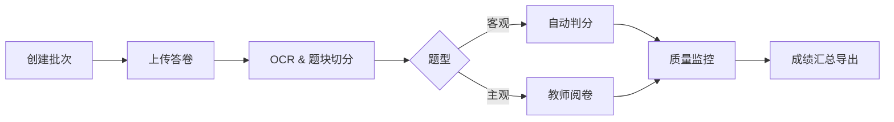

# 智阅 3.0 阅卷中心 MVP 方案

## 1. 必须实现的核心功能清单
| 优先级 | 功能 | 价值说明 |
|--------|------|----------|
| P0 | 批次与考试管理 | 创建批次、导入考生名单、配置科目，为后续流程奠定基础 |
| P0 | 答卷上传 & OCR 识别 | 支持扫描件 / PDF 上传，自动触发 OCR，生成页面坐标与文本 |
| P0 | 题块自动切分 & 题型识别 | 基于模板或 AI 模型切分客观/主观题块，确定评分方式 |
| P0 | 自动判分（客观题） | 根据气泡/条形码自动给分，实现初步分值产出 |
| P0 | 人工阅卷（主观题） | Web 端阅卷界面：题干、示例答案、快速输入分数与批注 |
| P0 | 质量监控 & 抽检 | 实时统计平均分、方差；提供重判与抽检入口 |
| P0 | 成绩汇总与导出 | 汇总客观+主观得分，导出 CSV / Excel |
| P1 | 异常处理工单 | 解决 OCR 失败、条码缺失、分割错误等异常 |
| P1 | 权限与审计日志 | 区分管理员 / 阅卷教师 / 质检员；记录关键操作 |
| P1 | Dashboard 实时监控 | 展示批次进度、阅卷速度、异常情况 |

> MVP 先完成 P0 功能，用于首轮试点；P1 功能在试点后两周内补充。

## 2. 关键用户流程

1. **管理员**：创建批次→上传答卷→监控整体进度。
2. **OCR 服务**：后台异步处理，写入识别结果与题块坐标。
3. **教师**：登录阅卷中心→领取题块→批注/评分→提交。
4. **质检员**：抽检→重判或确认→统计指标。
5. **系统**：持续汇总成绩→支持一键导出。

## 3. 基础技术架构
- 前端：React + Vite + Zustand 状态管理 + TailwindCSS
- 网关：API Gateway (FastAPI) 统一鉴权与限流
- 后端服务：
  - Core API（FastAPI + SQLModel）
  - OCR & 题块切分（Python + Tesseract / Gemini OCR）
  - 自动判分服务（Python，调用 AI 推理容器）
  - 队列 & 任务：RabbitMQ + Celery Worker
- 数据库：PostgreSQL（结构化数据） + MinIO（答卷原始图像）
- 缓存：Redis（会话、进度统计）
- 部署：Docker Compose（开发）/ Kubernetes（生产预留）

## 4. 最小资源需求
| 资源 | 规格 | 数量 | 说明 |
|------|------|------|------|
| 应用服务器 | 4 vCPU / 8 GB RAM | 1 | 运行 API、队列、Web 前端 |
| 数据库 | 2 vCPU / 4 GB RAM | 1 | PostgreSQL + Redis 共用实例 |
| 存储 | 100 GB SSD | 1 | MinIO 对象存储，保存答卷 & 日志 |
| GPU 节点 | NVIDIA T4 / 16 GB | 1 | OCR & 自动判分推理 |
| 备份 / 日志 | S3 兼容桶 | - | 定期快照 + 日志归档 |

> 以上为试点批次（≤5 万份答卷）规模预估，可水平扩展 Worker 与 GPU。

## 5. 初步时间规划（6 周）
| 周次 | 里程碑 | 关键输出 |
|------|--------|----------|
| 1 | 需求锁定 & 任务拆分 | PRD + 技术任务清单 |
| 1-2 | 架构骨架 & 环境搭建 | Docker Compose、DB Schema、项目脚手架 |
| 2-3 | 批次管理 & 上传链路 | 批次 CRUD、MinIO 上传页、进度条 |
| 3-4 | OCR & 题块切分服务 | 异步队列、识别结果写库、模板管理 |
| 4-5 | 自动判分 & 人工阅卷 UI | 客观题打分、主观题评分界面、Zustand 流程 |
| 5 | 质量监控 & 抽检 | 指标模型、抽检 API、质检页面 |
| 6 | 成绩汇总导出 & 内测 | 导出模块、bug 修复、UAT 通过 |

> P1 功能（异常工单、权限审计、监控仪表）将在 MVP 发布后两周内滚动交付。

---
该 MVP 定义保证核心闭环：上传→识别→评分→质检→导出，支持快速迭代并按需横向扩展。