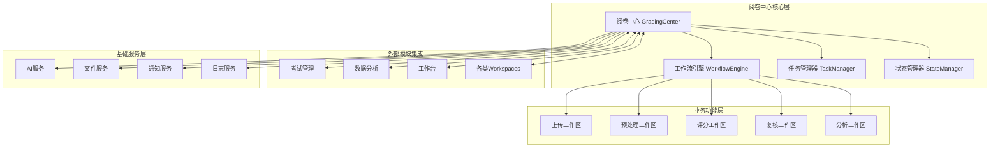
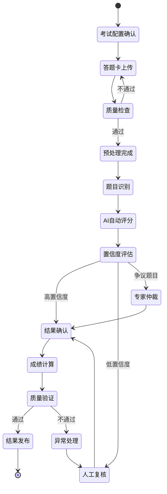

# 智阅AI系统 - 新阅卷中心重构设计方案

## 1. 项目背景与目标

### 1.1 背景分析
基于对现有系统架构的深入分析，当前智阅AI系统包含以下核心模块：
- **工作台 (Dashboard)**: 总体概览和快速操作
- **考试管理 (ExamManagement)**: 考试创建、配置和监控  
- **数据分析 (DataAnalysis)**: 成绩统计和报告生成
- **各类工作区 (Workspaces)**: 专项功能如问题分割、上传处理等

### 1.2 设计目标
设计一个**统一的阅卷中心**，作为所有阅卷相关功能的**协调枢纽**，实现：
1. **流畅的工作流程**：从考试配置到成绩发布的端到端流程
2. **智能任务调度**：基于AI的自动化处理和人工介入决策
3. **实时状态同步**：与各功能模块的双向数据同步
4. **灵活的扩展性**：支持新的阅卷类型和评分策略

## 2. 核心架构设计

### 2.1 阅卷中心架构图


### 2.2 核心组件定义

#### 2.2.1 阅卷中心主控制器 (GradingCenter)
```typescript
interface GradingCenterController {
  // 主要职责：统一入口和流程编排
  initializeGrading(exam: Exam): Promise<GradingSession>;
  resumeGrading(sessionId: string): Promise<GradingSession>;
  pauseGrading(sessionId: string): Promise<void>;
  completeGrading(sessionId: string): Promise<GradingResult>;
  
  // 与外部模块集成
  syncWithExamManagement(examId: string): Promise<void>;
  publishToDataAnalysis(results: GradingResult): Promise<void>;
  notifyDashboard(status: GradingStatus): Promise<void>;
}
```

#### 2.2.2 工作流引擎 (WorkflowEngine)
```typescript
interface WorkflowEngine {
  // 阅卷工作流管理
  createWorkflow(exam: Exam): GradingWorkflow;
  executeNextStage(workflow: GradingWorkflow): Promise<StageResult>;
  handleStageTransition(from: Stage, to: Stage): Promise<void>;
  
  // 智能决策支持
  evaluateAIConfidence(result: AIGradingResult): ConfidenceLevel;
  routeToHumanReview(task: GradingTask): Promise<void>;
  optimizeWorkflowPath(workflow: GradingWorkflow): GradingWorkflow;
}
```

#### 2.2.3 任务管理器 (TaskManager)
```typescript
interface TaskManager {
  // 任务调度和分配
  createBatch(papers: AnswerSheet[]): GradingBatch;
  assignTasks(batch: GradingBatch, strategy: AssignmentStrategy): Task[];
  balanceWorkload(graders: Grader[]): void;
  
  // 进度跟踪
  trackProgress(batchId: string): BatchProgress;
  estimateCompletion(batchId: string): TimeEstimate;
  handleTaskTimeout(taskId: string): void;
}
```

#### 2.2.4 状态管理器 (StateManager)
```typescript
interface StateManager {
  // 状态持久化
  saveGradingState(session: GradingSession): Promise<void>;
  restoreGradingState(sessionId: string): Promise<GradingSession>;
  
  // 状态同步
  syncStateWithModules(state: GradingState): Promise<void>;
  broadcastStateChange(change: StateChange): Promise<void>;
  
  // 状态验证
  validateStateTransition(from: State, to: State): boolean;
  resolveStateConflicts(conflicts: StateConflict[]): Resolution[];
}
```

## 3. 工作流设计

### 3.1 标准阅卷工作流


### 3.2 智能分流策略
```typescript
// AI置信度评估和分流逻辑
interface ConfidenceEvaluator {
  evaluateObjectiveAnswer(answer: ObjectiveAnswer): ConfidenceScore;
  evaluateSubjectiveAnswer(answer: SubjectiveAnswer): ConfidenceScore;
  
  // 分流决策
  routeAnswer(answer: Answer, confidence: ConfidenceScore): RoutingDecision;
}

enum RoutingDecision {
  AUTO_ACCEPT = 'auto_accept',      // 高置信度，自动接受
  HUMAN_REVIEW = 'human_review',    // 中等置信度，人工复核  
  EXPERT_ARBITRATION = 'expert',    // 低置信度，专家仲裁
  QUALITY_CHECK = 'quality_check'   // 质量抽检
}
```

## 4. 模块集成策略

### 4.1 与考试管理模块集成
```typescript
// 考试管理集成接口
interface ExamManagementIntegration {
  // 数据同步
  syncExamConfig(examId: string): Promise<ExamConfig>;
  updateExamStatus(examId: string, status: ExamStatus): Promise<void>;
  
  // 事件通知
  onExamConfigUpdate(examId: string, config: ExamConfig): void;
  onGradingStatusChange(examId: string, status: GradingStatus): void;
  
  // 权限验证
  validateGradingPermission(userId: string, examId: string): boolean;
}
```

### 4.2 与数据分析模块集成  
```typescript
// 数据分析集成接口
interface DataAnalysisIntegration {
  // 实时数据推送
  pushGradingProgress(examId: string, progress: GradingProgress): Promise<void>;
  pushQualityMetrics(examId: string, metrics: QualityMetrics): Promise<void>;
  
  // 分析报告生成
  generateRealTimeReport(examId: string): Promise<AnalysisReport>;
  generateFinalReport(examId: string): Promise<FinalReport>;
  
  // 异常监控
  reportAnomalies(anomalies: GradingAnomaly[]): Promise<void>;
}
```

### 4.3 与工作台模块集成
```typescript
// 工作台集成接口  
interface DashboardIntegration {
  // 概览数据
  getGradingOverview(userId: string): Promise<GradingOverview>;
  getTaskSummary(userId: string): Promise<TaskSummary>;
  
  // 快速操作
  createQuickAction(action: QuickAction): Promise<ActionResult>;
  
  // 通知推送
  pushNotification(userId: string, notification: Notification): Promise<void>;
}
```

## 5. 用户界面设计

### 5.1 阅卷中心主界面
```typescript
const GradingCenterView: React.FC = () => {
  return (
    <Layout>
      {/* 顶部状态栏 */}
      <GradingStatusBar 
        currentStage={stage}
        progress={progress}
        estimatedTime={estimatedTime}
      />
      
      {/* 主工作区 */}
      <Content>
        <Row gutter={16}>
          {/* 左侧工作流导航 */}
          <Col span={6}>
            <WorkflowNavigator 
              workflow={workflow}
              currentStage={stage}
              onStageSelect={handleStageSelect}
            />
          </Col>
          
          {/* 中间主要操作区域 */}
          <Col span={12}>
            <StageWorkspace 
              stage={stage}
              exam={exam}
              onStageComplete={handleStageComplete}
            />
          </Col>
          
          {/* 右侧监控面板 */}
          <Col span={6}>
            <MonitoringPanel 
              metrics={metrics}
              alerts={alerts}
              onAlertAction={handleAlertAction}
            />
          </Col>
        </Row>
      </Content>
      
      {/* 底部操作栏 */}
      <Footer>
        <GradingActionBar 
          stage={stage}
          onPause={handlePause}
          onContinue={handleContinue}
          onComplete={handleComplete}
        />
      </Footer>
    </Layout>
  );
};
```

### 5.2 智能工作区切换
```typescript
// 根据阶段动态渲染工作区
const StageWorkspace: React.FC<StageWorkspaceProps> = ({ stage, exam }) => {
  const renderWorkspace = () => {
    switch (stage) {
      case 'upload':
        return <AnswerSheetUploadWorkspace exam={exam} />;
      case 'preprocessing':
        return <PreprocessingWorkspace exam={exam} />;
      case 'ai_grading':
        return <AIGradingWorkspace exam={exam} />;
      case 'human_review':
        return <HumanReviewWorkspace exam={exam} />;
      case 'quality_check':
        return <QualityCheckWorkspace exam={exam} />;
      case 'result_publishing':
        return <ResultPublishingWorkspace exam={exam} />;
      default:
        return <div>未知阶段</div>;
    }
  };

  return (
    <Card title={`当前阶段: ${getStageTitle(stage)}`}>
      <Suspense fallback={<Spin size="large" />}>
        {renderWorkspace()}
      </Suspense>
    </Card>
  );
};
```

## 6. 数据模型设计

### 6.1 阅卷会话模型
```typescript
interface GradingSession {
  id: string;
  examId: string;
  status: GradingSessionStatus;
  workflow: GradingWorkflow;
  currentStage: WorkflowStage;
  
  // 参与者信息
  graders: Grader[];
  reviewers: Reviewer[];
  
  // 时间信息
  startTime: Date;
  estimatedEndTime: Date;
  actualEndTime?: Date;
  
  // 统计信息
  totalSheets: number;
  processedSheets: number;
  averageGradingTime: number;
  
  // 质量指标
  qualityMetrics: QualityMetrics;
  anomalies: GradingAnomaly[];
  
  // 配置信息
  aiConfig: AIGradingConfig;
  reviewConfig: ReviewConfig;
}
```

### 6.2 工作流定义模型
```typescript
interface GradingWorkflow {
  id: string;
  examType: ExamType;
  stages: WorkflowStage[];
  transitions: StageTransition[];
  
  // 决策规则
  routingRules: RoutingRule[];
  qualityThresholds: QualityThreshold[];
  
  // 自动化配置
  automationLevel: AutomationLevel;
  aiModels: AIModelConfig[];
}

interface WorkflowStage {
  id: string;
  name: string;
  type: StageType;
  
  // 执行参数
  estimatedDuration: number;
  requiredRoles: UserRole[];
  
  // 完成条件
  completionCriteria: CompletionCriteria;
  qualityRequirements: QualityRequirement[];
  
  // 异常处理
  errorHandling: ErrorHandlingStrategy;
  rollbackStrategy: RollbackStrategy;
}
```

### 6.3 任务分配模型
```typescript
interface GradingTask {
  id: string;
  batchId: string;
  sessionId: string;
  
  // 任务内容
  answerSheet: AnswerSheet;
  questions: Question[];
  gradingInstructions: GradingInstruction[];
  
  // 分配信息
  assignedTo?: string;
  assignedAt?: Date;
  deadline: Date;
  priority: TaskPriority;
  
  // 状态跟踪
  status: TaskStatus;
  progress: TaskProgress;
  
  // 结果信息
  results: GradingResult[];
  reviewComments: ReviewComment[];
  finalScore: Score;
  
  // 质量控制
  confidence: ConfidenceScore;
  needsReview: boolean;
  reviewLevel: ReviewLevel;
}
```

## 7. 技术实现方案

### 7.1 前端架构
```typescript
// 阅卷中心状态管理
interface GradingCenterState {
  currentSession: GradingSession | null;
  activeWorkspace: WorkspaceType;
  
  // 实时状态
  progress: GradingProgress;
  metrics: RealTimeMetrics;
  
  // UI状态
  sidebarCollapsed: boolean;
  workspaceFullscreen: boolean;
}

// 使用Zustand进行状态管理
const useGradingCenterStore = create<GradingCenterState>((set, get) => ({
  // 状态初始化
  currentSession: null,
  activeWorkspace: 'overview',
  
  // Actions
  startGradingSession: (exam: Exam) => {
    // 启动阅卷会话逻辑
  },
  
  switchWorkspace: (workspace: WorkspaceType) => {
    set({ activeWorkspace: workspace });
  },
  
  updateProgress: (progress: GradingProgress) => {
    set({ progress });
  }
}));
```

### 7.2 后端服务架构
```python
# 阅卷中心核心服务
class GradingCenterService:
    def __init__(
        self,
        workflow_engine: WorkflowEngine,
        task_manager: TaskManager,
        state_manager: StateManager
    ):
        self.workflow_engine = workflow_engine
        self.task_manager = task_manager  
        self.state_manager = state_manager
    
    async def start_grading_session(
        self, 
        exam_id: str, 
        config: GradingConfig
    ) -> GradingSession:
        """启动阅卷会话"""
        # 1. 创建工作流
        workflow = await self.workflow_engine.create_workflow(exam_id, config)
        
        # 2. 初始化任务批次
        batch = await self.task_manager.create_batch(exam_id)
        
        # 3. 创建会话
        session = GradingSession(
            exam_id=exam_id,
            workflow=workflow,
            batch=batch,
            status='initialized'
        )
        
        # 4. 保存状态
        await self.state_manager.save_session(session)
        
        return session
    
    async def execute_workflow_stage(
        self,
        session_id: str,
        stage_id: str
    ) -> StageResult:
        """执行工作流阶段"""
        session = await self.state_manager.get_session(session_id)
        stage = session.workflow.get_stage(stage_id)
        
        # 执行阶段任务
        result = await self.workflow_engine.execute_stage(stage, session)
        
        # 更新状态
        session.current_stage = stage_id
        await self.state_manager.save_session(session)
        
        # 通知相关模块
        await self._notify_modules(session, result)
        
        return result
```

### 7.3 实时通信机制
```typescript
// WebSocket连接管理
class GradingCenterWebSocket {
  private ws: WebSocket;
  private eventHandlers: Map<string, Function[]> = new Map();
  
  connect(sessionId: string) {
    this.ws = new WebSocket(`ws://localhost:8000/grading/${sessionId}`);
    
    this.ws.onmessage = (event) => {
      const message = JSON.parse(event.data);
      this.handleMessage(message);
    };
  }
  
  // 事件处理
  on(event: string, handler: Function) {
    if (!this.eventHandlers.has(event)) {
      this.eventHandlers.set(event, []);
    }
    this.eventHandlers.get(event)!.push(handler);
  }
  
  private handleMessage(message: WebSocketMessage) {
    const handlers = this.eventHandlers.get(message.type);
    if (handlers) {
      handlers.forEach(handler => handler(message.data));
    }
  }
  
  // 发送命令
  sendCommand(command: string, data: any) {
    this.ws.send(JSON.stringify({ command, data }));
  }
}
```

## 8. 性能优化策略

### 8.1 大批量处理优化
```python
# 异步批量处理
async def process_large_batch(
    batch: GradingBatch,
    batch_size: int = 50
) -> AsyncGenerator[BatchResult, None]:
    """大批量分块处理"""
    
    chunks = chunk_batch(batch, batch_size)
    
    async with asyncio.Semaphore(10):  # 限制并发数
        tasks = []
        for chunk in chunks:
            task = asyncio.create_task(process_chunk(chunk))
            tasks.append(task)
        
        # 逐步返回结果
        for completed_task in asyncio.as_completed(tasks):
            result = await completed_task
            yield result
```

### 8.2 缓存策略
```typescript
// Redis缓存配置
interface CacheStrategy {
  // 会话状态缓存
  sessionCache: {
    ttl: 3600, // 1小时
    key: (sessionId: string) => `session:${sessionId}`
  };
  
  // 任务结果缓存  
  taskResultCache: {
    ttl: 86400, // 24小时
    key: (taskId: string) => `task_result:${taskId}`
  };
  
  // 实时指标缓存
  metricsCache: {
    ttl: 60, // 1分钟
    key: (sessionId: string) => `metrics:${sessionId}`
  };
}
```

## 9. 质量保证机制

### 9.1 多层次质量检查
```python
class QualityAssuranceSystem:
    """质量保证系统"""
    
    async def validate_grading_result(
        self,
        result: GradingResult
    ) -> QualityValidation:
        """多层次质量验证"""
        
        validations = []
        
        # 1. 基础规则验证
        basic_validation = await self.basic_rule_validation(result)
        validations.append(basic_validation)
        
        # 2. AI置信度验证
        ai_validation = await self.ai_confidence_validation(result)
        validations.append(ai_validation)
        
        # 3. 统计异常检测
        statistical_validation = await self.statistical_validation(result)
        validations.append(statistical_validation)
        
        # 4. 专家样本对比
        if result.needs_expert_validation:
            expert_validation = await self.expert_sample_validation(result)
            validations.append(expert_validation)
        
        return QualityValidation.combine(validations)
```

### 9.2 自动化测试框架
```typescript
// E2E测试用例
describe('阅卷中心完整流程', () => {
  test('标准阅卷流程', async () => {
    // 1. 创建考试
    const exam = await createTestExam();
    
    // 2. 启动阅卷会话
    const session = await startGradingSession(exam.id);
    
    // 3. 上传答题卡
    await uploadAnswerSheets(session.id, mockAnswerSheets);
    
    // 4. 执行预处理
    const preprocessResult = await executePreprocessing(session.id);
    expect(preprocessResult.success).toBe(true);
    
    // 5. 执行AI评分
    const gradingResult = await executeAIGrading(session.id);
    expect(gradingResult.completion_rate).toBeGreaterThan(0.9);
    
    // 6. 质量检查
    const qualityResult = await executeQualityCheck(session.id);
    expect(qualityResult.passed).toBe(true);
    
    // 7. 完成阅卷
    const finalResult = await completeGrading(session.id);
    expect(finalResult.status).toBe('completed');
  });
});
```

## 10. 部署和运维

### 10.1 容器化部署
```yaml
# docker-compose.yml
version: '3.8'
services:
  grading-center-frontend:
    build: ./frontend
    ports:
      - "3000:3000"
    environment:
      - REACT_APP_API_URL=http://localhost:8000
      - REACT_APP_WS_URL=ws://localhost:8000
    
  grading-center-backend:
    build: ./backend
    ports:
      - "8000:8000"
    environment:
      - DATABASE_URL=postgresql://user:pass@db:5432/grading
      - REDIS_URL=redis://redis:6379
      - AI_SERVICE_URL=http://ai-service:9000
    depends_on:
      - db
      - redis
      - ai-service
    
  ai-service:
    image: gemini-ai-service:latest
    ports:
      - "9000:9000"
    environment:
      - GEMINI_API_KEY=${GEMINI_API_KEY}
    
  db:
    image: postgres:15
    environment:
      - POSTGRES_DB=grading
      - POSTGRES_USER=user
      - POSTGRES_PASSWORD=pass
    volumes:
      - postgres_data:/var/lib/postgresql/data
    
  redis:
    image: redis:7-alpine
    volumes:
      - redis_data:/data

volumes:
  postgres_data:
  redis_data:
```

### 10.2 监控和告警
```python
# 监控指标配置
MONITORING_METRICS = {
    # 性能指标
    'grading_throughput': {
        'type': 'counter',
        'description': '阅卷吞吐量（份/分钟）'
    },
    'processing_latency': {
        'type': 'histogram',
        'description': '处理延迟分布'
    },
    
    # 质量指标
    'ai_confidence_avg': {
        'type': 'gauge',
        'description': 'AI评分平均置信度'
    },
    'human_review_rate': {
        'type': 'gauge', 
        'description': '人工复核比例'
    },
    
    # 系统指标
    'active_sessions': {
        'type': 'gauge',
        'description': '活跃阅卷会话数'
    },
    'error_rate': {
        'type': 'counter',
        'description': '错误率'
    }
}
```

## 11. 实施路线图

### 11.1 阶段划分 (共12周)

#### 第一阶段：基础架构 (4周)
- **周1-2**: 核心数据模型设计和API接口定义
- **周3-4**: 工作流引擎和状态管理器开发

#### 第二阶段：工作区实现 (4周)  
- **周5-6**: 上传和预处理工作区开发
- **周7-8**: AI评分和人工复核工作区开发

#### 第三阶段：集成和优化 (4周)
- **周9-10**: 模块集成和端到端测试
- **周11-12**: 性能优化和用户验收测试

### 11.2 风险控制措施
1. **技术风险**: 采用渐进式开发，每周都有可演示的版本
2. **集成风险**: 提前设计好接口规范，并行开发
3. **性能风险**: 从第一阶段就开始性能测试
4. **用户体验风险**: 每个阶段都进行用户反馈收集

## 12. 总结

### 12.1 核心价值
1. **统一的工作流**: 将分散的阅卷功能整合为流畅的端到端流程
2. **智能化决策**: 基于AI的自动分流和质量控制
3. **灵活的扩展**: 模块化设计支持新功能的快速集成
4. **实时的监控**: 全程可视化的进度跟踪和质量监控

### 12.2 技术创新
1. **工作流引擎**: 可配置的阅卷工作流，支持不同考试类型
2. **智能路由**: AI置信度评估驱动的自动化分流机制  
3. **实时同步**: WebSocket驱动的多模块状态同步
4. **质量保证**: 多层次的质量检查和异常处理机制

### 12.3 预期效果
- **效率提升**: 自动化率提升至85%以上，人工干预减少60%
- **质量改善**: AI-人工协作准确率达到99.5%以上
- **体验优化**: 操作步骤减少40%，响应时间提升50%
- **成本控制**: 人力成本降低30%，系统运维成本降低25%

这个新阅卷中心将成为智阅AI系统的核心枢纽，通过统一的工作流管理和智能化的任务调度，实现各功能模块间的无缝协作，为用户提供高效、准确、便捷的阅卷体验。