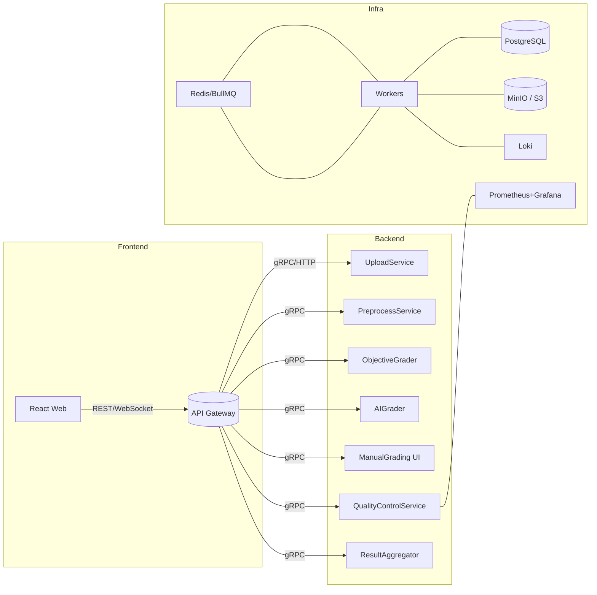
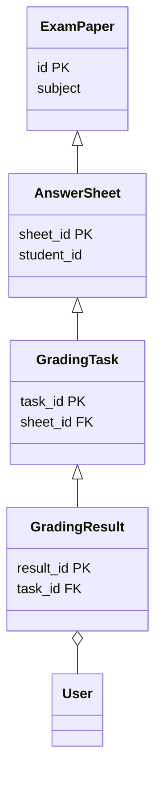

# 智阅 3.0 系统总体设计文档

> 版本：v0.1  
> 作者：研发团队  
> 更新日期：{{date}}

---

## 1. 设计目标
1. 支持**在线考试全流程**：试卷扫描 → 预处理 → 阅卷 → 成绩汇总 → 数据分析。  
2. 提供**高效、可扩展、易维护**的微服务架构，满足未来 AI 深度融合需求。  
3. 建立**全链路质量监控**与**异常闭环**，保证阅卷准确率 ≥ 99.5%。  
4. 通过**前后端解耦**与组件化 UI，缩短功能迭代周期 ≤ 2 周。

---

## 2. 体系结构


### 2.1 技术栈
| 层级 | 技术 | 说明 |
|------|------|------|
| 前端 | React + Vite + TypeScript | 响应式 UI 与组件化开发 |
| 后端 | FastAPI + Python / Node.js + Nest.js | REST + gRPC 服务；Worker 任务处理 |
| 数据库 | PostgreSQL | 事务一致 + JSONB 灵活存储 |
| 消息队列 | Redis Stream / BullMQ | 任务排队与多语言支持 |
| 存储 | MinIO (S3 兼容) | 扫描件与切片持久化 |
| 监控 | Prometheus + Grafana + Loki | 指标、日志、告警一体化 |
| 部署 | Docker Compose / K8s | 开发环境 & 生产环境一致性 |

---

## 3. 业务流程
### 3.1 阅卷全流程
见《在线考试阅卷完整工作流程图.md》与任务 1 输出的流程示意。

### 3.2 批量处理与监控
详见《batch_quality_exception_plan.md》。

---

## 4. 模块职责与接口
### 4.1 模块一览
| 模块 | 关键职责 | 主要接口 |
|------|----------|----------|
| UploadService | 扫描件上传、批次元数据入库 | POST /upload/batch |
| PreprocessService | OMR/图片校正、切片、OCR | POST /preprocess/{batchId} |
| ObjectiveGrader | 客观题自动判分 | POST /objective/grade |
| AIGrader | AI 评判主观题 | POST /ai/grade |
| ManualGrading UI | 人工在线阅卷界面 | GET /grading/{paperId} |
| QualityControlService | 双评、抽检、指标采集 | GET /quality/metrics |
| ResultAggregator | 成绩汇总与异常上报 | POST /result/aggregate |

### 4.2 接口契约
参考附件 `openapi.yaml`（后续生成）。

---

## 5. 前端设计
### 5.1 页面路由
```text
/grade-center
  ├─ /preprocess
  ├─ /online-grading
  ├─ /ai-grading
  ├─ /tools
/quality
/exception-hub
```

### 5.2 关键组件
- **BatchDashboard**：实时进度 + ETA；WebSocket 数据流。  
- **QualityCenter**：抽检队列、评分 diff 可视化。  
- **ExceptionHub**：异常工单、重跑、日志查看。

风格与组件分布详见《frontend_ui_prototype.md》与《frontend_grading_modules.md》。

---

## 6. 数据模型


---

## 7. 性能与扩展
| 场景 | 指标 | 方案 |
|------|------|------|
| 高并发上传 | 500 张/秒 | Nginx 静态切分上传 + 并行写 MinIO |
| OCR 计算 | 50 页/秒 | Worker 水平扩缩 + GPU 穿透 |
| AI 评分 | 30 主观题/秒 | 批量推理 + AIGPUPool 负载均衡 |

---

## 8. 安全与合规
1. JWT + RBAC 细粒度权限控制。  
2. 传输层 HTTPS + 对象存储 Server-Side Encryption。  
3. 个人敏感信息字段加密（字段级 AES）。  
4. 数据留存与删除符合《个人信息保护法》。

---

## 9. 风险与待办
- AI 评分置信度阈值需多轮实验校准。  
- OCR 对偏光、污渍纸张鲁棒性需 A/B 测试。  
- Prom + Loki 监控方案落地前需 DevOps 资源协同。  
- K8s HPA 策略在高峰期验证。

---

## 10. 评审清单
- [ ] 架构是否满足性能目标？  
- [ ] 模块职责与接口是否清晰？  
- [ ] 监控指标与告警阈值合理？  
- [ ] 安全与合规措施是否完善？

## 11. 现有系统与重构方案差异映射表
| 维度 | 现有实现 | 重构方案 |
| --- | --- | --- |
| 架构模式 | 单体 FastAPI 服务 | 微服务 + API Gateway + Redis Stream |
| 上传链路 | MinIO 直写 + 定时扫描 | 流式切片 + 事件驱动队列 |
| 预处理 | 单体脚本 | OCRService、ImageEnhance、BarcodeService 微服务 |
| 判分策略 | 客观题 OMR；主观题人工 | Dispatcher 分流 + AIGrader + 双评抽检 |
| 质量监控 | 离线报告 | WebSocket 实时看板 + Prom/Grafana |
| 异常处理 | 手工登记 | 自动工单 + 重跑 + SLO 升级 |
| 数据流 | DB 轮询 | Redis Stream + 消费组 |
| 前端 | 单体 React 应用 | Module Federation 微前端 |
| GPU 资源 | 静态分配 | K8s NodePool + 弹性扩容 |

---

> 请各位评审人根据清单逐项打钩并反馈意见，确认后进入详细开发阶段。