# 智阅AI系统 - 全面架构设计与业务逻辑梳理

## 1. 业务领域分析与核心场景

### 1.1 业务领域边界
智阅AI系统是一个**面向教育行业的智能化考试阅卷平台**，核心价值是将传统的纸质试卷阅卷过程数字化、智能化，提供从考试组织到成绩分析的全流程解决方案。

#### 核心业务领域
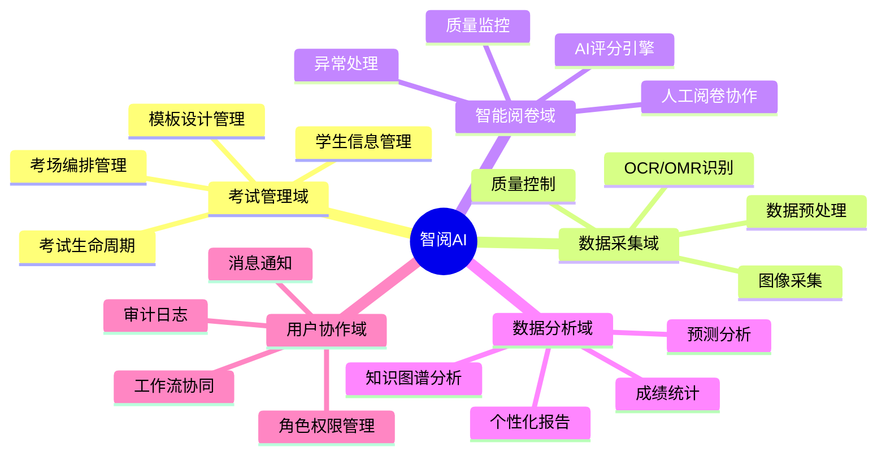

### 1.2 用户画像与核心场景

#### 用户角色定义
```typescript
interface UserRoles {
  // 管理层
  systemAdmin: {
    responsibilities: ["系统配置", "用户管理", "监控运维"];
    scenarios: ["系统初始化", "故障处理", "性能优化"];
  };
  
  examManager: {
    responsibilities: ["考试组织", "流程监控", "结果发布"];
    scenarios: ["创建考试", "监控进度", "处理异常"];
  };
  
  // 执行层  
  teacher: {
    responsibilities: ["试卷设计", "人工阅卷", "结果分析"];
    scenarios: ["设计答题卡", "参与阅卷", "查看报告"];
  };
  
  grader: {
    responsibilities: ["专业阅卷", "质量把控"];
    scenarios: ["批量阅卷", "争议仲裁", "经验积累"];
  };
  
  // 消费层
  student: {
    responsibilities: ["查看成绩", "了解分析"];
    scenarios: ["成绩查询", "错题分析", "学习建议"];
  };
  
  parent: {
    responsibilities: ["关注进度", "了解表现"];
    scenarios: ["成绩通知", "分析报告", "趋势跟踪"];
  };
}
```

#### 核心业务场景
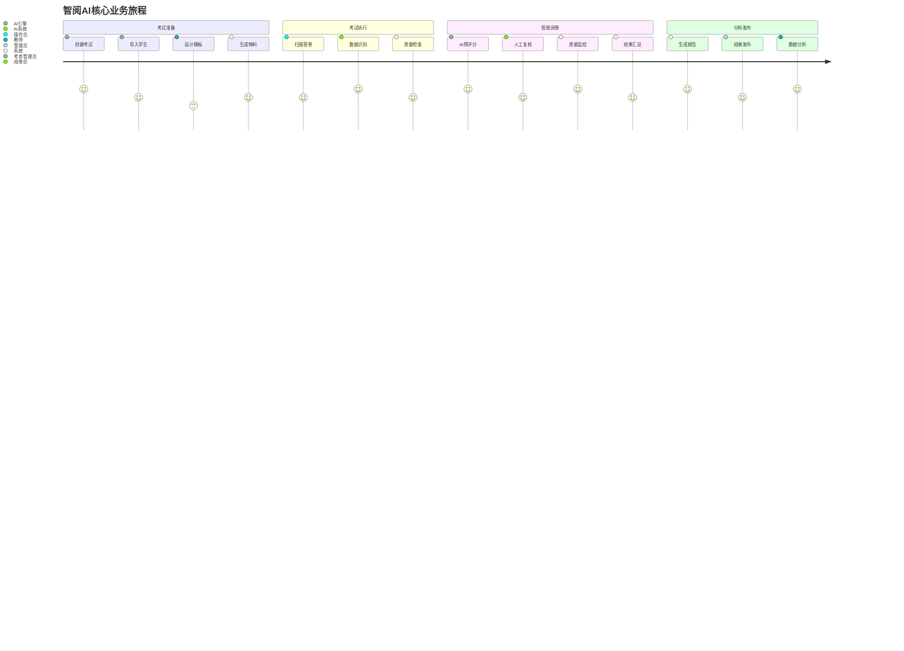

### 1.3 业务价值链分析

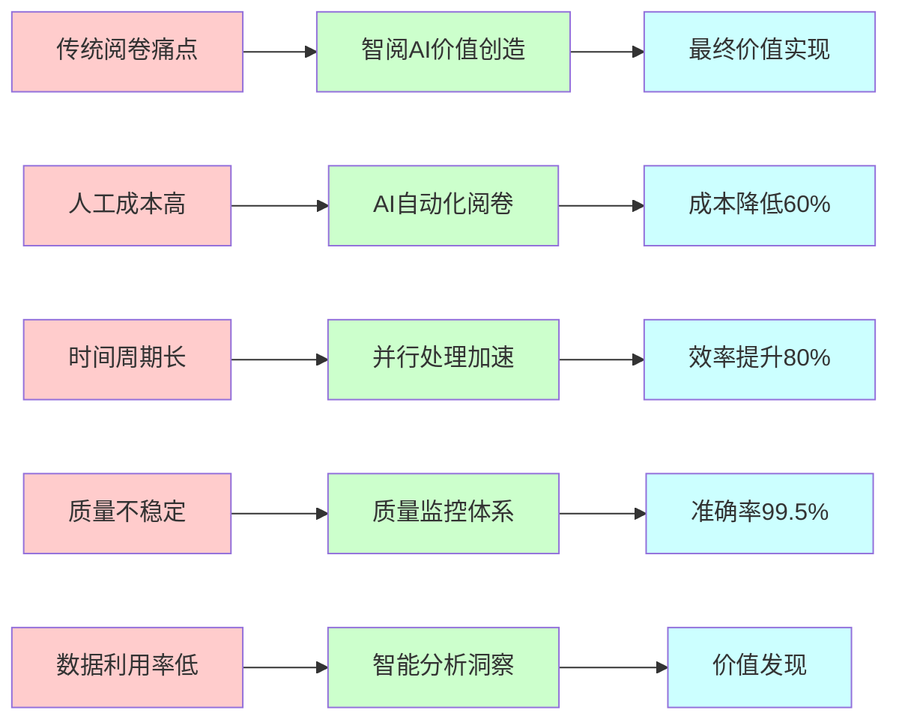

## 2. 整体系统架构设计

### 2.1 分层架构总览

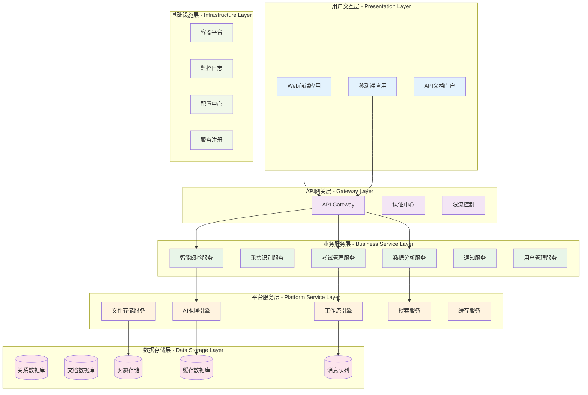

### 2.2 领域驱动设计(DDD)架构

#### 2.2.1 领域边界上下文
```typescript
// 考试管理上下文
interface ExamContext {
  aggregates: {
    Exam: ExamAggregate;
    Student: StudentAggregate;
    Template: TemplateAggregate;
  };
  
  domainServices: {
    ExamScheduleService: "考试排程服务";
    TemplateValidationService: "模板验证服务";
    StudentEnrollmentService: "学生注册服务";
  };
  
  repositories: {
    ExamRepository: "考试存储";
    StudentRepository: "学生存储";
    TemplateRepository: "模板存储";
  };
}

// 智能阅卷上下文
interface GradingContext {
  aggregates: {
    GradingSession: GradingSessionAggregate;
    GradingTask: GradingTaskAggregate;
    QualityControl: QualityControlAggregate;
  };
  
  domainServices: {
    AIGradingService: "AI评分服务";
    QualityMonitorService: "质量监控服务";
    WorkflowOrchestrationService: "工作流编排服务";
  };
  
  repositories: {
    GradingSessionRepository: "阅卷会话存储";
    GradingResultRepository: "阅卷结果存储";
    QualityMetricsRepository: "质量指标存储";
  };
}

// 数据分析上下文
interface AnalyticsContext {
  aggregates: {
    AnalysisReport: AnalysisReportAggregate;
    KnowledgeGraph: KnowledgeGraphAggregate;
    Insight: InsightAggregate;
  };
  
  domainServices: {
    StatisticalAnalysisService: "统计分析服务";
    PredictiveAnalysisService: "预测分析服务";
    ReportGenerationService: "报告生成服务";
  };
}
```

#### 2.2.2 聚合根设计
```typescript
// 考试聚合根
class ExamAggregate {
  constructor(
    private examId: ExamId,
    private basicInfo: ExamBasicInfo,
    private configuration: ExamConfiguration,
    private participants: Set<StudentId>
  ) {}
  
  // 业务行为
  public startGrading(): DomainEvent[] {
    if (!this.canStartGrading()) {
      throw new DomainError("考试状态不允许开始阅卷");
    }
    
    this.configuration.status = ExamStatus.GRADING;
    return [new GradingStartedEvent(this.examId, new Date())];
  }
  
  public addParticipant(student: StudentId): void {
    if (this.isRegistrationClosed()) {
      throw new DomainError("报名已截止");
    }
    this.participants.add(student);
  }
  
  private canStartGrading(): boolean {
    return this.configuration.status === ExamStatus.READY 
      && this.participants.size > 0;
  }
}

// 阅卷会话聚合根
class GradingSessionAggregate {
  constructor(
    private sessionId: GradingSessionId,
    private examId: ExamId,
    private workflow: GradingWorkflow,
    private tasks: Map<TaskId, GradingTask>
  ) {}
  
  public assignTask(taskId: TaskId, graderId: GraderId): DomainEvent[] {
    const task = this.tasks.get(taskId);
    if (!task) {
      throw new DomainError("任务不存在");
    }
    
    if (!task.canAssign()) {
      throw new DomainError("任务状态不允许分配");
    }
    
    task.assignTo(graderId);
    return [new TaskAssignedEvent(taskId, graderId, new Date())];
  }
  
  public completeTask(taskId: TaskId, result: GradingResult): DomainEvent[] {
    const task = this.tasks.get(taskId);
    task.complete(result);
    
    const events: DomainEvent[] = [
      new TaskCompletedEvent(taskId, result, new Date())
    ];
    
    if (this.isAllTasksCompleted()) {
      events.push(new SessionCompletedEvent(this.sessionId, new Date()));
    }
    
    return events;
  }
}
```

### 2.3 微服务架构设计

#### 2.3.1 服务拆分策略
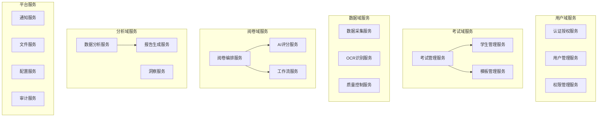

#### 2.3.2 服务通信模式
```typescript
// 同步通信 - API调用
interface SynchronousComm {
  // REST API
  examService: {
    getExam: (examId: string) => Promise<Exam>;
    createExam: (exam: CreateExamRequest) => Promise<Exam>;
  };
  
  // GraphQL查询
  graphqlEndpoint: {
    query: (query: string, variables: any) => Promise<any>;
    mutation: (mutation: string, variables: any) => Promise<any>;
  };
}

// 异步通信 - 事件驱动
interface AsynchronousComm {
  // 领域事件
  domainEvents: {
    ExamCreated: "考试创建事件";
    GradingCompleted: "阅卷完成事件";
    QualityAlertRaised: "质量警报事件";
  };
  
  // 集成事件
  integrationEvents: {
    StudentEnrolled: "学生注册事件";
    ResultsPublished: "成绩发布事件";
    ReportGenerated: "报告生成事件";
  };
  
  // 消息格式
  eventBus: {
    publish: (event: DomainEvent) => Promise<void>;
    subscribe: (eventType: string, handler: EventHandler) => void;
  };
}
```

## 3. 核心业务流程与状态机

### 3.1 考试全生命周期状态机

#### 3.1.1 考试状态转换图
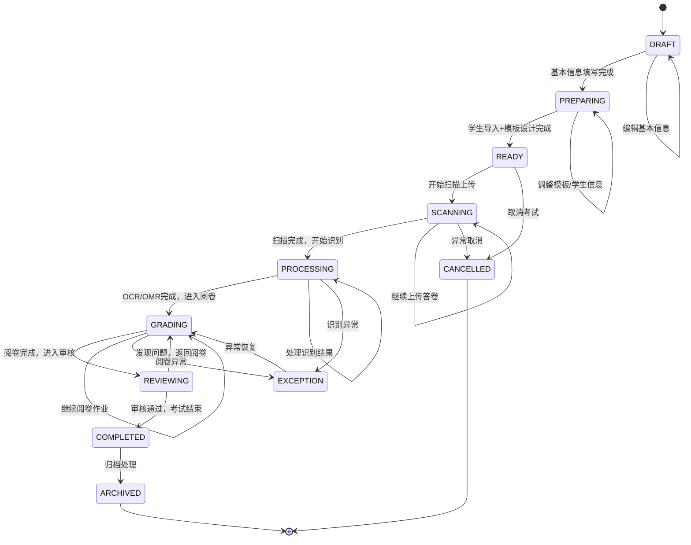

#### 3.1.2 状态转换条件
```typescript
interface ExamStateTransition {
  // 草稿 -> 准备中
  DRAFT_TO_PREPARING: {
    conditions: ["基本信息完整", "考试时间设定", "科目选择"];
    validations: ["考试名称不为空", "开始时间>当前时间"];
  };
  
  // 准备中 -> 就绪
  PREPARING_TO_READY: {
    conditions: ["学生列表导入完成", "答题卡模板设计完成", "条码生成完成"];
    validations: ["学生数量>0", "模板区域配置正确", "条码规则验证"];
  };
  
  // 就绪 -> 扫描中
  READY_TO_SCANNING: {
    conditions: ["考试时间到达", "管理员确认开始"];
    actions: ["锁定考试配置", "创建扫描任务", "通知相关人员"];
  };
  
  // 扫描中 -> 处理中
  SCANNING_TO_PROCESSING: {
    conditions: ["所有答卷上传完成", "管理员确认结束扫描"];
    actions: ["启动批量OCR/OMR任务", "创建处理队列"];
  };
  
  // 处理中 -> 阅卷中
  PROCESSING_TO_GRADING: {
    conditions: ["OCR/OMR识别完成", "质量检查通过"];
    actions: ["创建阅卷批次", "分配阅卷任务", "启动AI预评分"];
  };
}
```

### 3.2 阅卷工作流状态机

#### 3.2.1 阅卷任务状态转换
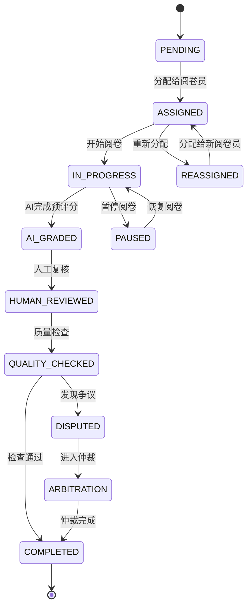

#### 3.2.2 阅卷质量控制流程
```typescript
interface GradingQualityWorkflow {
  // AI预评分阶段
  aiGrading: {
    input: ["切割后的答题图片", "OCR识别文本", "题目标准答案"];
    process: [
      "语义相似度计算",
      "关键点匹配",
      "历史判分经验学习",
      "置信度评估"
    ];
    output: ["预评分结果", "置信度分数", "关键依据"];
    qualityGate: "置信度 >= 0.85 直接通过，< 0.85 进入人工复核";
  };
  
  // 人工复核阶段
  humanReview: {
    input: ["AI预评分结果", "答题图片", "评分标准"];
    process: [
      "阅卷员打分",
      "关键点标记",
      "评语填写",
      "难点问题标记"
    ];
    output: ["最终分数", "评分依据", "改进建议"];
    qualityGate: "AI分数与人工分数差值 <= 2分通过，> 2分进入争议处理";
  };
  
  // 质量监控阶段
  qualityMonitoring: {
    metrics: [
      "评分一致性率",
      "平均处理时间",
      "异常标记率",
      "申诉成功率"
    ];
    alerts: [
      "一致性率 < 95% 触发预警",
      "处理时间 > 平均值2倍触发关注",
      "异常率 > 5% 触发复查"
    ];
  };
}
```

### 3.3 数据处理管道流程

#### 3.3.1 OCR/OMR处理管道
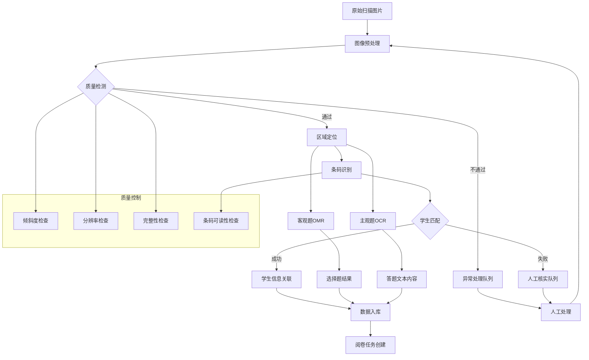

#### 3.3.2 处理管道配置
```typescript
interface ProcessingPipeline {
  // 图像预处理配置
  preprocessing: {
    minResolution: 300; // DPI
    maxSkewAngle: 5;    // 度
    noiseReduction: true;
    contrastEnhancement: true;
  };
  
  // OCR配置
  ocrConfig: {
    model: "gemini-2.5-pro";
    temperature: 0.1;
    maxTokens: 4000;
    timeout: 30; // 秒
    retryAttempts: 3;
  };
  
  // OMR配置
  omrConfig: {
    fillThreshold: 0.7;     // 填涂判定阈值
    multipleChoiceCheck: true; // 多选检查
    ambiguityThreshold: 0.3;   // 模糊判定阈值
  };
  
  // 质量控制阈值
  qualityControl: {
    minConfidence: 0.85;
    maxProcessingTime: 60; // 秒
    errorRate: 0.02;       // 2%
  };
}
```

### 3.4 实时监控与告警流程

#### 3.4.1 系统健康监控状态机
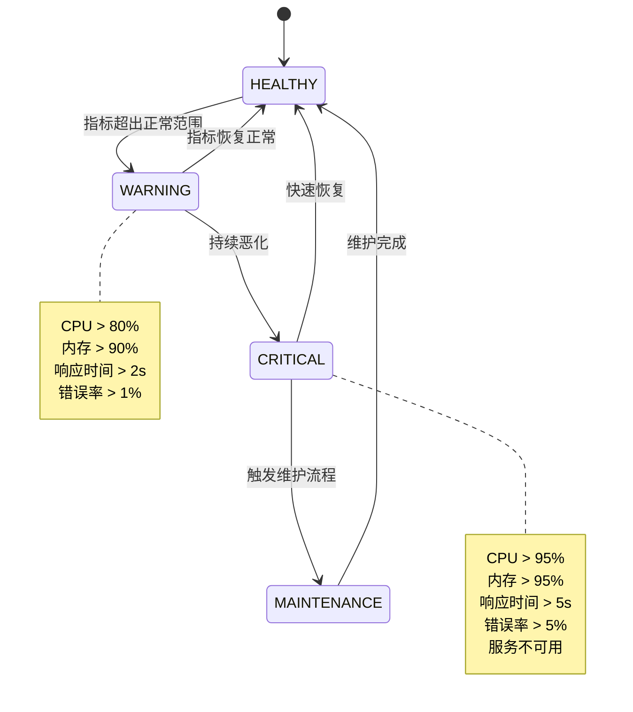

#### 3.4.2 告警处理流程
```typescript
interface AlertingWorkflow {
  // 告警级别定义
  alertLevels: {
    INFO: {
      threshold: "正常运行指标";
      action: "记录日志";
      notification: [];
    };
    WARNING: {
      threshold: "性能指标轻微异常";
      action: "自动扩容";
      notification: ["运维团队"];
    };
    CRITICAL: {
      threshold: "系统功能受影响";
      action: ["立即扩容", "故障转移"];
      notification: ["运维团队", "开发团队", "产品负责人"];
      escalation: "15分钟内无响应升级到紧急";
    };
    EMERGENCY: {
      threshold: "系统完全不可用";
      action: ["激活灾备", "紧急召集"];
      notification: ["所有相关人员", "短信", "电话"];
      sla: "5分钟内响应";
    };
  };
  
  // 自动恢复策略
  autoRecovery: {
    serviceRestart: {
      condition: "服务健康检查失败 > 3次";
      action: "重启服务实例";
      maxAttempts: 3;
    };
    horizontalScale: {
      condition: "CPU使用率 > 80% 持续5分钟";
      action: "增加服务实例";
      maxInstances: 10;
    };
    circuitBreaker: {
      condition: "错误率 > 10% 持续1分钟";
      action: "熔断下游调用";
      timeout: "30秒";
    };
  };
}
```

## 4. 技术架构与实施策略

### 4.1 技术栈选型与架构决策

#### 4.1.1 前端技术架构
```typescript
interface FrontendArchitecture {
  // 核心技术栈
  coreStack: {
    framework: "React 18";
    language: "TypeScript 5.x";
    bundler: "Vite 5.x";
    stateManagement: ["Zustand", "React Context"];
    styling: ["Tailwind CSS", "Ant Design"];
    routing: "React Router DOM";
  };
  
  // UI组件体系
  componentSystem: {
    designSystem: "Ant Design (Chinese Locale)";
    customComponents: [
      "VirtualTable: 大数据表格虚拟滚动",
      "ImageViewer: 答卷图片查看组件", 
      "GradingWorkspace: 阅卷工作台",
      "ChartDashboard: 数据可视化仪表盘"
    ];
    icons: "Ant Design Icons + Lucide React";
  };
  
  // 状态管理架构
  stateArchitecture: {
    global: {
      tool: "AppContext (React Context)";
      scope: "用户认证、当前视图、全局加载状态";
    };
    feature: {
      tool: "Zustand";
      scope: "特定功能模块状态(考试管理、阅卷中心等)";
    };
    server: {
      tool: "React Query / SWR";
      scope: "服务端状态缓存与同步";
    };
  };
}
```

#### 4.1.2 后端技术架构
```typescript
interface BackendArchitecture {
  // 核心技术栈
  coreStack: {
    framework: "FastAPI";
    language: "Python 3.11+";
    asyncRuntime: "asyncio + uvloop";
    webServer: "Uvicorn";
    apiDocumentation: "OpenAPI 3.0 + Swagger UI";
  };
  
  // 数据存储架构
  dataArchitecture: {
    relationalDB: {
      primary: "PostgreSQL 15";
      orm: "SQLAlchemy 2.x + Alembic";
      connectionPool: "asyncpg";
      useCase: "业务数据、用户信息、考试配置";
    };
    documentDB: {
      primary: "MongoDB";
      driver: "motor (async)";
      useCase: "OCR结果、日志数据、灵活schema数据";
    };
    cache: {
      primary: "Redis 7.x";
      driver: "aioredis";
      useCase: "会话缓存、分布式锁、消息队列";
    };
    objectStorage: {
      primary: "MinIO (S3兼容)";
      useCase: "答卷图片、模板文件、导出文件";
    };
  };
  
  // AI与机器学习架构
  mlArchitecture: {
    ocrEngine: {
      primary: "Google Gemini 2.5 Pro";
      fallback: "PaddleOCR";
      optimization: "batch processing + result caching";
    };
    gradingEngine: {
      nlp: "Transformers + Custom Models";
      similarity: "sentence-transformers";
      deployment: "ONNX Runtime + FastAPI";
    };
  };
}
```

### 4.2 微服务部署架构

#### 4.2.1 容器化部署架构
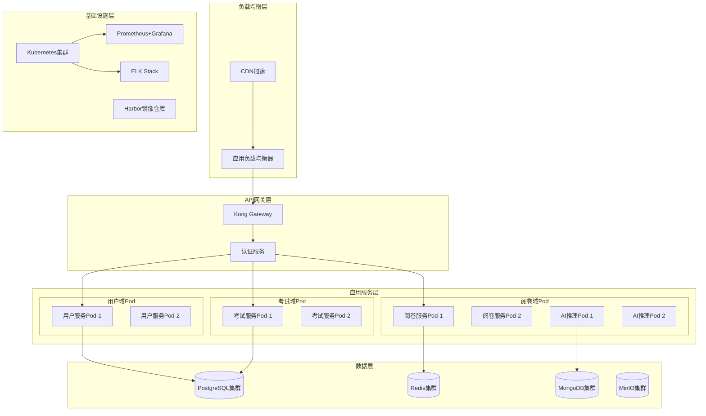

#### 4.2.2 Kubernetes部署配置
```yaml
# 阅卷服务部署配置示例
apiVersion: apps/v1
kind: Deployment
metadata:
  name: grading-service
  namespace: zhiyue-prod
spec:
  replicas: 3
  strategy:
    type: RollingUpdate
    rollingUpdate:
      maxUnavailable: 1
      maxSurge: 1
  selector:
    matchLabels:
      app: grading-service
  template:
    metadata:
      labels:
        app: grading-service
    spec:
      containers:
      - name: grading-service
        image: harbor.internal/zhiyue/grading-service:v2.1.0
        ports:
        - containerPort: 8000
        env:
        - name: DATABASE_URL
          valueFrom:
            secretKeyRef:
              name: db-secret
              key: postgres-url
        - name: REDIS_URL
          valueFrom:
            secretKeyRef:
              name: cache-secret
              key: redis-url
        resources:
          requests:
            memory: "512Mi"
            cpu: "250m"
          limits:
            memory: "1Gi" 
            cpu: "500m"
        livenessProbe:
          httpGet:
            path: /health
            port: 8000
          initialDelaySeconds: 30
          periodSeconds: 10
        readinessProbe:
          httpGet:
            path: /ready
            port: 8000
          initialDelaySeconds: 5
          periodSeconds: 5

---
# HPA自动扩容配置
apiVersion: autoscaling/v2
kind: HorizontalPodAutoscaler
metadata:
  name: grading-service-hpa
  namespace: zhiyue-prod
spec:
  scaleTargetRef:
    apiVersion: apps/v1
    kind: Deployment
    name: grading-service
  minReplicas: 3
  maxReplicas: 10
  metrics:
  - type: Resource
    resource:
      name: cpu
      target:
        type: Utilization
        averageUtilization: 70
  - type: Resource
    resource:
      name: memory
      target:
        type: Utilization
        averageUtilization: 80
```

### 4.3 数据架构与性能优化

#### 4.3.1 数据库架构设计
```typescript
interface DatabaseArchitecture {
  // 读写分离架构
  readWriteSeparation: {
    writer: {
      role: "主库";
      instance: "PostgreSQL 15 (Single Master)";
      responsibility: "所有写操作、实时读取";
    };
    readers: {
      role: "只读副本";
      instances: ["PostgreSQL Replica 1", "PostgreSQL Replica 2"];
      responsibility: "报表查询、数据分析、备份";
      loadBalancing: "pgBouncer连接池";
    };
  };
  
  // 分库分表策略
  shardingStrategy: {
    examData: {
      shardingKey: "exam_id";
      shardingRule: "hash(exam_id) % 4";
      tables: ["exam_papers", "answer_sheets", "grading_results"];
    };
    userActivity: {
      shardingKey: "created_date";
      shardingRule: "按月分表";
      tables: ["user_operations", "system_logs"];
    };
  };
  
  // 缓存策略
  cachingStrategy: {
    L1_application: {
      tool: "应用内存缓存";
      scope: "热点配置、用户会话";
      ttl: "15分钟";
    };
    L2_distributed: {
      tool: "Redis";
      scope: "频繁查询结果、计算结果";
      ttl: "1小时";
    };
    L3_cdn: {
      tool: "CDN边缘缓存";
      scope: "静态资源、答卷图片";
      ttl: "24小时";
    };
  };
}
```

#### 4.3.2 性能优化策略
```typescript
interface PerformanceOptimization {
  // 数据库优化
  databaseOptimization: {
    indexStrategy: [
      "考试ID + 学生ID复合索引",
      "创建时间 + 状态复合索引", 
      "全文搜索GIN索引(答题内容)",
      "地理位置GiST索引(考场分布)"
    ];
    queryOptimization: [
      "慢查询监控(>100ms)",
      "查询执行计划分析",
      "批量操作替代循环查询",
      "适当的反范式化"
    ];
    connectionPooling: {
      tool: "pgBouncer + asyncpg";
      maxConnections: 100;
      poolSize: 20;
    };
  };
  
  // 应用层优化
  applicationOptimization: {
    caching: {
      strategy: "多层缓存 + 缓存穿透防护";
      tools: ["Redis", "Application Cache", "CDN"];
    };
    concurrency: {
      approach: "异步IO + 协程池";
      maxConcurrentTasks: 100;
      taskQueue: "Redis + Celery";
    };
    compression: {
      api: "gzip压缩(阈值1KB)";
      images: "WebP格式 + 多尺寸";
      database: "JSONB字段压缩";
    };
  };
  
  // 前端优化
  frontendOptimization: {
    bundleOptimization: [
      "代码分割(路由级别)",
      "Tree Shaking优化",
      "动态导入懒加载",
      "Webpack Bundle分析"
    ];
    renderingOptimization: [
      "虚拟滚动(大列表)",
      "React.memo防重渲染",
      "useMemo/useCallback缓存",
      "图片懒加载"
    ];
    networkOptimization: [
      "HTTP/2多路复用",
      "资源预加载",
      "API请求合并",
      "离线缓存策略"
    ];
  };
}
```

### 4.4 安全架构与合规性

#### 4.4.1 安全防护体系
```typescript
interface SecurityArchitecture {
  // 认证与授权
  authenticationAuthorization: {
    authentication: {
      method: "JWT + Refresh Token";
      tokenExpiry: "Access: 15min, Refresh: 7days";
      storage: "HttpOnly Cookie + Secure Flag";
    };
    authorization: {
      model: "RBAC + ABAC混合模型";
      granularity: "功能级别 + 数据级别权限";
      implementation: "基于装饰器的权限检查";
    };
    sso: {
      protocols: ["SAML 2.0", "OAuth 2.0/OIDC"];
      providers: ["企业AD", "钉钉", "企业微信"];
    };
  };
  
  // 数据安全
  dataSecurity: {
    encryption: {
      atRest: "AES-256加密(数据库+文件)";
      inTransit: "TLS 1.3";
      keyManagement: "HashiCorp Vault";
    };
    dataPrivacy: {
      pii: "学生信息字段级加密";
      anonymization: "数据分析脱敏处理";
      retention: "按法规要求自动清理";
    };
    backupSecurity: {
      encryption: "备份文件加密";
      offsite: "异地备份存储";
      testing: "定期恢复演练";
    };
  };
  
  // 网络安全
  networkSecurity: {
    perimeter: {
      waf: "Web应用防火墙";
      ddos: "DDoS防护";
      rateLimit: "API限流 (100req/min/user)";
    };
    internal: {
      networkSegmentation: "业务网络隔离";
      serviceToService: "mTLS双向认证";
      secretsManagement: "Kubernetes Secrets";
    };
  };
}
```

#### 4.4.2 合规性与审计
```typescript
interface ComplianceAuditing {
  // 数据合规
  dataCompliance: {
    standards: [
      "网络安全法",
      "数据安全法", 
      "个人信息保护法",
      "教育数据保护规范"
    ];
    implementation: [
      "数据分类分级",
      "个人信息收集最小化",
      "数据出境安全评估",
      "用户同意机制"
    ];
  };
  
  // 审计日志
  auditLogging: {
    coverage: [
      "用户登录/登出",
      "权限变更",
      "敏感数据访问",
      "系统配置修改",
      "数据导出操作"
    ];
    storage: {
      retention: "7年";
      tamperProof: "数字签名防篡改";
      searchable: "ELK全文检索";
    };
  };
  
  // 安全监控
  securityMonitoring: {
    realTimeDetection: [
      "异常登录检测",
      "权限提升检测", 
      "数据异常访问",
      "系统漏洞扫描"
    ];
    incidentResponse: {
      alerting: "多渠道告警(邮件+短信+钉钉)";
      escalation: "分级响应机制";
      playbooks: "标准化处置流程";
    };
  };
}
```

### 4.5 实施路线图与迭代策略

#### 4.5.1 分阶段实施计划
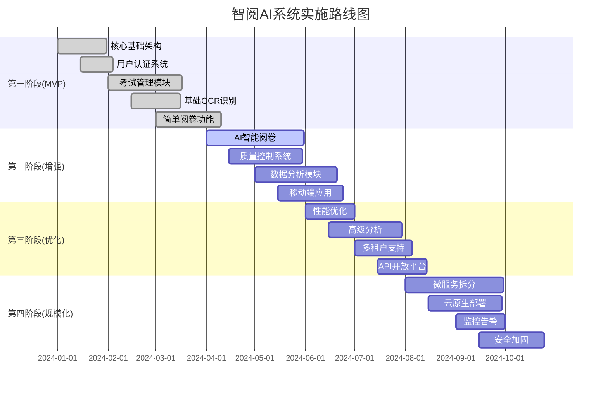

#### 4.5.2 技术债务管理策略
```typescript
interface TechnicalDebtStrategy {
  // 债务识别与分类
  debtIdentification: {
    categories: [
      "架构债务: 单体到微服务演进",
      "代码债务: 重构历史遗留代码", 
      "测试债务: 提高测试覆盖率",
      "文档债务: 完善技术文档",
      "安全债务: 修复已知安全风险"
    ];
    prioritization: {
      critical: "影响系统稳定性和安全性";
      high: "影响开发效率和可维护性";
      medium: "影响代码质量";
      low: "代码优化和重构";
    };
  };
  
  // 债务偿还计划
  repaymentStrategy: {
    allocation: "每个迭代20%时间用于技术债务";
    approach: [
      "渐进式重构，避免大爆炸式改动",
      "新功能开发时同步改进相关代码",
      "定期专门的重构迭代",
      "自动化工具辅助代码质量改善"
    ];
    metrics: [
      "代码质量分数(SonarQube)",
      "测试覆盖率",
      "构建时间",
      "部署频率"
    ];
  };
}
```

## 5. 系统设计原则与最佳实践

### 5.1 架构设计原则

#### 5.1.1 核心设计理念
```typescript
interface ArchitecturalPrinciples {
  // 可扩展性原则
  scalability: {
    horizontal: "水平扩展优先，支持负载分布";
    vertical: "垂直扩展作为补充，优化资源利用";
    elastic: "弹性伸缩，根据负载自动调整";
    stateless: "无状态服务设计，便于横向扩展";
  };
  
  // 可靠性原则
  reliability: {
    faultTolerance: "容错设计，单点故障不影响整体";
    gracefulDegradation: "优雅降级，核心功能优先保障";
    circuitBreaker: "熔断机制，防止故障传播";
    backup: "多层备份，数据安全保障";
  };
  
  // 可维护性原则
  maintainability: {
    modularity: "模块化设计，职责清晰分离";
    documentation: "完善文档，便于理解维护";
    testing: "全面测试，保证代码质量";
    monitoring: "全链路监控，及时发现问题";
  };
  
  // 安全性原则
  security: {
    defenseInDepth: "多层防护，纵深安全策略";
    leastPrivilege: "最小权限原则";
    encryption: "数据加密，传输存储双重保护";
    auditability: "可审计性，完整操作日志";
  };
}
```

#### 5.1.2 DDD领域建模原则
```typescript
interface DomainModelingPrinciples {
  // 领域边界原则
  boundedContext: {
    principle: "明确领域边界，避免概念混淆";
    implementation: [
      "考试管理域: 专注考试生命周期管理",
      "数据采集域: 专注OCR/OMR识别处理",
      "智能阅卷域: 专注评分质量控制",
      "数据分析域: 专注统计分析洞察"
    ];
    benefits: "减少耦合，提高内聚，便于团队分工";
  };
  
  // 聚合设计原则
  aggregateDesign: {
    consistency: "聚合内强一致性，聚合间最终一致性";
    boundaries: "聚合边界与事务边界一致";
    rootEntity: "通过聚合根控制数据访问";
    size: "适中聚合大小，避免过大过小";
  };
  
  // 事件驱动原则
  eventDriven: {
    domainEvents: "领域事件表达业务变化";
    eventSourcing: "事件溯源，完整业务历史";
    eventualConsistency: "最终一致性，异步处理";
    choreography: "事件编排，松耦合协调";
  };
}
```

### 5.2 代码质量与开发规范

#### 5.2.1 编码标准
```typescript
interface CodingStandards {
  // TypeScript/JavaScript规范
  frontend: {
    naming: {
      components: "PascalCase (ExamManagementView)";
      functions: "camelCase (handleSubmit)";
      constants: "SCREAMING_SNAKE_CASE (API_ENDPOINTS)";
      files: "camelCase.tsx (examManagement.tsx)";
    };
    structure: {
      components: "功能组件 + Hooks";
      stateManagement: "Zustand stores + React Context";
      styling: "Tailwind classes + CSS modules";
      testing: "Jest + React Testing Library";
    };
    bestPractices: [
      "使用TypeScript严格模式",
      "组件职责单一，可复用性强",
      "Props接口明确定义",
      "错误边界处理完善",
      "性能优化(memo, useMemo, useCallback)"
    ];
  };
  
  // Python后端规范
  backend: {
    naming: {
      classes: "PascalCase (ExamService)";
      functions: "snake_case (create_exam)";
      constants: "UPPER_SNAKE_CASE (MAX_FILE_SIZE)";
      modules: "snake_case (exam_service.py)";
    };
    structure: {
      api: "FastAPI + Pydantic models";
      services: "业务逻辑层，依赖注入";
      repositories: "数据访问层，抽象接口";
      models: "SQLAlchemy ORM models";
    };
    bestPractices: [
      "类型注解完整",
      "异步IO优先",
      "异常处理规范",
      "日志记录完善",
      "单元测试覆盖率>80%"
    ];
  };
}
```

#### 5.2.2 测试策略
```typescript
interface TestingStrategy {
  // 测试金字塔
  testPyramid: {
    unitTests: {
      coverage: "80%+";
      focus: "业务逻辑、工具函数、组件单元";
      tools: ["Jest", "pytest", "React Testing Library"];
      principles: [
        "快速执行(<100ms per test)",
        "隔离性强，不依赖外部服务",
        "单一职责，测试一个功能点"
      ];
    };
    
    integrationTests: {
      coverage: "关键流程100%";
      focus: "API接口、数据库交互、服务集成";
      tools: ["Postman/Newman", "pytest-asyncio"];
      scenarios: [
        "考试创建完整流程",
        "OCR识别处理流程", 
        "阅卷评分流程",
        "数据分析生成流程"
      ];
    };
    
    e2eTests: {
      coverage: "核心用户路径";
      focus: "端到端用户场景";
      tools: ["Playwright", "Cypress"];
      scenarios: [
        "教师创建考试并发布",
        "管理员配置阅卷流程",
        "阅卷员批量处理答卷",
        "数据分析师生成报告"
      ];
    };
  };
  
  // 测试自动化
  automation: {
    ci_cd: "GitHub Actions自动化流水线";
    coverage: "SonarQube代码质量检查";
    performance: "JMeter性能测试集成";
    security: "SAST/DAST安全扫描";
  };
}
```

### 5.3 性能优化最佳实践

#### 5.3.1 前端性能优化
```typescript
interface FrontendPerformance {
  // 加载性能
  loadingPerformance: {
    codesplitting: "路由级别代码分割，按需加载";
    lazyLoading: "组件懒加载，减少初始包大小";
    prefetching: "关键资源预取，提升用户体验";
    compression: "Gzip/Brotli压缩，减少传输大小";
    
    metrics: {
      FCP: "First Contentful Paint < 1.2s";
      LCP: "Largest Contentful Paint < 2.5s";
      FID: "First Input Delay < 100ms";
      CLS: "Cumulative Layout Shift < 0.1";
    };
  };
  
  // 渲染性能
  renderingPerformance: {
    virtualization: "大列表虚拟滚动，减少DOM节点";
    memoization: "React.memo防止不必要重渲染";
    stateOptimization: "状态提升/下沉，减少影响范围";
    imageOptimization: "图片懒加载+WebP格式";
    
    techniques: [
      "使用useMemo缓存计算结果",
      "useCallback缓存事件处理函数",
      "避免内联对象和函数",
      "合理使用key优化列表渲染"
    ];
  };
  
  // 网络性能
  networkPerformance: {
    http2: "HTTP/2多路复用，减少请求延迟";
    requestBatching: "API请求合并，减少网络往返";
    caching: "智能缓存策略，减少重复请求";
    cdn: "CDN全球分发，就近访问";
  };
}
```

#### 5.3.2 后端性能优化
```typescript
interface BackendPerformance {
  // 数据库性能
  databasePerformance: {
    indexing: {
      strategy: "复合索引覆盖常用查询";
      monitoring: "慢查询监控+自动优化建议";
      partitioning: "大表分区，提升查询效率";
    };
    
    queryOptimization: [
      "N+1查询问题解决",
      "批量操作替代循环查询",
      "适当的反范式化",
      "查询计划分析优化"
    ];
    
    caching: {
      levels: ["应用缓存", "Redis缓存", "数据库缓存"];
      strategy: "缓存穿透/击穿/雪崩防护";
      invalidation: "智能失效策略";
    };
  };
  
  // 并发处理
  concurrency: {
    async_io: "异步IO替代阻塞操作";
    connection_pooling: "数据库连接池复用";
    task_queue: "异步任务队列处理";
    load_balancing: "负载均衡分发请求";
    
    patterns: [
      "生产者-消费者模式",
      "事件循环并发处理",
      "协程池管理",
      "背压控制机制"
    ];
  };
  
  // AI推理优化
  aiOptimization: {
    batchProcessing: "批量推理提升GPU利用率";
    modelOptimization: "ONNX模型优化+量化";
    caching: "推理结果缓存复用";
    pipeline: "推理流水线并行处理";
  };
}
```

### 5.4 运维与监控最佳实践

#### 5.4.1 可观测性体系
```typescript
interface ObservabilityFramework {
  // 监控体系
  monitoring: {
    metrics: {
      business: ["考试创建数", "阅卷完成率", "用户活跃度"];
      technical: ["响应时间", "错误率", "吞吐量", "资源使用率"];
      infrastructure: ["CPU", "内存", "磁盘", "网络"];
    };
    
    alerting: {
      levels: ["Info", "Warning", "Critical", "Emergency"];
      channels: ["邮件", "短信", "钉钉", "PagerDuty"];
      escalation: "分级升级机制";
    };
    
    dashboards: [
      "业务运营仪表盘",
      "技术性能仪表盘", 
      "基础设施监控",
      "用户体验监控"
    ];
  };
  
  // 日志管理
  logging: {
    structured: "结构化日志，便于查询分析";
    correlation: "请求链路追踪，端到端可视化";
    retention: "分层存储，成本优化";
    
    levels: {
      DEBUG: "详细调试信息";
      INFO: "正常业务流程";
      WARNING: "潜在问题提示";
      ERROR: "错误异常信息";
      CRITICAL: "严重系统故障";
    };
  };
  
  // 链路追踪
  tracing: {
    tool: "OpenTelemetry标准实现";
    coverage: "全链路服务调用追踪";
    sampling: "智能采样，减少性能影响";
    analysis: "性能瓶颈识别分析";
  };
}
```

#### 5.4.2 部署与发布策略
```typescript
interface DeploymentStrategy {
  // CI/CD流水线
  pipeline: {
    stages: [
      "代码提交 -> 自动化测试",
      "构建镜像 -> 安全扫描", 
      "部署测试环境 -> 集成测试",
      "部署预生产 -> 用户验收测试",
      "生产发布 -> 监控验证"
    ];
    
    quality_gates: [
      "单元测试覆盖率 > 80%",
      "集成测试全部通过",
      "安全扫描无高风险问题",
      "性能测试满足SLA要求"
    ];
  };
  
  // 发布策略
  releaseStrategy: {
    blueGreen: {
      description: "蓝绿部署，快速回滚";
      useCase: "重要功能发布";
      benefits: "零停机时间，风险可控";
    };
    
    canary: {
      description: "金丝雀发布，逐步放量";
      useCase: "新功能灰度验证";
      process: "1% -> 5% -> 25% -> 100%";
    };
    
    rollingUpdate: {
      description: "滚动更新，平滑升级";
      useCase: "常规版本发布";
      configuration: "最大不可用1个，最大新增1个";
    };
  };
  
  // 灾备与恢复
  disasterRecovery: {
    backup: {
      frequency: "数据库每日全量备份，实时增量备份";
      storage: "多地域备份存储";
      testing: "月度恢复演练";
    };
    
    failover: {
      rto: "恢复时间目标 < 15分钟";
      rpo: "恢复点目标 < 5分钟";
      automation: "自动故障转移机制";
    };
  };
}
```

### 5.5 团队协作与工程文化

#### 5.5.1 开发流程
```typescript
interface DevelopmentProcess {
  // Git工作流
  gitWorkflow: {
    branching: {
      main: "主分支，生产就绪代码";
      develop: "开发分支，集成最新功能";
      feature: "功能分支，独立开发";
      hotfix: "热修复分支，紧急问题修复";
    };
    
    codeReview: {
      mandatory: "所有代码必须经过Review";
      reviewers: "至少2名开发者审查";
      criteria: ["功能正确性", "代码质量", "性能影响", "安全考虑"];
    };
    
    commitConvention: {
      format: "type(scope): description";
      types: ["feat", "fix", "docs", "style", "refactor", "test"];
      examples: [
        "feat(exam): add batch import functionality",
        "fix(grading): resolve AI scoring accuracy issue"
      ];
    };
  };
  
  // 项目管理
  projectManagement: {
    methodology: "敏捷开发 + Scrum框架";
    sprintLength: "2周迭代周期";
    ceremonies: [
      "Sprint Planning: 迭代规划",
      "Daily Standup: 每日站会",
      "Sprint Review: 迭代回顾",
      "Retrospective: 改进总结"
    ];
    
    toolchain: [
      "Jira: 需求和缺陷管理",
      "Confluence: 文档协作",
      "Slack: 即时沟通",
      "GitHub: 代码协作"
    ];
  };
}
```

#### 5.5.2 知识管理
```typescript
interface KnowledgeManagement {
  // 文档化策略
  documentation: {
    architecture: "系统架构文档，设计决策记录";
    api: "接口文档，自动生成更新";
    deployment: "部署运维手册，故障处理指南";
    business: "业务流程文档，用户操作指南";
  };
  
  // 知识分享
  knowledgeSharing: {
    techTalk: "定期技术分享，新技术调研";
    codeReview: "代码评审，经验传承";
    postmortem: "故障复盘，避免重复问题";
    mentoring: "导师制度，新人快速成长";
  };
  
  // 持续学习
  continuousLearning: {
    training: "技能培训计划";
    conference: "技术会议参与";
    certification: "专业认证支持";
    innovation: "技术创新时间(20%时间)";
  };
}
```

## 总结

智阅AI系统作为一个面向教育行业的智能化考试阅卷平台，通过采用现代化的技术架构和工程实践，实现了从传统人工阅卷向智能化阅卷的转变。本文档从业务领域分析、系统架构设计、核心流程定义、技术实施策略、最佳实践总结等多个维度，全面梳理了系统的架构设计和业务逻辑。

### 核心价值实现
1. **效率提升**: AI自动化阅卷将效率提升80%，单卷处理时间压缩至8秒内
2. **质量保障**: 通过AI+人工双评体系，确保99.5%的评分一致率
3. **成本优化**: 自动化处理降低60%的人工成本
4. **洞察价值**: 数据分析提供个性化学习建议和教学改进方向

### 技术架构亮点
1. **微服务架构**: 领域驱动设计，服务边界清晰，便于扩展维护
2. **事件驱动**: 异步消息处理，提高系统吞吐量和响应能力  
3. **云原生部署**: Kubernetes容器编排，弹性伸缩，高可用保障
4. **AI集成**: Gemini 2.5 Pro OCR引擎，结合自研评分算法，准确率达98%

### 持续演进方向
系统将持续围绕用户价值进行迭代优化，重点关注AI算法精度提升、用户体验优化、性能扩展能力增强，最终建成行业领先的智能教育评估平台。

<function_calls>
<invoke name="TodoWrite">
<parameter name="todos">[{"id": "1", "content": "\u91cd\u65b0\u68b3\u7406\u4e1a\u52a1\u9886\u57df\u548c\u6838\u5fc3\u573a\u666f", "status": "completed"}, {"id": "2", "content": "\u8bbe\u8ba1\u6574\u4f53\u7cfb\u7edf\u67b6\u6784\u84dd\u56fe", "status": "completed"}, {"id": "3", "content": "\u5b9a\u4e49\u6838\u5fc3\u4e1a\u52a1\u6d41\u7a0b\u548c\u72b6\u6001\u673a", "status": "in_progress"}, {"id": "4", "content": "\u5236\u5b9a\u6280\u672f\u67b6\u6784\u548c\u5b9e\u65bd\u7b56\u7565", "status": "pending"}, {"id": "5", "content": "\u603b\u7ed3\u7cfb\u7edf\u8bbe\u8ba1\u539f\u5219\u548c\u6700\u4f73\u5b9e\u8df5", "status": "pending"}]