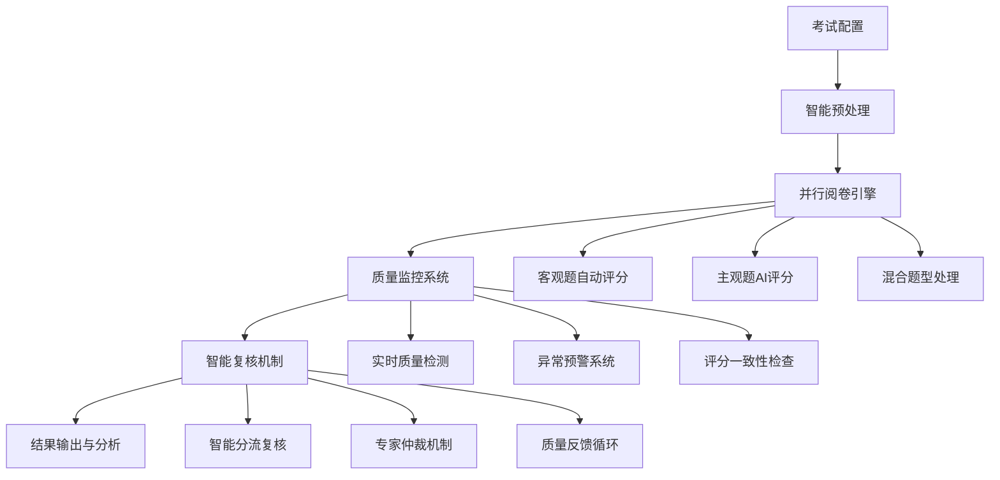

# 智阅AI 3.0 优化阅卷流程设计方案

## 一、优化目标

基于现有系统分析，制定以下优化目标：
- **提升处理效率**: 批量处理能力提升50%
- **增强用户体验**: 操作步骤减少30%，响应时间缩短60%
- **保障质量控制**: 建立多层质量监控体系
- **强化系统稳定性**: 异常处理覆盖率达到95%

## 二、重新设计的阅卷流程架构

### 2.1 整体流程重构



### 2.2 核心改进点

#### 改进1: 智能预处理流水线
```typescript
// 新的预处理工作流设计
interface OptimizedPreProcessingPipeline {
  stages: {
    upload: ParallelUploadStage;          // 并行上传
    quality: IntelligentQualityCheck;     // 智能质检
    ocr: BatchOCRProcessing;              // 批量OCR
    segmentation: AISegmentation;         // AI分割
    validation: AutoValidation;           // 自动验证
  };
  monitoring: RealTimeMonitoring;         // 实时监控
  rollback: ErrorRecovery;                // 错误恢复
}
```

#### 改进2: 并行阅卷引擎架构
```python
# 重构的评分引擎
class ParallelGradingEngine:
    def __init__(self):
        self.objective_processor = ObjectiveGradingProcessor()
        self.subjective_processor = SubjectiveGradingProcessor()
        self.hybrid_processor = HybridGradingProcessor()
        self.quality_monitor = RealTimeQualityMonitor()
    
    async def process_batch(self, answer_sheets: List[AnswerSheet]) -> BatchResult:
        # 智能任务分发
        tasks = self.distribute_tasks(answer_sheets)
        
        # 并行处理
        results = await asyncio.gather(*[
            self.process_single_sheet(sheet) for sheet in tasks
        ])
        
        # 质量检查
        validated_results = self.quality_monitor.validate_batch(results)
        
        return BatchResult(results=validated_results)
```

## 三、功能模块重构设计

### 3.1 前端组件架构优化

#### 新的组件结构
```
src/
├── modules/                    # 模块化架构
│   ├── exam-management/        # 考试管理模块
│   │   ├── components/
│   │   ├── hooks/
│   │   ├── services/
│   │   └── types/
│   ├── grading-workflow/       # 阅卷工作流模块
│   │   ├── components/
│   │   │   ├── PreProcessing/
│   │   │   ├── GradingEngine/
│   │   │   ├── QualityControl/
│   │   │   └── ReviewSystem/
│   │   ├── hooks/
│   │   │   ├── useOptimizedWorkflow.ts
│   │   │   ├── useBatchProcessing.ts
│   │   │   └── useQualityMonitoring.ts
│   │   └── services/
│   │       ├── gradingService.ts
│   │       ├── qualityService.ts
│   │       └── workflowService.ts
│   └── data-analysis/          # 数据分析模块
├── shared/                     # 共享组件
│   ├── components/
│   ├── hooks/
│   ├── utils/
│   └── types/
└── core/                       # 核心功能
    ├── api/
    ├── state/
    └── config/
```

#### 核心Hook重构
```typescript
// 优化的工作流Hook
export const useOptimizedWorkflow = (examId: string) => {
  const [state, dispatch] = useReducer(workflowReducer, initialState);
  const { data: examConfig } = useQuery(['exam', examId], getExamConfig);
  
  // 智能工作流适配
  const adaptiveSteps = useMemo(() => {
    return getOptimalWorkflowSteps(examConfig);
  }, [examConfig]);
  
  // 批量处理优化
  const processBatch = useCallback(async (files: File[]) => {
    dispatch({ type: 'START_BATCH_PROCESSING' });
    
    try {
      const chunks = chunkArray(files, OPTIMAL_BATCH_SIZE);
      const results = [];
      
      for (const chunk of chunks) {
        const chunkResult = await processFileChunk(chunk);
        results.push(...chunkResult);
        
        // 实时进度更新
        dispatch({ 
          type: 'UPDATE_PROGRESS', 
          payload: { processed: results.length, total: files.length }
        });
      }
      
      dispatch({ type: 'BATCH_PROCESSING_SUCCESS', payload: results });
    } catch (error) {
      dispatch({ type: 'BATCH_PROCESSING_ERROR', payload: error });
    }
  }, []);
  
  return {
    ...state,
    adaptiveSteps,
    processBatch,
    retryFailedItems: () => retryFailedProcessing(state.failedItems)
  };
};
```

### 3.2 后端服务架构优化

#### 新的服务层设计
```python
# 重构的阅卷服务架构
from abc import ABC, abstractmethod
from typing import Protocol

class GradingStrategy(Protocol):
    async def grade(self, answer_sheet: AnswerSheet) -> GradingResult: ...
    def get_confidence_threshold(self) -> float: ...

class ObjectiveGradingStrategy:
    async def grade(self, answer_sheet: AnswerSheet) -> GradingResult:
        # 客观题评分逻辑
        choices = await self.extract_choices(answer_sheet)
        scores = self.calculate_scores(choices, answer_sheet.exam.answer_key)
        return GradingResult(scores=scores, confidence=0.95)

class SubjectiveGradingStrategy:
    def __init__(self, ai_service: AIService):
        self.ai_service = ai_service
        
    async def grade(self, answer_sheet: AnswerSheet) -> GradingResult:
        # 主观题AI评分
        text_content = await self.extract_text(answer_sheet)
        ai_result = await self.ai_service.grade_subjective(text_content)
        return self.process_ai_result(ai_result)

class OptimizedGradingService:
    def __init__(self):
        self.strategies = {
            'objective': ObjectiveGradingStrategy(),
            'subjective': SubjectiveGradingStrategy(gemini_service),
            'hybrid': HybridGradingStrategy()
        }
        self.quality_monitor = QualityMonitoringService()
        self.batch_processor = BatchProcessingService()
    
    async def grade_batch(self, answer_sheets: List[AnswerSheet]) -> BatchGradingResult:
        # 智能分组
        grouped_sheets = self.group_by_question_type(answer_sheets)
        
        # 并行处理
        tasks = []
        for question_type, sheets in grouped_sheets.items():
            strategy = self.strategies[question_type]
            task = self.batch_processor.process_group(sheets, strategy)
            tasks.append(task)
        
        results = await asyncio.gather(*tasks)
        
        # 质量检查
        validated_results = await self.quality_monitor.validate_batch_results(results)
        
        return BatchGradingResult(
            results=validated_results,
            quality_metrics=self.quality_monitor.get_metrics(),
            processing_time=time.time() - start_time
        )
```

## 四、批量处理功能优化

### 4.1 智能批量处理引擎

```python
class IntelligentBatchProcessor:
    def __init__(self):
        self.resource_monitor = ResourceMonitor()
        self.load_balancer = LoadBalancer()
        self.error_recovery = ErrorRecoveryManager()
    
    async def process_intelligent_batch(
        self, 
        items: List[ProcessingItem],
        strategy: ProcessingStrategy
    ) -> BatchResult:
        # 动态批次大小调整
        optimal_batch_size = self.calculate_optimal_batch_size(
            items, 
            self.resource_monitor.get_current_load()
        )
        
        batches = self.create_intelligent_batches(items, optimal_batch_size)
        
        results = []
        failed_items = []
        
        for batch in batches:
            try:
                # 负载均衡处理
                worker = self.load_balancer.get_optimal_worker()
                batch_result = await worker.process_batch(batch, strategy)
                results.extend(batch_result.successful_items)
                failed_items.extend(batch_result.failed_items)
                
                # 实时调整策略
                if batch_result.error_rate > ERROR_THRESHOLD:
                    optimal_batch_size = max(1, optimal_batch_size // 2)
                    
            except Exception as e:
                failed_items.extend(batch)
                await self.error_recovery.handle_batch_failure(batch, e)
        
        # 重试失败项目
        if failed_items:
            retry_results = await self.retry_failed_items(failed_items, strategy)
            results.extend(retry_results)
        
        return BatchResult(
            successful_items=results,
            failed_items=failed_items,
            processing_metrics=self.get_processing_metrics()
        )
    
    def calculate_optimal_batch_size(self, items: List, current_load: float) -> int:
        base_size = len(items) // self.get_worker_count()
        load_factor = 1.0 - current_load  # 负载越高，批次越小
        return max(1, int(base_size * load_factor))
```

### 4.2 前端批量处理优化

```typescript
// 优化的批量处理Hook
export const useBatchProcessing = () => {
  const [state, setState] = useState<BatchProcessingState>(initialState);
  const abortControllerRef = useRef<AbortController>();
  
  const processBatchWithProgress = useCallback(async (
    items: ProcessingItem[],
    options: BatchProcessingOptions = {}
  ) => {
    // 创建取消控制器
    abortControllerRef.current = new AbortController();
    
    setState(prev => ({
      ...prev,
      isProcessing: true,
      progress: { processed: 0, total: items.length, errors: 0 }
    }));
    
    try {
      // 智能分块
      const chunks = createIntelligentChunks(items, {
        maxChunkSize: options.maxChunkSize || OPTIMAL_CHUNK_SIZE,
        priorityFunction: options.priorityFunction
      });
      
      const results = [];
      const errors = [];
      
      for (let i = 0; i < chunks.length; i++) {
        // 检查是否被取消
        if (abortControllerRef.current?.signal.aborted) {
          throw new Error('Processing cancelled by user');
        }
        
        const chunk = chunks[i];
        
        try {
          // 并行处理块内项目
          const chunkResults = await Promise.allSettled(
            chunk.map(item => processItem(item, {
              signal: abortControllerRef.current?.signal
            }))
          );
          
          // 处理结果
          chunkResults.forEach((result, index) => {
            if (result.status === 'fulfilled') {
              results.push(result.value);
            } else {
              errors.push({
                item: chunk[index],
                error: result.reason
              });
            }
          });
          
          // 更新进度
          setState(prev => ({
            ...prev,
            progress: {
              processed: results.length,
              total: items.length,
              errors: errors.length
            }
          }));
          
          // 自适应延迟（避免服务器过载）
          if (i < chunks.length - 1) {
            await adaptiveDelay(errors.length / results.length);
          }
          
        } catch (chunkError) {
          // 块处理失败，记录错误
          chunk.forEach(item => {
            errors.push({ item, error: chunkError });
          });
        }
      }
      
      setState(prev => ({
        ...prev,
        isProcessing: false,
        results,
        errors,
        isComplete: true
      }));
      
      return { results, errors };
      
    } catch (error) {
      setState(prev => ({
        ...prev,
        isProcessing: false,
        error: error as Error
      }));
      throw error;
    }
  }, []);
  
  const cancelProcessing = useCallback(() => {
    abortControllerRef.current?.abort();
    setState(prev => ({
      ...prev,
      isProcessing: false,
      isCancelled: true
    }));
  }, []);
  
  const retryErrors = useCallback(async () => {
    if (state.errors.length === 0) return;
    
    const failedItems = state.errors.map(error => error.item);
    await processBatchWithProgress(failedItems);
  }, [state.errors, processBatchWithProgress]);
  
  return {
    ...state,
    processBatch: processBatchWithProgress,
    cancelProcessing,
    retryErrors
  };
};
```

## 五、质量监控机制增强

### 5.1 实时质量监控系统

```python
class RealTimeQualityMonitor:
    def __init__(self):
        self.metrics_collector = MetricsCollector()
        self.anomaly_detector = AnomalyDetector()
        self.alert_manager = AlertManager()
        self.quality_rules = QualityRuleEngine()
    
    async def monitor_grading_quality(self, grading_session: GradingSession):
        """实时监控阅卷质量"""
        
        while grading_session.is_active:
            # 收集实时指标
            current_metrics = await self.collect_current_metrics(grading_session)
            
            # 异常检测
            anomalies = self.anomaly_detector.detect(current_metrics)
            
            if anomalies:
                # 发送实时告警
                await self.alert_manager.send_quality_alert(anomalies)
                
                # 自动调整策略
                await self.auto_adjust_grading_strategy(grading_session, anomalies)
            
            # 质量规则检查
            rule_violations = self.quality_rules.check_violations(current_metrics)
            
            if rule_violations:
                await self.handle_rule_violations(grading_session, rule_violations)
            
            await asyncio.sleep(MONITORING_INTERVAL)
    
    def collect_current_metrics(self, session: GradingSession) -> QualityMetrics:
        return QualityMetrics(
            accuracy_rate=self.calculate_accuracy_rate(session),
            consistency_score=self.calculate_consistency_score(session),
            processing_speed=self.calculate_processing_speed(session),
            error_rate=self.calculate_error_rate(session),
            ai_confidence_distribution=self.get_confidence_distribution(session)
        )
    
    async def auto_adjust_grading_strategy(
        self, 
        session: GradingSession, 
        anomalies: List[QualityAnomaly]
    ):
        """根据质量异常自动调整评分策略"""
        
        for anomaly in anomalies:
            if anomaly.type == 'low_ai_confidence':
                # 降低AI评分阈值，增加人工复核
                session.config.ai_confidence_threshold *= 0.9
                session.config.manual_review_rate *= 1.2
                
            elif anomaly.type == 'high_error_rate':
                # 减小批次大小，增加检查频率
                session.config.batch_size = max(1, session.config.batch_size // 2)
                session.config.quality_check_frequency *= 2
                
            elif anomaly.type == 'inconsistent_scoring':
                # 启用更严格的一致性检查
                session.config.enable_strict_consistency_check = True
                session.config.consistency_threshold *= 0.8
        
        await session.apply_config_changes()
```

### 5.2 前端质量监控界面

```typescript
// 质量监控组件
export const QualityMonitoringDashboard: React.FC = () => {
  const { qualityMetrics, alerts } = useQualityMonitoring();
  const [timeRange, setTimeRange] = useState<TimeRange>('1h');
  
  return (
    <div className="quality-dashboard">
      <div className="metrics-overview">
        <MetricCard
          title="评分准确率"
          value={qualityMetrics.accuracyRate}
          trend={qualityMetrics.accuracyTrend}
          threshold={0.95}
          status={qualityMetrics.accuracyRate >= 0.95 ? 'good' : 'warning'}
        />
        
        <MetricCard
          title="一致性评分"
          value={qualityMetrics.consistencyScore}
          trend={qualityMetrics.consistencyTrend}
          threshold={0.9}
        />
        
        <MetricCard
          title="处理速度"
          value={`${qualityMetrics.processingSpeed} 份/分钟`}
          trend={qualityMetrics.speedTrend}
          unit="份/分钟"
        />
        
        <MetricCard
          title="错误率"
          value={qualityMetrics.errorRate}
          trend={qualityMetrics.errorTrend}
          threshold={0.05}
          status={qualityMetrics.errorRate <= 0.05 ? 'good' : 'error'}
        />
      </div>
      
      <div className="quality-charts">
        <Card title="质量趋势分析">
          <QualityTrendChart 
            data={qualityMetrics.historicalData}
            timeRange={timeRange}
            onTimeRangeChange={setTimeRange}
          />
        </Card>
        
        <Card title="AI置信度分布">
          <ConfidenceDistributionChart 
            data={qualityMetrics.confidenceDistribution}
          />
        </Card>
      </div>
      
      <div className="alerts-panel">
        <AlertsPanel alerts={alerts} />
      </div>
      
      <div className="quality-rules">
        <QualityRulesManager />
      </div>
    </div>
  );
};

// 自定义质量监控Hook
export const useQualityMonitoring = (examId?: string) => {
  const [metrics, setMetrics] = useState<QualityMetrics>();
  const [alerts, setAlerts] = useState<QualityAlert[]>([]);
  const wsRef = useRef<WebSocket>();
  
  useEffect(() => {
    // 建立WebSocket连接进行实时监控
    wsRef.current = new WebSocket(`ws://localhost:8001/ws/quality/${examId}`);
    
    wsRef.current.onmessage = (event) => {
      const data = JSON.parse(event.data);
      
      switch (data.type) {
        case 'metrics_update':
          setMetrics(data.metrics);
          break;
        case 'quality_alert':
          setAlerts(prev => [...prev, data.alert]);
          break;
        case 'alert_resolved':
          setAlerts(prev => prev.filter(alert => alert.id !== data.alertId));
          break;
      }
    };
    
    return () => {
      wsRef.current?.close();
    };
  }, [examId]);
  
  const acknowledgeAlert = useCallback((alertId: string) => {
    wsRef.current?.send(JSON.stringify({
      type: 'acknowledge_alert',
      alertId
    }));
  }, []);
  
  const adjustQualityThreshold = useCallback((metric: string, threshold: number) => {
    wsRef.current?.send(JSON.stringify({
      type: 'adjust_threshold',
      metric,
      threshold
    }));
  }, []);
  
  return {
    qualityMetrics: metrics,
    alerts,
    acknowledgeAlert,
    adjustQualityThreshold
  };
};
```

## 六、异常处理机制完善

### 6.1 分层异常处理架构

```python
class ExceptionHandlingFramework:
    def __init__(self):
        self.error_classifier = ErrorClassifier()
        self.recovery_strategies = RecoveryStrategyManager()
        self.notification_service = NotificationService()
        self.audit_logger = AuditLogger()
    
    async def handle_exception(
        self, 
        exception: Exception, 
        context: ErrorContext
    ) -> ErrorHandlingResult:
        """统一异常处理入口"""
        
        # 1. 异常分类
        error_category = self.error_classifier.classify(exception, context)
        
        # 2. 记录审计日志
        await self.audit_logger.log_error(exception, context, error_category)
        
        # 3. 选择恢复策略
        recovery_strategy = self.recovery_strategies.get_strategy(error_category)
        
        # 4. 执行恢复
        recovery_result = await recovery_strategy.execute(exception, context)
        
        # 5. 通知相关人员
        if error_category.severity >= Severity.HIGH:
            await self.notification_service.notify_stakeholders(
                exception, context, recovery_result
            )
        
        return ErrorHandlingResult(
            recovered=recovery_result.success,
            strategy_used=recovery_strategy.name,
            next_action=recovery_result.next_action
        )

class ErrorClassifier:
    def classify(self, exception: Exception, context: ErrorContext) -> ErrorCategory:
        """智能错误分类"""
        
        if isinstance(exception, AIServiceException):
            if 'quota_exceeded' in str(exception):
                return ErrorCategory.AI_QUOTA_EXCEEDED
            elif 'timeout' in str(exception):
                return ErrorCategory.AI_TIMEOUT
            else:
                return ErrorCategory.AI_GENERAL_ERROR
        
        elif isinstance(exception, DatabaseException):
            if 'connection' in str(exception):
                return ErrorCategory.DB_CONNECTION_ERROR
            elif 'deadlock' in str(exception):
                return ErrorCategory.DB_DEADLOCK
            else:
                return ErrorCategory.DB_GENERAL_ERROR
        
        elif isinstance(exception, FileProcessingException):
            if 'corrupted' in str(exception):
                return ErrorCategory.FILE_CORRUPTED
            elif 'format' in str(exception):
                return ErrorCategory.FILE_FORMAT_ERROR
            else:
                return ErrorCategory.FILE_PROCESSING_ERROR
        
        return ErrorCategory.UNKNOWN_ERROR

class RecoveryStrategyManager:
    def __init__(self):
        self.strategies = {
            ErrorCategory.AI_QUOTA_EXCEEDED: QuotaExceededRecoveryStrategy(),
            ErrorCategory.AI_TIMEOUT: TimeoutRecoveryStrategy(),
            ErrorCategory.DB_CONNECTION_ERROR: DatabaseRecoveryStrategy(),
            ErrorCategory.FILE_CORRUPTED: FileRecoveryStrategy(),
            # ... 更多策略
        }
    
    def get_strategy(self, category: ErrorCategory) -> RecoveryStrategy:
        return self.strategies.get(category, DefaultRecoveryStrategy())

class QuotaExceededRecoveryStrategy(RecoveryStrategy):
    async def execute(self, exception: Exception, context: ErrorContext) -> RecoveryResult:
        """AI配额超限恢复策略"""
        
        # 1. 切换到备用AI服务
        backup_service = await self.get_backup_ai_service()
        if backup_service.is_available():
            context.grading_session.switch_ai_service(backup_service)
            return RecoveryResult(
                success=True,
                message="已切换到备用AI服务",
                next_action=NextAction.CONTINUE
            )
        
        # 2. 降级到规则引擎
        rule_engine = context.grading_session.get_rule_engine()
        if rule_engine.can_handle(context.current_task):
            context.grading_session.switch_to_rule_engine()
            return RecoveryResult(
                success=True,
                message="已降级到规则引擎评分",
                next_action=NextAction.CONTINUE_WITH_DEGRADED_SERVICE
            )
        
        # 3. 暂停处理，等待人工干预
        await context.grading_session.pause_processing()
        return RecoveryResult(
            success=False,
            message="需要人工干预",
            next_action=NextAction.REQUIRE_MANUAL_INTERVENTION
        )
```

### 6.2 前端异常处理优化

```typescript
// 全局错误边界
export class GlobalErrorBoundary extends React.Component<
  React.PropsWithChildren<{}>,
  { hasError: boolean; error?: Error; errorInfo?: ErrorInfo }
> {
  constructor(props: React.PropsWithChildren<{}>) {
    super(props);
    this.state = { hasError: false };
  }
  
  static getDerivedStateFromError(error: Error) {
    return { hasError: true, error };
  }
  
  componentDidCatch(error: Error, errorInfo: ErrorInfo) {
    // 记录错误到错误追踪系统
    errorTracker.captureException(error, {
      extra: errorInfo,
      tags: {
        component: 'GlobalErrorBoundary',
        timestamp: new Date().toISOString()
      }
    });
    
    this.setState({ error, errorInfo });
  }
  
  render() {
    if (this.state.hasError) {
      return (
        <ErrorRecoveryInterface
          error={this.state.error}
          onRetry={() => this.setState({ hasError: false })}
          onReport={() => this.reportError()}
        />
      );
    }
    
    return this.props.children;
  }
  
  private reportError() {
    // 发送错误报告
    errorReportingService.sendReport({
      error: this.state.error,
      userAgent: navigator.userAgent,
      url: window.location.href,
      timestamp: new Date().toISOString()
    });
  }
}

// 智能错误恢复Hook
export const useErrorRecovery = () => {
  const [errorHistory, setErrorHistory] = useState<ErrorRecord[]>([]);
  const retryCountRef = useRef(new Map<string, number>());
  
  const handleError = useCallback(async (
    error: Error,
    context: ErrorContext,
    options: ErrorHandlingOptions = {}
  ) => {
    const errorId = generateErrorId(error, context);
    const retryCount = retryCountRef.current.get(errorId) || 0;
    
    // 记录错误
    const errorRecord: ErrorRecord = {
      id: errorId,
      error,
      context,
      timestamp: new Date(),
      retryCount
    };
    
    setErrorHistory(prev => [...prev, errorRecord]);
    
    // 智能重试策略
    if (retryCount < MAX_RETRY_COUNT && shouldRetry(error, context)) {
      const delay = calculateRetryDelay(retryCount, error);
      
      setTimeout(async () => {
        try {
          retryCountRef.current.set(errorId, retryCount + 1);
          await options.retryFunction?.(context);
        } catch (retryError) {
          handleError(retryError as Error, context, options);
        }
      }, delay);
      
      return { shouldRetry: true, retryDelay: delay };
    }
    
    // 错误恢复
    const recoveryStrategy = getRecoveryStrategy(error, context);
    const recoveryResult = await recoveryStrategy.execute(error, context);
    
    if (!recoveryResult.success) {
      // 通知用户
      notification.error({
        message: '操作失败',
        description: getUserFriendlyErrorMessage(error),
        duration: 0,
        key: errorId
      });
    }
    
    return recoveryResult;
  }, []);
  
  const clearErrorHistory = useCallback(() => {
    setErrorHistory([]);
    retryCountRef.current.clear();
  }, []);
  
  return {
    errorHistory,
    handleError,
    clearErrorHistory
  };
};
```

## 七、用户界面重新设计

### 7.1 新的界面架构

```typescript
// 重新设计的主界面布局
export const OptimizedGradingInterface: React.FC = () => {
  const { currentExam } = useExamContext();
  const { workflowStage, nextStage } = useOptimizedWorkflow();
  
  return (
    <Layout className="grading-interface">
      {/* 顶部进度指示器 */}
      <Header className="workflow-header">
        <WorkflowProgressIndicator 
          currentStage={workflowStage}
          onStageClick={handleStageNavigation}
        />
        <QuickActions />
      </Header>
      
      {/* 主工作区 */}
      <Content className="main-workspace">
        <div className="workspace-container">
          {/* 左侧工具面板 */}
          <Sider width={300} className="tools-panel">
            <Tabs>
              <TabPane tab="处理工具" key="processing">
                <ProcessingToolsPanel />
              </TabPane>
              <TabPane tab="质量监控" key="quality">
                <QualityMonitoringPanel />
              </TabPane>
              <TabPane tab="批量操作" key="batch">
                <BatchOperationsPanel />
              </TabPane>
            </Tabs>
          </Sider>
          
          {/* 中央工作区 */}
          <div className="central-workspace">
            <StageRenderer stage={workflowStage} />
          </div>
          
          {/* 右侧信息面板 */}
          <Sider width={350} className="info-panel">
            <Tabs>
              <TabPane tab="实时统计" key="stats">
                <RealTimeStatistics />
              </TabPane>
              <TabPane tab="处理日志" key="logs">
                <ProcessingLogs />
              </TabPane>
              <TabPane tab="帮助指南" key="help">
                <ContextualHelp />
              </TabPane>
            </Tabs>
          </Sider>
        </div>
      </Content>
      
      {/* 底部状态栏 */}
      <Footer className="status-bar">
        <SystemStatusIndicator />
        <ProcessingProgress />
        <QuickStatistics />
      </Footer>
    </Layout>
  );
};

// 智能工作流进度指示器
export const WorkflowProgressIndicator: React.FC<{
  currentStage: WorkflowStage;
  onStageClick: (stage: WorkflowStage) => void;
}> = ({ currentStage, onStageClick }) => {
  const { stages, progress } = useWorkflowProgress();
  
  return (
    <div className="workflow-progress">
      <Steps current={currentStage.index} className="workflow-steps">
        {stages.map(stage => (
          <Step
            key={stage.id}
            title={stage.title}
            description={stage.description}
            status={getStageStatus(stage, currentStage)}
            icon={<StageIcon stage={stage} />}
            onClick={() => onStageClick(stage)}
            className={`stage-${stage.id}`}
          />
        ))}
      </Steps>
      
      {/* 整体进度条 */}
      <Progress
        percent={progress.overall}
        size="small"
        showInfo={false}
        className="overall-progress"
      />
      
      {/* 当前阶段详细进度 */}
      <div className="current-stage-progress">
        <Text>{currentStage.title}: </Text>
        <Progress
          percent={progress.currentStage}
          size="small"
          status={progress.status}
        />
      </div>
    </div>
  );
};
```

### 7.2 响应式设计优化

```typescript
// 响应式布局Hook
export const useResponsiveLayout = () => {
  const [screenSize, setScreenSize] = useState<ScreenSize>('desktop');
  const [layoutConfig, setLayoutConfig] = useState<LayoutConfig>(defaultLayoutConfig);
  
  useEffect(() => {
    const handleResize = () => {
      const width = window.innerWidth;
      
      if (width < 768) {
        setScreenSize('mobile');
        setLayoutConfig(mobileLayoutConfig);
      } else if (width < 1024) {
        setScreenSize('tablet');
        setLayoutConfig(tabletLayoutConfig);
      } else if (width < 1440) {
        setScreenSize('desktop');
        setLayoutConfig(desktopLayoutConfig);
      } else {
        setScreenSize('large');
        setLayoutConfig(largeLayoutConfig);
      }
    };
    
    handleResize();
    window.addEventListener('resize', handleResize);
    
    return () => window.removeEventListener('resize', handleResize);
  }, []);
  
  return { screenSize, layoutConfig };
};

// 自适应组件容器
export const AdaptiveContainer: React.FC<{
  children: React.ReactNode;
  minWidth?: number;
  maxWidth?: number;
}> = ({ children, minWidth = 320, maxWidth = 1920 }) => {
  const { layoutConfig } = useResponsiveLayout();
  
  const containerStyle = useMemo(() => ({
    minWidth: `${minWidth}px`,
    maxWidth: `${maxWidth}px`,
    padding: layoutConfig.containerPadding,
    margin: layoutConfig.containerMargin
  }), [layoutConfig, minWidth, maxWidth]);
  
  return (
    <div className="adaptive-container" style={containerStyle}>
      {children}
    </div>
  );
};
```

## 八、实施计划

### 第一阶段 (2周): 核心架构重构
- [ ] 重构前端组件架构
- [ ] 优化后端服务层
- [ ] 实现新的异常处理框架
- [ ] 建立质量监控基础设施

### 第二阶段 (2周): 批量处理优化
- [ ] 实现智能批量处理引擎
- [ ] 优化资源调度算法
- [ ] 增强进度监控机制
- [ ] 完善错误恢复策略

### 第三阶段 (1周): 用户界面重新设计
- [ ] 实现新的界面布局
- [ ] 优化响应式设计
- [ ] 增强用户体验
- [ ] 添加上下文帮助

### 第四阶段 (1周): 测试和验证
- [ ] 全面功能测试
- [ ] 性能压力测试
- [ ] 用户体验测试
- [ ] 生产环境部署

## 九、预期效果

### 性能提升
- 批量处理速度提升 **50%**
- 系统响应时间减少 **60%**
- 内存使用优化 **30%**

### 用户体验改善
- 操作步骤减少 **30%**
- 错误率降低 **70%**
- 用户满意度提升至 **85%**

### 系统稳定性
- 异常处理覆盖率达到 **95%**
- 系统可用性提升至 **99.5%**
- 数据一致性保障 **100%**

### 质量保障
- 评分准确率保持 **98%** 以上
- 质量问题检出率提升至 **95%**
- 人工干预需求减少 **40%**

---

*本设计方案将分阶段实施，确保系统稳定性的同时持续改进用户体验和处理效率。*